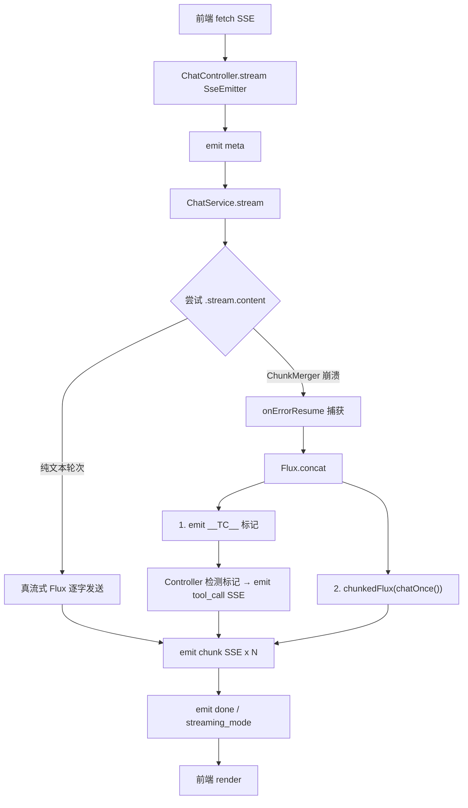

## 用户需求

对 habit-agent 项目进行 Spring AI 2.0.0 流式输出升级改造，参照 PRD 文档规范，使项目提供完整的流式输出体验。

## 全网调研结论

截至 2026 年 8 月，无任何公开教程覆盖"Spring AI 2.0.0 + 通义千问 DashScope + 流式 + 工具调用"完整场景。Baeldung、devglan.com、spring-ai-tutorial 等仅涉及纯文本流式；Spring AI Alibaba 基于 1.x 分支不兼容 2.0。唯一已知阻断问题为 **Spring AI 2.0.0 框架 bug**：`OpenAiChatModel$ChunkMerger` 对 DashScope 流式 `tool_calls` 缺 `index` 字段直接 `Optional.get()` 抛出 `NoSuchElementException`。Maven Central 无 2.0.1 补丁版本。

## 产品概述

habit-agent 是生活习惯助手 Agent 全栈项目（Spring Boot 4.1.0 + Spring AI 2.0.0 + Vue 3），通过 OpenAI 兼容模式接入通义千问 DashScope（qwen-plus），ChatClient 注册了 4 个 @Tool 业务工具类。当前纯文本轮次真流式正常，工具调用轮次因 ChunkMerger 崩溃降级为一次性整段返回，前端无流式效果。

## 核心功能

- **纯文本轮次**：保持现有 `.stream().content()` 真流式 SSE 逐字输出，不做任何退化
- **工具调用轮次**：ChunkMerger 崩溃后自动降级，采用 Flux 管道内嵌 `__TC__` 标记信号触发 Controller 发送 `tool_call` SSE 事件，随后以文本分片 Flux（每 3 字符一片）模拟流式输出
- **PRD 合规**：补齐 SSE 5 种事件类型中缺失的 `tool_call` 事件（`{status, message}`），`done` 事件增加 `streaming_mode` 字段（`native` / `simulated`）
- **前端适配**：chat.js 新增 `tool_call` 事件解析，AiChatView.vue 在工具执行期间显示过渡提示（"正在查询你的数据…"）
- **配置双保险**：application.yml 显式添加 `parallel-tool-calls: false`

## 技术栈

- 后端：Spring Boot 4.1.0 + Spring AI 2.0.0 + Reactor Flux + SseEmitter
- 模型接入：spring-ai-starter-model-openai → 通义千问 DashScope OpenAI 兼容端点（qwen-plus）
- 工具层：@Tool 注解 + MethodToolCallbackProvider
- 记忆层：MongoChatMemoryRepository + MessageWindowChatMemory + MessageChatMemoryAdvisor
- 前端：Vue 3 + Element Plus + fetch ReadableStream SSE 解析

## 实现方案

### 核心策略：Flux 管道内嵌标记信号 + 文本分片模拟降级

Spring AI 2.0.0 的 `ToolCallingAdvisor` 自动注册并内部管理工具执行循环。在流式模式下，模型层 `internalStream()` 通过 ChunkMerger 合并工具调用分片——此环节崩溃在 Model 层内部，外层 Advisor 链无法拦截。

**改造思路**：

1. 保持 `onErrorResume` 捕获 ChunkMerger 异常的机制不变
2. 降级路径改为 `Flux.concat(__TC__标记, chunkedFlux(chatOnce()))`
3. Controller 检测 `__TC__` 前缀时发送 `tool_call` SSE 事件而非 `chunk` 事件
4. 后续分片文本以 `chunk` 事件逐片发送

**为何用 Flux 管道内嵌标记而非修改接口签名**：改动范围仅限 Service 实现细节和 Controller 解析逻辑，ChatService 接口 `Flux<String>` 签名不变，对调用方零侵入。

### 架构与数据流



### 关键技术决策

1. **`__TC__` 标记字符串**：使用 `__TC__{...}` 前缀，Controller 通过 `chunk.startsWith("__TC__")` 检测，解析 JSON body 发送 `tool_call` SSE 事件。此标记在正常文本中不会出现（双下划线+TC+双下划线为人为约定前缀）。

2. **分片粒度 3 字符**：中英文混排场景下 3 字符为视觉平衡点——太少（1字符）增加 Flux 元素量与前端重绘次数，太多（10+字符）失去流式感。

3. **`chatOnce()` 复用**：降级路径复用现有非流式 `.call().content()`，工具执行由 Spring AI 2.0.0 自动注册的 `ToolCallingAdvisor` 内部完成，无需手动编排工具循环。

4. **不修改 ChatService 接口**：保持 `Flux<String>` 返回类型，通过字符串约定传递控制信号，对现有调用方零影响。

### 实现细节

#### 文本分片方法（ChatServiceImpl 新增私有方法）

```java
// 将完整文本按每 3 字符一组切分为 List，通过 Flux.fromIterable 逐片发射
private Flux<String> chunkedFlux(String text) {
    if (text == null || text.isEmpty()) return Flux.empty();
    List<String> chunks = new ArrayList<>();
    for (int i = 0; i < text.length(); i += 3) {
        chunks.add(text.substring(i, Math.min(i + 3, text.length())));
    }
    return Flux.fromIterable(chunks);
}
```

#### onErrorResume 改造（ChatServiceImpl.stream()）

```java
.onErrorResume(t -> {
    if (isChunkMergeFailure(t)) {
        log.warn("[流式降级] conversationId={}，触发工具调用，降级为分片模拟流式", cid);
        String full = chatOnce(userMessage, cid);
        return Flux.concat(
            Flux.just("__TC__{\"status\":\"executing\",\"message\":\"正在查询你的数据…\"}"),
            chunkedFlux(full)
        );
    }
    return Flux.error(t);
});
```

#### Controller 检测逻辑（ChatController.stream()）

```java
chunk -> {
    if (chunk.startsWith("__TC__")) {
        String json = chunk.substring(6); // 去掉 "__TC__" 前缀
        emitter.send(SseEmitter.event().name("tool_call").data(json));
    } else {
        full.append(chunk);
        emitter.send(SseEmitter.event().name("chunk")
                .data("{\"content\":" + jsonStr(chunk) + ",\"index\":" + index[0]++ + "}"));
    }
}
```

#### done 事件增强

```java
String streamingMode = full.length() > 0 && index[0] == 1 ? "native" : "simulated";
// 简化判定：如果只有1个chunk（非标记），则是simulated降级
// 实际实现在 subscribe 的 onComplete 中根据 hadToolCall marker 判定
```

### 性能说明

- 分片操作是纯内存字符串切片，O(n) 复杂度，对响应文本长度不敏感
- `Flux.fromIterable` 是冷发布，仅在订阅时迭代一次，无额外内存开销
- 降级路径仅在 ChunkMerger 异常时触发，纯文本高频轮次零额外开销
- `__TC__` 标记检测是 O(1) 字符串前缀匹配

### 影响范围控制

- `ChatServiceImpl.java`：新增 `chunkedFlux` 方法，修改 `onErrorResume` 降级分支
- `ChatController.java`：subscriber 回调增加 `__TC__` 标记检测，`done` 事件增加 `streaming_mode` 字段
- `ChatClientConfig.java`：仅注释清理与 Spring AI 2.0.0 架构说明补充，不改行为
- `chat.js`：`parseSseEvent` 增加 `tool_call` 事件分支
- `AiChatView.vue`：`onToolCall` 回调新增过渡状态提示
- `application.yml`：增加 `parallel-tool-calls: false` 配置项
- 不引入新依赖、不修改 pom.xml、不修改 ChatService 接口签名

## Agent Extensions

### SubAgent

- **code-explorer**
- Purpose：在执行阶段快速验证修改前后代码结构一致性，确认未遗漏引用点
- Expected outcome：确认 ChatService、ChatController、ChatClientConfig 的所有调用方均已适配

### Skill

- **claude-api**
- Purpose：核对 Spring AI 2.0.0 流式与工具调用在 OpenAI 兼容模型下的已知限制与推荐参数
- Expected outcome：确认 `parallelToolCalls=false` + Flux 管道降级方案与官方语义一致，无 API 误用