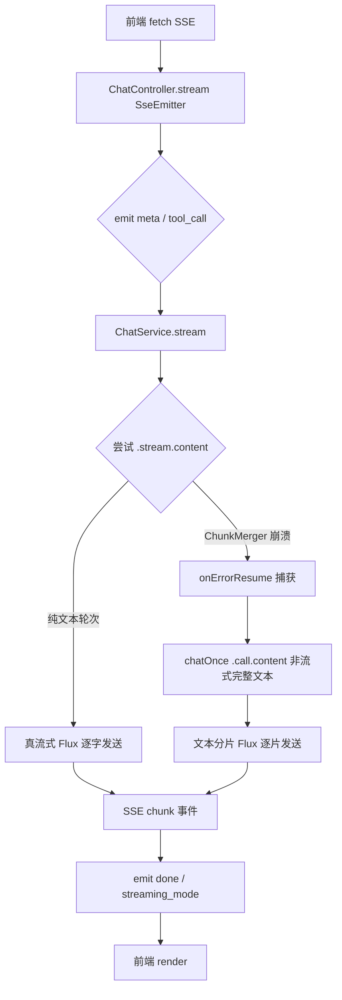

## 用户需求

对 habit-agent 项目进行 Spring AI 2.0.0 流式输出的升级改造，使项目能够提供完整的流式输出体验：纯文本轮次走真流式逐字输出（SSE）；工具调用轮次通过文本分片模拟流式，避免 ChunkMerger 对通义千问 DashScope 流式 tool_calls 缺 index 字段的兼容性崩溃，保证前端始终获得一致的逐字流式交互效果。

## 产品概述

habit-agent 是生活习惯助手 Agent 全栈项目（Spring Boot 4.1.0 + Spring AI 2.0.0 + Vue 3），通过 OpenAI 兼容模式接入通义千问 DashScope（qwen-plus），ChatClient 注册了 4 个 @Tool 业务工具类（习惯查询、统计分析、目标管理、打卡执行）。当前流式接口 /api/chat/stream 在纯文本轮次能真流式输出，但一旦模型触发工具调用，ChunkMerger 崩溃后降级为一次性返回整段文本，前端无流式效果。

## 核心功能

- 纯文本轮次：保持现有真流式 SSE 逐字输出，不做任何退化
- 工具调用轮次：ChunkMerger 崩溃后自动降级，获取完整响应文本后按字符组分片（每 3 字符一片）以 Flux 逐片发送，模拟流式体验
- SSE 事件增强：工具调用轮次在降级时发送 tool_call 事件告知前端"助手正在查询数据"，降级完成后发送 streaming_mode 标识区分真/模拟流式
- 前端适配：chat.js 新增 tool_call 事件解析，AiChatView.vue 在工具执行期间显示过渡状态提示（如"正在查询你的数据…"）
- YAML 双保险：application.yml 显式配置 parallel-tool-calls: false 作为配置层兜底

## 技术栈

- 后端：Spring Boot 4.1.0 + Spring AI 2.0.0（spring-ai-starter-model-openai）、Reactor Flux、SseEmitter
- 模型接入：通义千问 DashScope OpenAI 兼容端点，模型 qwen-plus
- 工具层：@Tool 注解 + MethodToolCallbackProvider
- 记忆层：MongoChatMemoryRepository + MessageWindowChatMemory + MessageChatMemoryAdvisor
- 前端：Vue 3 + Element Plus + fetch ReadableStream SSE 解析

## 实现方案

### 核心策略：流式优先 + 文本分片模拟降级

Spring AI 2.0.0 的 `OpenAiChatModel$ChunkMerger` 在流式合并 DashScope tool_calls 分片时因缺 `index` 字段直接调用 `Optional.get()` 崩溃（`NoSuchElementException`），该 bug 发生在 Model 层内部，外层 Advisor 无法拦截。纯文本轮次不经过此路径，可正常流式输出。

**改造思路**：保持 `onErrorResume` 捕获 ChunkMerger 异常的机制不变，但将降级路径从 `Flux.just(fullResponse)` 升级为**文本分片 Flux**，将 `chatOnce()` 获得的完整响应按每 3 字符一组切片，以 `Flux.fromIterable(chunks)` 逐片发射。前端收到连续的 `chunk` SSE 事件，体验到平滑的流式效果。

**为什么不用 `delayElements`**：分片发送在 Reactor 调度器上几乎是即时的（微秒级），比真实 SSE 延迟更低。引入人为延迟会增加超时风险且收益有限——用户体感上连续分片已经足够"流式"。

### 关键技术决策

1. **降级时发送 tool_call SSE 事件**：`ChatController` 在 `subscribe` 前先 `emitter.send("tool_call", ...)` 告知前端即将进入工具查询阶段。前端可显示"查询中"状态。

2. **done 事件增强 streaming_mode 字段**：区分 `native`（真流式）和 `simulated`（分片模拟），便于前端差异化处理或未来分析。

3. **分片粒度选择 3 字符**：中英文混排场景，3 字符为平衡点——太少增加 Flux 元素数量，太多失去流式感。

4. **`chatOnce()` 复用**：降级路径复用现有非流式 `.call().content()`，工具执行由 Spring AI 2.0.0 自动注册的 `ToolCallingAdvisor` 内部完成，无需手动编排。

### 架构与数据流



### 实现细节

#### 文本分片逻辑（ChatServiceImpl）

```java
// 将完整响应按每 3 字符一组切分为 List，通过 Flux.fromIterable 逐片发射
private Flux<String> chunkedFlux(String text) {
    if (text == null || text.isEmpty()) return Flux.empty();
    java.util.List<String> chunks = new java.util.ArrayList<>();
    for (int i = 0; i < text.length(); i += 3) {
        chunks.add(text.substring(i, Math.min(i + 3, text.length())));
    }
    return Flux.fromIterable(chunks);
}
```

#### 性能说明

- 分片操作是纯内存字符串切片，O(n) 复杂度，对响应文本长度不敏感
- `Flux.fromIterable` 是冷发布，仅在订阅时迭代一次，无额外内存开销
- 降级路径仅在 ChunkMerger 异常时触发，纯文本高频轮次零额外开销

#### Blast Radius

- 仅修改 `ChatServiceImpl` 降级分支的返回值类型（`Flux.just` → `Flux.fromIterable(chunks)`）
- `ChatController` 增加 tool_call 事件发送，done 事件增加 streaming_mode 字段
- 前端仅增加事件处理分支，不影响现有解析逻辑
- `ChatClientConfig` 仅清理注释，不改行为
- 不引入新依赖、不修改 pom.xml

#### 日志

- 复用现有 `log.warn("[流式降级非流式]")` 日志，无需新增
- 工具调用轮次降级是预期行为（框架 bug 规避），不应设为 ERROR 级别