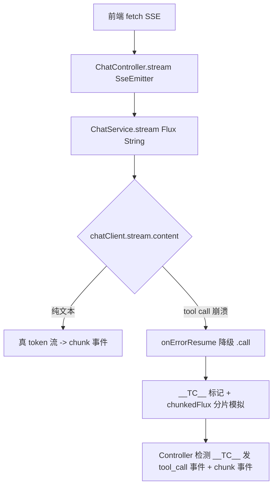
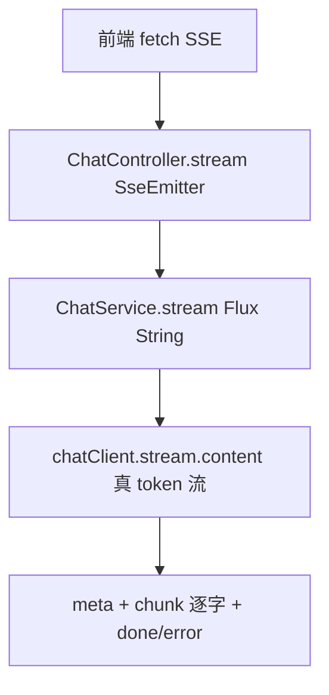
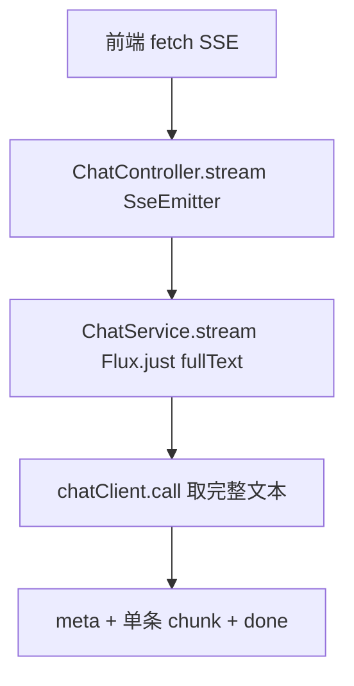

## 用户需求

扫描当前 habit-agent 项目，全面分析所有 Spring AI 相关代码与配置，识别现有流式输出（streaming）实现方式、数据流转路径与关键组件，并制定一份详细升级改造计划。

## 产品概述

项目为生活习惯助手 Agent（Spring Boot 4 + Spring AI 2.0.0），当前 AI 对话同时提供非流式（POST /api/chat）与 SSE 流式（GET /api/chat/stream）两种端点。流式实现中存在因 DashScope 流式 tool call 缺 index 字段导致 ChunkMerger 崩溃、以伪流式（__TC__ 分片模拟）掩盖的问题。本次升级目标：先验证真流式在纯文本与 tool call 两种场景下能否稳定跑通；若能，保留真流式并删除伪流式降级代码；若不能，则退回非流式——服务端一次性取得完整文本后仍以 SSE 端点单次推送，并彻底删除伪流式相关代码。

## 核心特性

- 全面梳理 Spring AI 调用链路、配置、依赖现状与流式数据流转。
- 编写真流式验证探针，覆盖「纯文本轮次」与「触发 tool call 轮次」两类场景。
- 依据验证结论二选一落地：
- 方案 A（真流式可行）：保留 chatClient.stream().content() 真逐字输出，移除 onErrorResume 伪流式降级、__TC__ 标记与 chunkedFlux 分片逻辑。
- 方案 B（真流式不可行）：stream() 返回 Flux.just(完整文本)，服务端一次性推送单条 chunk + done，删除所有伪流式代码。
- 两种方案均保留 GET /api/chat/stream 与 POST /api/chat 端点形态，保证 PRD 契约与前端 SSE 解析逻辑最小改动。
- 显式补充 spring-boot-starter-webflux 依赖（官方要求命令式应用支持 .stream() 必须引入 Reactive 栈）。
- 明确错误处理、兼容性、性能与测试策略，确保平滑过渡且不影响 Tool Calling、对话记忆、Session、Analysis、RAG 等既有模块。

## 技术栈

- 后端：Spring Boot 4.1.0、Spring AI 2.0.0（BOM 统一管理）、Java 21
- 模型接入：spring-ai-starter-model-openai（OpenAI 兼容模式接 DashScope 通义千问）
- 响应式：spring-boot-starter-webflux（新增显式依赖，支撑 .stream() 的 Reactive 栈 / WebClient）
- 前端：Vue 3 + Vite（AiChatView.vue + api/chat.js，SSE 通过 fetch + ReadableStream 解析）
- 测试：spring-boot-starter-test + Reactor Test（StepVerifier）

## 实现方案

### 总体策略

分两阶段：阶段一为「真流式可行性验证」，阶段二为「按验证结论落地升级（方案 A 或 B）」。阶段一产出明确的是/否判定，阶段二据此二选一切换实现，保证过程可逆、不影响现有非流式功能与前端契约。

### 关键决策与权衡

1. **显式引入 webflux**：当前流式靠 spring-ai-starter-model-openai 传递依赖带 reactor/webflux 侥幸可用，版本不受 Boot BOM 管理。官方 Implementation Notes 明确要求命令式应用显式引入 spring-boot-starter-webflux 以支持 .stream()。显式声明后版本由 Boot BOM 统一，消除升级隐患，且 web+webflux 共存时 Spring Boot 仍以 Tomcat(Servlet) 启动，现有 SseEmitter / @RestController 不受影响。
2. **保留 SSE 端点形态**：不论真流式还是退回非流式，GET /api/chat/stream 端点与 5 种事件（meta/chunk/tool_call/done/error）契约不变。方案 B 下 stream() 返回 Flux.just(fullText)，Controller 仍发 meta + 单条 chunk + done，前端解析逻辑零改动。
3. **ChatService.stream 签名不变**：接口方法 `Flux<String> stream(String, String)` 在两种方案下均成立（真 token 流 / 单元素流），避免前端与接口契约破坏性变更。
4. **伪流式代码彻底删除**：方案 A 删除 onErrorResume 伪流式降级、__TC__ 标记、chunkedFlux；方案 B 同样删除这些代码，改为一次性返回。杜绝「靠分片模拟打字机」的工程折中。

### 性能与可靠性

- 真流式（方案 A）：逐 token 推送，内存占用 O(1)，无完整文本缓冲；需保留停止信号（ConcurrentHashMap）与 SseEmitter 超时（120s）机制。
- 退回非流式（方案 B）：服务端先 .call() 取完整文本再发单条 chunk，首字延迟 = 完整生成延迟，但复杂度最低、最稳定；SseEmitter 超时仍需保留以防前端悬挂。
- 错误处理：方案 A 下若真流式仍偶发 ChunkMerger 崩溃，不再降级伪装，直接经 SSE error 事件上报（errorCode=AI_TIMEOUT 或 AI_SERVICE_UNAVAILABLE），由前端 onError 友好提示；不再双倍 token 重发。
- 避免 isChunkMergeFailure 中 `cause instanceof NoSuchElementException` 过宽误判（原隐患）在方案 A 中随伪流式代码一并移除。

## 实现要点（执行细节）

- 验证探针用最小 Spring Boot Test：直接注入 ChatClient，分别构造纯文本 prompt 与触发 tool call 的 prompt，调用 `.stream().content().collectList().block(Duration)` 观察是否抛 NoSuchElementException / ChunkMerger 栈帧。
- 验证时对比 `parallelToolCalls(true/false)` 与尝试自定义 OpenAiApi / 覆写解析以绕过 ChunkMerger（作为方案 A 保留的候选修复，但默认优先官方版本）。
- 阶段二改动严格限定在 ChatService/ChatServiceImpl/ChatController/pom.xml/前端极小适配，不触碰 Tool/Advisor/Memory/Session 等模块。
- 日志沿用项目现有 lombok @Slf4j，错误日志不 dump 大 payload，SSE 异常走 error 事件而非抛出异常。

## 架构设计

### 现有数据流转（修改前）



### 目标数据流转（方案 A 真流式）



### 目标数据流转（方案 B 退回非流式，仍走 SSE）



## 目录结构

```
pom.xml                                                          # [MODIFY] 新增 spring-boot-starter-webflux 显式依赖
src/test/java/com/habit/agent/StreamingProbeTest.java           # [NEW] 真流式可行性验证探针（纯文本 + tool call 两场景，StepVerifier/block）
src/main/java/com/habit/agent/service/ChatService.java          # [MODIFY] 保持 stream 签名；补充方案判定后的注释说明
src/main/java/com/habit/agent/service/impl/ChatServiceImpl.java # [MODIFY] 方案A: 移除 onErrorResume/__TC__/chunkedFlux，纯 stream；方案B: stream 改 Flux.just(chatOnce)
src/main/java/com/habit/agent/controller/ChatController.java    # [MODIFY] 方案A: 移除 __TC__ 检测分支；方案B: 适配单条 chunk；保留 SSE 端点与超时/停止
frontend/src/api/chat.js                                        # [MODIFY] 方案B 下无需改；方案A 确认 onError 仍能处理 error 事件
frontend/src/views/AiChatView.vue                               # [MODIFY] 仅方案B 时确认一次性 chunk 渲染正常，无需去打字机逻辑
```

## 关键代码结构

```java
// ChatService 接口（两种方案均保持）
public interface ChatService {
    String chat(String userMessage, String conversationId);
    Flux<String> stream(String userMessage, String conversationId);
    List<Map<String, String>> getMessages(String conversationId);
    String generateTitle(String userMessage);
}

// 方案 A：ChatServiceImpl.stream 真流式
public Flux<String> stream(String userMessage, String conversationId) {
    String cid = ensureSession(userMessage, conversationId);
    return chatClient.prompt()
            .user(userMessage)
            .advisors(a -> a.param(ChatMemory.CONVERSATION_ID, cid))
            .options(OpenAiChatOptions.builder().parallelToolCalls(false).build())
            .stream()
            .content();
}

// 方案 B：ChatServiceImpl.stream 退回非流式（仍走 SSE）
public Flux<String> stream(String userMessage, String conversationId) {
    String cid = ensureSession(userMessage, conversationId);
    String full = chatOnce(userMessage, cid);
    return Flux.just(full);
}
```