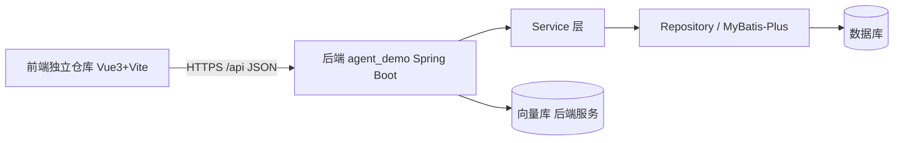

## 用户需求

将 agent_demo 项目中除 `agent模型.md` 以外的 5 份 PRD 文档，从当前的"Thymeleaf 混合 SSR 架构"改写为"主流前后端分离全栈方案"。本次任务范围仅限 PRD 文档改写，不修改任何 Java/前端代码。

## 产品概述

后端 agent_demo（Spring Boot）重构为纯 REST API 服务，彻底移除 Thymeleaf 与 PageController 页面路由；前端以独立仓库形态存在，采用 Vue 3 + Vite 技术栈，通过统一 API 契约与后端对接。5 份 PRD 需同步更新架构描述、模块流程、接口设计与向量库方案，使文档整体体现主流前后端分离实践。

## 核心特性

- 移除所有 Thymeleaf 模板、PageController、SSR 页面相关描述，后端定位为纯 `/api` 服务
- 新增独立前端仓库（Vue 3 + Vite）的工程结构、分层与路由/状态/请求封装说明
- API 接口设计补充 CORS、统一响应体、鉴权、错误码等前后端分离约定
- 向量库搭建计划保留后端服务部分，前端交互改为调用 API
- 模块开发流程按"后端 Controller→Service→Repository + 前端 Vue 组件"重排阶段与分工
- `agent模型.md` 保持原样不参与改写

## 技术栈选择

- 文档改写目标架构：后端 Spring Boot 纯 REST API（保留 MyBatis-Plus 持久层，移除 Thymeleaf）；前端 Vue 3 + Vite + Pinia + Axios + Vue Router + Element Plus
- 文档格式：Markdown（与现有 PRD 一致）
- 仓库组织：后端 agent_demo 仓库保持不变；前端为独立 git 仓库，经 API 契约对接

## 实现方案

### 总体策略

逐份重读 5 份 PRD，将其中所有"服务端渲染页面、Thymeleaf 模板、PageController 路由、表单直提交"相关内容替换为"前端 Vue 工程调用后端 REST API"的描述；新增前端独立仓库的架构、目录、模块职责与对接约定；补充前后端分离必需的 API 规范（CORS、统一响应、鉴权、错误码）。

### 关键技术决策

1. **保留后端分层与接口资产**：现有 `/api` REST 接口（Controller→Service→Repository）与 MyBatis-Plus 模式（memory 14799943）是成熟的，PRD 改写以"后端 API 契约化"为核心，不重新审视后端业务逻辑。
2. **前端独立仓库定位**：依据用户确认，前端不放入 agent_demo 子目录，而是在 PRD 中以独立仓库视角描述（仓库名、目录结构、依赖、与后端联调方式），便于后续独立初始化。
3. **彻底移除 SSR 描述**：所有 `templates/*.html`、PageController、Thymeleaf 依赖相关段落从 PRD 删除或改写为"历史遗留/待清理"，明确后端只提供 JSON API。
4. **API 契约先行**：在 `API接口设计方案.md` 与 `API接口文档设计计划.md` 中明确请求/响应格式、状态码、鉴权头、CORS 策略，作为前后端对接的唯一事实来源。

### 性能与可靠性

- 文档改写不产生运行时开销；重点是文档一致性与可追溯性。
- 改写后需保证 5 份 PRD 之间术语、接口路径、模块命名一致，避免前后矛盾。

## 实现注意事项

- 仅做文档变更，不触碰 `src/`、`pom.xml`、`sql/` 等代码与配置。
- `agent模型.md` 完全不动。
- 改写时复用现有 PRD 中的接口路径、实体名（如 HabitGoal、GoalController 等已探明的类名），保持与代码一致。
- 每份 PRD 改写后整体通读一次，确认无残留 SSR 表述。
- 不执行 git 提交（依用户确认，仅文档改写）。

## 架构设计

改写后的逻辑架构（文档描述层面）：

后端不再渲染页面，仅暴露 `/api`；前端通过 Axios 调用，Vue Router 管理路由，Pinia 管理状态。

## 目录结构（本次改写的文件）

PRD/ 目录下仅改写以下 5 份文档，均标注 [MODIFY]：

- d:/javacode/agent_demo/PRD/详细模块开发流程.md  # [MODIFY] 重排阶段为"后端 API 模块 + 前端 Vue 模块"双线开发流程，移除 SSR 页面阶段，补充前端构建/联调阶段
- d:/javacode/agent_demo/PRD/向量库搭建计划表.md  # [MODIFY] 保留后端向量服务搭建，前端交互改为"调用向量检索 API"，移除模板展示描述
- d:/javacode/agent_demo/PRD/agent_demo开发计划.md  # [MODIFY] 总览改为前后端分离全栈方案，补充前端独立仓库计划与联调里程碑
- d:/javacode/agent_demo/PRD/API接口设计方案.md  # [MODIFY] 补充 CORS、统一响应体、鉴权、错误码、版本化等前后端分离约定，移除页面跳转描述
- d:/javacode/agent_demo/PRD/API接口文档设计计划.md  # [MODIFY] 文档生成方式改为面向纯 API（如 OpenAPI/Swagger），补充前端如何消费接口文档
- d:/javacode/agent_demo/PRD/agent模型.md  # 不动（保留）

## Agent Extensions

### Skill

- **doc-coauthoring**
- Purpose: 指导 5 份 PRD 的结构化协同改写，确保文档结构一致、内容完整、术语统一
- Expected outcome: 输出的 5 份 PRD 结构清晰、前后一致，符合前后端分离方案叙事