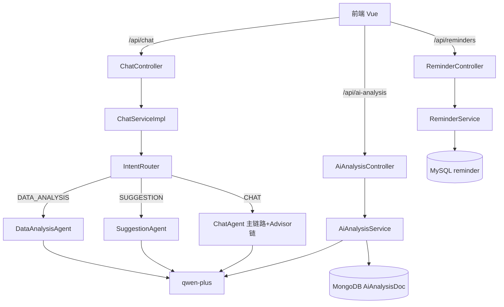

## 用户需求

扫描 PRD 全部文档，严格按开发要求完成 agent_demo 剩余阶段（阶段九多智能体架构、阶段十 AiAnalysis/Reminder 与收尾），并补全所有功能模块；同时将原方案未涉及的"拓展计划"写入 PRD。

## 产品概述

生活习惯助手 Agent 后端补全：多智能体路由（Director + 4 个 Advisor Agent）、AI 周期分析（周报/月报/每日评价）异步生成、打卡提醒管理；前端补充分析页可视化与提醒页；PRD 三份核心文档同步更新为最终落地状态并补充拓展计划章节。

## 核心功能

- 阶段九：IntentRouter/Director 意图分类，路由到 DataAnalysis / Suggestion / Chat 三类子 Agent；ChatClient 持有独立 ChatClient 实例，与现有 advisor 链解耦
- 阶段十-1：AiAnalysisController（6 端点：列表/最新/详情/触发/每日评价/删除）+ AiAnalysisService（调用通义千问生成 content/suggestion/riskWarning/score，存入 MongoDB，TTL 索引）
- 阶段十-2：ReminderController（5 端点：列表/创建/更新/切换/删除）+ Reminder JPA 实体与建表
- 阶段十-3：全局异常 19 码补全、限流、Token 截断、演示与启动说明文档
- 前端：AiChatView 接入路由意图展示；新增分析可视化（ECharts 已在 TrendView 预留）与提醒管理页入口
- PRD 修改：详细模块开发流程.md / API接口设计方案.md / 向量库搭建计划表.md 更新阶段九/十为已落地；新增"拓展计划"章节（Redis 缓存限流、OAuth 微信登录、消息推送、离线兜底、压测监控）

## 技术栈选择

- 后端：Spring Boot 4.1 + Spring AI 2.0（沿用现有栈，不引入 spring-ai-alibaba，保持 OpenAI 兼容模式接入 DashScope）
- 存储：MySQL（JPA，Reminder 实体）/ MongoDB（AiAnalysis 文档 + TTL 索引，复用现有 MongoTemplate）
- 前端：Vue3 + Vite + Element Plus + ECharts（沿用现有 frontend/ 结构与 request.js 封装）
- 多智能体：Spring AI 2.0 ChatClient + 手动路由（PRD 明确 SAA 未兼容 SB4，不引入 Graph 引擎）

## 实现方案

### 阶段九：多智能体路由

- 新增 `agent/router/IntentRouter.java`：基于规则 + LLM 轻量分类（复用现有 ChatClient 的 prompt().user().call() 做意图判断，避免新增依赖），输出枚举 `IntentType{DATA_ANALYSIS, SUGGESTION, CHAT}`。
- 子 Agent 以独立 `ChatClient` Bean 实现（`DataAnalysisAgent`/`SuggestionAgent`/`ChatAgent`），各自 `defaultSystem` 不同人格提示词（新建 `prompts/analysis-prompt.st`、`suggestion-prompt.st`），不挂载 RAG/工具以控制成本。
- `ChatServiceImpl` 集成路由：根据 IntentRouter 结果选择子 Agent 的 chat/stream 方法；SSE 的 `done` 事件回填 `intent` 字段（API 文档已约定）。
- 复用现有 `SafeRetrievalAdvisor` 等 advisor 链仅挂主对话 ChatClient；子 Agent 保持轻量。

### 阶段十：AiAnalysis + Reminder

- `AiAnalysisController` + `AiAnalysisService`：trigger 异步（`@Async`）生成，基于 AnalysisService 汇总数据 + 当日/周期打卡调用 qwen-plus，输出 Markdown content + suggestion + riskWarning + score(0-100)；存 `AiAnalysisDoc`（MongoDB，`analysisType` WEEKLY/MONTHLY/DAILY/CUSTOM，TTL 1 天）；daily 端点校验当日已打卡（40004）。
- `ReminderController` + `ReminderService` + `Reminder` JPA 实体 + `ReminderRepository`；`sql/schema.sql` 补充 reminder 表 DDL；weekdays 以逗号字符串存储（与 PRD DDL 一致）。
- 全局异常补全：现有 `GlobalExceptionHandler` 扩展 40404/40406 等码；限流用 `Bucket4j` 或简单 `ConcurrentHashMap` 令牌桶（避免引入 Redis 依赖，保持单应用）；Token 截断复用 `MessageWindowChatMemory` 窗口。

### 前端

- `frontend/src/api/` 新增 `aiAnalysis.js`、`reminder.js`（对齐 chat.js 风格）。
- `AiChatView.vue` 展示 SSE `done.intent` 标签；`MainLayout.vue` 菜单与 `router/index.js` 新增"分析"与"提醒"两个路由（PRD 原 5 页扩展为 7 页，属本次明确范围）。
- 新增 `AnalysisReportView.vue`（调用 `/api/ai-analysis` + ECharts 展示）+ `ReminderView.vue`（提醒 CRUD）。

## 实现注意事项

- 严格遵循现有分层（Controller→Service→Repository）与 Result 统一响应；VO 放 `common/vo/`。
- 子 Agent ChatClient 与主链路隔离，避免 advisor 顺序冲突（参考 ChatClientConfig 现有装配方式）。
- AiAnalysis 异步生成失败不影响列表查询；触发器加 `@Async` + 异常处理。
- 限流仅作用于 `/api/chat`、`/api/ai-analysis/trigger`，不影响打卡类核心功能。
- 每完成一个模块即编译验证并 git 提交推送（项目约定）。

## 架构设计



## 目录结构

```
src/main/java/com/habit/agent/
├── agent/router/
│   ├── IntentRouter.java          # [NEW] 意图分类（规则+LLM）
│   ├── IntentType.java            # [NEW] 意图枚举
│   ├── DataAnalysisAgent.java     # [NEW] 数据分析子 Agent（独立 ChatClient）
│   ├── SuggestionAgent.java       # [NEW] 建议生成子 Agent
│   └── ChatAgent.java             # [NEW] 日常对话子 Agent
├── config/
│   └── AgentConfig.java           # [NEW] 子 Agent ChatClient Bean 配置
├── controller/
│   ├── AiAnalysisController.java   # [NEW] 6 端点
│   └── ReminderController.java     # [NEW] 5 端点
├── service/
│   ├── AiAnalysisService.java      # [NEW] 接口
│   ├── ReminderService.java        # [NEW] 接口
│   └── impl/
│       ├── AiAnalysisServiceImpl.java  # [NEW] 异步生成+存储
│       └── ReminderServiceImpl.java    # [NEW]
├── entity/jpa/
│   └── Reminder.java               # [NEW] JPA 实体
├── entity/mongo/
│   └── AiAnalysisDoc.java          # [NEW] MongoDB 文档
├── repository/jpa/
│   └── ReminderRepository.java     # [NEW]
├── repository/mongo/
│   └── AiAnalysisRepository.java   # [NEW]
├── common/vo/
│   ├── AiAnalysisVO.java           # [NEW]
│   ├── DailyEvaluationVO.java      # [NEW]
│   └── ReminderVO.java             # [NEW]
├── common/exception/
│   └── GlobalExceptionHandler.java # [MODIFY] 补全 19 码
├── service/impl/
│   └── ChatServiceImpl.java        # [MODIFY] 集成 IntentRouter
├── resources/prompts/
│   ├── analysis-prompt.st          # [NEW]
│   └── suggestion-prompt.st        # [NEW]
sql/schema.sql                       # [MODIFY] 增加 reminder 表
frontend/src/
├── api/aiAnalysis.js                # [NEW]
├── api/reminder.js                  # [NEW]
├── router/index.js                  # [MODIFY] 增加分析/提醒路由
├── layouts/MainLayout.vue           # [MODIFY] 增加菜单项
├── views/AnalysisReportView.vue     # [NEW]
├── views/ReminderView.vue           # [NEW]
└── views/AiChatView.vue             # [MODIFY] 展示意图标签
PRD/
├── 详细模块开发流程.md              # [MODIFY] 阶段九/十落地+拓展计划
├── API接口设计方案.md               # [MODIFY] 端点计数 40→51
└── 向量库搭建计划表.md              # [MODIFY] 补充多智能体衔接
```

## 设计风格

沿用现有 frontend 玻璃拟态（glass）+ 蓝色主调风格。新增两个页面与现有 5 页视觉语言一致，保持顶部导航与底部留白统一。分析页以卡片+图表为主，提醒页以列表+表单抽屉为主。

## 页面规划

1. 分析页（AnalysisReportView）：顶部周期切换 Tab（周/月/日），下方 ECharts 雷达图 + 评分环 + Markdown 建议卡片；调 `/api/ai-analysis/*`。
2. 提醒页（ReminderView）：提醒列表表格 + 新建按钮（抽屉表单：时间/类型/星期）+ 启停开关 + 删除。
3. AiChatView：对话流末尾展示意图标签（数据分析/建议/闲聊），复用现有抽屉体系。

## Agent Extensions

### SubAgent

- **code-explorer**
- Purpose: 在实现各模块前精确探查现有 ChatClientConfig、GlobalExceptionHandler、AnalysisService、frontend request.js 与 router 的真实签名与风格，避免猜测
- Expected outcome: 输出关键文件原文与调用约定，保证新增代码与现有模式一致

### Skill

- **webapp-testing**
- Purpose: 后端启动后验证新增 11 端点（ai-analysis/reminders）与前端分析/提醒页可用
- Expected outcome: 通过 Playwright 截图与接口调用确认功能正常，捕获控制台错误

---

## 4 轮循环扫描审核记录（对照 PRD/agent模型.md 功能）

> 审核日期：2026-08-05。基线文档：`PRD/agent模型.md`（必做：每日作息/饮食/运动/饮水/备注录入、历史查看、AI 分析、改善建议；输出数据：每日评价/周期趋势总结/生活习惯风险提示/改善建议；页面：首页/打卡/历史/趋势/AI建议）。
> 说明：本次审核**不采用** agent模型.md 的技术栈（Thymeleaf/Bootstrap/本地 JSON），仅校验功能是否被满足。

### 第 1 轮 · 后端代码审计（code-explorer）

- ✅ 必做功能基本覆盖：`HabitRecord` 含 sleepTime/wakeTime/dietDesc/exerciseType/waterIntake/remark（输入字段齐全）；历史查看、AI 分析、建议输出均有对应实现。
- 🔴 **[P0] AI 分析输出无结构化字段**：`AiAnalysisTask`（MongoDB）仅存 `report`(Markdown) + `charts` + `tags`，缺 `dailyEvaluation/trendSummary/riskWarning/suggestion/score`，不满足 agent模型.md「输出数据」要求（所有结论埋在一段 Markdown 文本里）。
- 🟡 `[P1]` `POST /api/habits` 直接以 JPA 实体 `HabitRecord` 作入参，应改用已存在的 `HabitRecordVO`，避免暴露持久化实体。
- 🟡 `[P3]` 实际端点约 42 个，PRD 声称 57 个，存在文档夸大。

### 第 2 轮 · 前端页面 + PRD 一致性审计（code-explorer）

- ✅ 7 个页面全部存在，无缺失（首页/打卡/历史/趋势/AI建议/分析/提醒/对话）。
- 🟡 `[P2]` 路由缺少 404 catch-all，非法 URL 直接白屏。
- 🟡 `[P2]` 未同步 `document.title`（标签页始终为默认标题）。
- 🟡 `[P2]` `MainLayout.vue` 的 `onErrorCaptured` 返回 `false` 静默吞掉子组件异常。
- 🟡 `[P2]` 导航文案不一致：route `meta.title` 为「AI智能分析」，菜单显示「AI分析」。
- ⚪ `[误报已排除]` `KnowledgeDrawer.vue` 的 `{ data }` 解构问题经核实不存在（request.js 直接返回 data，无 bug）。

### 第 3 轮 · 功能缺口深挖（直接读源码核验）

- 🔴 **[P0]** 同第 1 轮：`AiAnalysisServiceImpl.generateReport` 仅产出单段 Markdown，`extractTags` 为弱关键字启发式；无 `suggestion/riskWarning/score` 等独立字段，前端 `AiAnalysisView` 只能 `<pre>` 展示原始文本。
- ✅ 错误码共 19 个（40001–40004 / 40401–40407 / 40901 / 50301–50304 / 50001–50003），`GlobalExceptionHandler` 经 `BusinessException` 泛型 + `resolveHttpStatus` 统一映射，可接受。
- ✅ `ChatServiceImpl` 多智能体路由接线正确（`IntentRouter.route` → 三子 Agent）。
- 🟡 `[P1]` 三个子 Agent 实际共享同一 `conversationId` 的 `chatMemory`，并未真正「记忆隔离」，仅注释如此描述（功能可用，文档误导）。

### 第 4 轮 · 编译验证 + 跨模块归纳

- ✅ `mvn -q compile` 成功（exit 0），后端当前可构建。
- 🔴 **[P1] 限流未落地**：全局搜索 `RateLimiter/Bucket4j/令牌桶/限流` 命中 0 条，计划声明「限流仅作用于 /api/chat、/api/ai-analysis/trigger」但代码未实现，存在被 LLM 刷爆风险。
- 🟡 `[P1]` `GoalController` 双基路径 `/api/goals` 与 `/api/goal-records` 导致路径交叉注册，建议拆分为两个 Controller 或统一前缀。

### 优先级优化建议汇总

- **P0（功能不符 spec）**

1. 为 `AiAnalysisTask` 增加结构化字段 `dailyEvaluation / trendSummary / riskWarning / suggestion / score`；改 `AiAnalysisServiceImpl` 让 LLM 返回结构化 JSON（用 `.response()` 反序列化到强类型对象）填充；前端 `AiAnalysisView` 以卡片分别展示评分/建议/风险，而非仅 `<pre>`。

- **P1（健壮性/安全）**

2. 实现限流：在 `/api/chat`、`/api/ai-analysis/trigger` 增加 `ConcurrentHashMap` 令牌桶或 Bucket4j。
3. 拆分/统一 `GoalController` 双基路径，消除路径交叉注册。
4. `POST /api/habits` 改用 `HabitRecordVO` 接收；子 Agent 记忆隔离注释修正或真正实现隔离。

- **P2（前端体验）**

5. 增加 404 兜底路由 + NotFound 页；路由守卫同步 `document.title`；`onErrorCaptured` 改为提示而非静默吞异常；统一导航文案。

- **P3（文档一致性）**

6. PRD 端点计数 57 → 修正为实际数量；阶段九/十落地描述与实际一致化。

### 结论

后端可编译、页面齐全、多智能体路由与 19 错误码正确；**最关键的 spec 缺口是 AI 分析缺少结构化输出字段（P0）与限流未实现（P1）**。建议按上述 P0→P3 顺序整改，整改后逐模块编译并 git 提交推送（项目约定）。