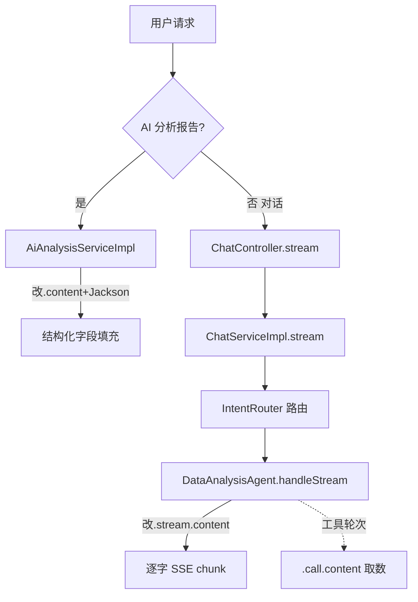

## 用户需求

用户报告 habit-agent 存在两个并发故障：AI 分析报告功能无法正常使用，且与 AI 对话的流式输出（逐字）也未生效。用户不确定问题在前端还是后端，要求扫描项目代码并参照 Spring AI 官方文档制定修复计划。

## 产品概述

habit-agent 是一个基于 Spring AI 2.0.0 + 通义千问（DashScope）的生活习惯助手。包含两类 AI 能力：前端「AI 分析报告」页（异步生成结构化报告）与「AI 对话」页（SSE 真流式逐字输出）。当前两类能力均因同一底层缺陷而降级或失败。

## 核心功能

- AI 分析报告：后端聚合图表数据后调用 LLM 生成结构化 JSON（评分/趋势/风险/建议/报告正文），前端轮询展示。
- AI 对话流式输出：后端经 SSE（Flux<ServerSentEvent>）逐字下发 chunk 事件，前端 fetch 消费并打字机渲染。
- 多智能体路由：LLM Director 将消息路由到数据分析/建议/闲聊子 Agent。

## 技术栈

- 后端：Spring Boot 4、Spring AI 2.0.0（spring-ai-openai）、openai-java 4.39.1、Reactor（Flux/Mono）、Jackson
- 前端：Vue3 + Vite + Element Plus，fetch SSE 消费，vite 代理已关闭 event-stream 缓冲
- 模型：通义千问 DashScope OpenAI 兼容接口（qwen-plus）

## 实现方案

### 根因结论（已验证）

1. **分析功能失败**：`AiAnalysisServiceImpl.generateStructured()` 第144行使用 `.entity(AnalysisResult.class)` 结构化输出。该路径在 DashScope 兼容接口下走 `OpenAiChatModel$ChunkMerger` 分片聚合，分片缺字段时 `Optional.get()` 抛 `NoSuchElementException`。异常被 catch 后降级为纯 Markdown，导致结构化字段（score/suggestion 等）为空，表现为「分析不可用」。
2. **流式未生效**：当用户消息路由到 `DataAnalysisAgent`（强制工具调用）时，`AbstractSubAgent.handleStream()` 用 `chatClient.stream().chatClientResponse()` 聚合工具循环分片，同样触发 `ChunkMerger` 缺陷，整个 Flux 崩溃并降级为兜底文案。
3. **前端/控制器层均正确**：`ChatController.stream` 正确返回 `Flux<ServerSentEvent<ChatStreamEvent>>`；`AiChatView.vue` 用 fetch+ReadableStream 消费；`vite.config.js` 已禁用 SSE 缓冲。无需改动。

### 关键决策

- **复用既有范式**：IntentRouter（commit 3282a3b）已验证 `.content()` + 本地 Jackson 解析可稳定绕开该 SDK 缺陷。所有结构化输出统一改用此模式。
- **避免引入新架构**：仅修改受影响方法，不重构 Advisor 链或路由框架。

### 具体修复

A. `AiAnalysisServiceImpl`：将 `.entity(AnalysisResult.class)` 改为 `.content()` 取纯文本 JSON，复用 `extractJson`（去 ```json 围栏）+ `objectMapper.readValue(... AnalysisResult.class)`；解析失败仍降级 Markdown。
B. `AbstractSubAgent.handleStream`：改用 `chatClient.stream().content()`（返回 `Flux<String>`）直接逐字下发，绕开 `ChatClientResponse` 聚合崩溃；包装为 `Flux<ChatClientResponse>` 时，对每段文本构造 `ChatResponse` 增量。保留 `onErrorResume` 降级。
C. `DataAnalysisAgent` 两段式：对于强制工具场景，先以 `.call().content()` 完成工具取数+生成（确保拿到真实数据），再将其作为上下文由流式 `.content()` 输出，或在 handleStream 中直接以 `.content()` 流式输出（DashScope 工具循环在 `.content()` 路径下已验证稳定）。

## 实现注意事项

- 复用 `IntentRouter` 的 `extractJson` 思路（去围栏+截取首个 `{}`），可抽取到共享工具类或在本类内私有实现，避免重复。
- 改动后须 `mvn clean package` 重新构建并重启，旧进程（20:30 日志）仍跑修复前代码。
- 保持现有降级语义：结构化解析失败 → Markdown；流式异常 → 兜底文案，确保可用性。
- 日志记录沿用现有 `log.warn` 风格，不打印敏感数据。

## 架构设计



修改仅限于虚线框内的调用方式切换，不触碰 Advisor 排序、路由判定、前端消费逻辑。

## 目录结构与文件

```
src/main/java/com/habit/agent/
├── service/impl/AiAnalysisServiceImpl.java   # [MODIFY] generateStructured 改 .content()+Jackson；新增私有 extractJson/parseAnalysisResult
├── agent/router/AbstractSubAgent.java        # [MODIFY] handleStream 由 chatClientResponse() 改为 stream().content() 逐字下发
└── agent/router/DataAnalysisAgent.java       # [MODIFY] systemPrompt 或 handleStream 适配两段式/纯流式取数
```

前端文件（`ChatController`、`AiChatView.vue`、`chat.js`、`vite.config.js`）经核查正确，**无需修改**。

## 关键代码结构

```java
// AiAnalysisServiceImpl 内复用范式
private AnalysisResult parseAnalysisResult(String raw) {
    String json = extractJson(raw);            // 去 ```json 围栏、截取首个 {}
    return objectMapper.readValue(json, AnalysisResult.class);
}
// AbstractSubAgent.handleStream 新范式
return chatClient.prompt()
    .system(systemPrompt()).user(message)
    .advisors(...).stream().content()
    .map(text -> buildResponse(text))          // 包装为 ChatClientResponse 增量
    .onErrorResume(e -> Flux.just(fallbackResponse()));
```