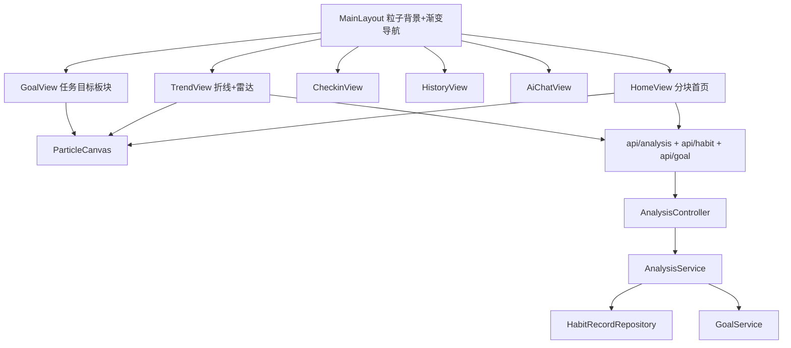

## 用户需求概述

对 habit-agent（Spring Boot 4 + Vue3 生活习惯助手）项目前三个阶段已完成的前端页面进行现代审美视觉升级，并按约定同时实现后端分析接口，打通真实数据，使整个系统呈现大气、流动式的视觉体验。

## 核心功能

- 首页分块式重构：Hero 轮播区、今日概变统计卡、任务目标进度区、滑动卡片区、心情饼图、近 7 天折线趋势、快捷入口，全部接入真实接口。
- 现代审美渐变主题：以流动渐变（青绿→靛蓝→紫）替换单一主色，统一应用于导航栏、卡片、按钮、图表。
- 全站轻量 Canvas 粒子背景：自建零依赖粒子组件，普通页面轻量粒子，任务目标/重点视图采用重粒子效果。
- 任务目标板块预留：基于现有 HabitGoal 模块，首页与独立视图预留专属展示空间与配色位（按目标类型给色），不新增后端实体。
- 趋势页充实：折线图（睡眠/运动/饮水）+ 雷达图（睡眠/运动/饮水/饮食/心情五维）渲染真实后端数据。
- 其他页面统一视觉标准：打卡页、历史页、AI 建议页沿用首页风格（渐变、微动效、粒子背景）。
- 后端分析接口实现：新增 AnalysisController/AnalysisService 及配套 VO，基于 HabitRecord + HabitGoal 计算趋势、达成率、雷达维度，供前端图表消费。

## 视觉与交互效果

页面采用大圆角玻璃拟态卡片、流动渐变描边、悬浮微动效；粒子在背景缓慢游动并与鼠标轻微交互；首页各区块以渐变分隔、滚动进入动画；图表配色与主题渐变一致，整体观感科技、通透、大气。

## 技术栈选择

- 前端：沿用 Vue3 + Vite5 + Vue Router4 + Pinia2 + Axios + Element Plus2 + ECharts5 + TailwindCSS3.4。新增粒子效果使用原生 Canvas（零新增依赖，符合用户"轻量自建"要求）。
- 后端：沿用 Spring Boot 4 + Spring Data JPA + H2。新增分析模块遵循既有 Controller→Service→Repository 分层与 Result 统一响应规范。
- 图表：ECharts 已具备，无需新增库；饼图/折线/雷达均用 vue-echarts 或原生 echarts.init。

## 实现方案

### 总体策略

以"视觉系统升级 + 数据通道打通"双线推进：先建立全局设计令牌（CSS 变量+Tailwind 扩展）与粒子基础设施，再逐页重构并接入真实接口；后端独立补齐分析服务。

### 关键技术决策

1. **粒子组件 ParticleCanvas.vue**：基于 requestAnimationFrame 的轻量 Canvas 粒子系统，props 控制 `density`（low/heavy）与 `theme` 配色；挂在 MainLayout 作为固定背景层（pointer-events:none），按路由 meta 决定密度，任务/趋势视图设 heavy。重粒子仅增加粒子数与连线，避免阴影/模糊等昂贵绘制。
2. **渐变主题体系**：在 style.css 用 CSS 自定义属性定义 `--grad-primary`、`--grad-accent` 等多段渐变；Tailwind 扩展 `backgroundImage` 与 `boxShadow` 工具类；所有卡片/导航统一引用，保证一致性且便于整体换色。
3. **后端分析计算**：AnalysisService 复用 HabitRecordRepository 既有 `findByUserIdAndRecordDateBetweenOrderByRecordDateDesc` 与 GoalService 目标数据，纯内存聚合（数据量小，O(n) 可接受），不引入新查询；达成率按目标 targetValue 与近 N 天实际均值计算，雷达图返回五维 0-100 分值。
4. **VO 与接口对齐 PRD**：严格按《详细模块开发流程》阶段九定义 `/api/analysis/trends`、`/achievement`、`/overview`、`/radar` 四个端点与 VO 字段，前端 analysis.js 封装对应调用。

### 性能与可靠性

- 粒子使用单 Canvas + rAF，组件卸载取消动画帧；heavy 模式限制粒子数（约 60-80）与连线距离，避免低端机卡顿。
- 首页数据并行请求（Promise.all），加载失败降级为空态，不阻塞渲染。
- 图表容器 autoresize + 路由切换时 dispose，防止内存泄漏；窗口 resize 监听节流。
- 后端分析无 N+1，聚合在单条查询内存完成；userId 强制默认用户，遵循越权防护约定。

## 实现要点（防回归）

- 不改动既有后端业务接口（HabitController/GoalController），仅在 `com.habit.agent` 下新增 analysis 包，避免影响阶段二已验收功能。
- 前端保持 `/api` 代理不变；新增 api/analysis.js 仅调用新增端点。
- 复用现有 moodColors/goal 配色逻辑，新增目标类型配色映射（SLEEP/EXERCISE/WATER/DIET/CUSTOM）集中到 constants，避免散落。
- 保留 HomeView 现有饼图（心情分布）逻辑，升级为渐变主题样式并补充真实折线趋势区块。

## 架构设计

前端组件层次：MainLayout（粒子背景 + 渐变导航）→ 各 View（分块卡片 + ECharts）；公共：ParticleCanvas、渐变工具类、目标配色常量。
后端层次：AnalysisController（REST）→ AnalysisService（聚合计算，依赖 HabitRecordRepository + GoalService）→ 复用既有 Entity/Repository，输出新 VO。



## 目录结构

```
frontend/src/
├── style.css                     # [MODIFY] 新增渐变主题 CSS 变量、玻璃拟态、流动动效 keyframes
├── tailwind.config.js            # [MODIFY] 扩展渐变 backgroundImage、shadow、animation 工具类
├── components/
│   └── ParticleCanvas.vue        # [NEW] 轻量 Canvas 粒子背景，props: density/theme，rAF 驱动
├── layouts/
│   └── MainLayout.vue            # [MODIFY] 集成 ParticleCanvas 背景、流动渐变导航、路由 meta 控密度
├── views/
│   ├── HomeView.vue              # [MODIFY] 分块式重构：Hero/统计/目标/滑动卡/饼图/折线/入口，接真实接口
│   ├── TrendView.vue             # [MODIFY] 睡眠折线+运动柱状+饮水折线+雷达图，接 /api/analysis
│   ├── CheckinView.vue           # [MODIFY] 统一渐变风格+粒子+任务目标预留提示区
│   ├── HistoryView.vue           # [MODIFY] 统一渐变表格卡片风格+粒子背景
│   ├── AiChatView.vue            # [MODIFY] 渐变气泡+粒子背景+流动感
│   └── GoalView.vue              # [NEW] 任务目标专属视图：基于 HabitGoal，预留空间+配色，heavy 粒子
├── api/
│   ├── analysis.js               # [NEW] 封装 /api/analysis/trends|achievement|overview|radar
│   └── goal.js                   # [MODIFY] 确认对接任务目标板块（toggle-active 等已存在）
└── constants/
    └── theme.js                  # [NEW] 目标类型→配色映射、渐变 token 引用，集中管理

src/main/java/com/habit/agent/
├── controller/AnalysisController.java   # [NEW] GET /api/analysis/* 4 端点，返回 Result<VO>
├── service/AnalysisService.java         # [NEW] 趋势/达成率/概览/雷达聚合计算
└── common/vo/
    ├── TrendDataVO.java                 # [NEW] 日期列表+睡眠/运动/饮水数值序列
    ├── AchievementRateVO.java           # [NEW] 各维度达成率+总达成率
    ├── AnalysisOverviewVO.java          # [NEW] 平均睡眠/运动/饮水/心情/打卡天数
    └── RadarDataVO.java                 # [NEW] 五维指标/数值/目标
```

## 设计风格

采用「流动渐变 + 玻璃拟态 + 粒子流动」的现代科技风。以青绿(#0f766e)→靛蓝(#6366f1)→紫(#a855f7)的多段流动渐变为核心视觉语言，卡片为大圆角半透明玻璃质感，悬浮时渐变描边发光。全局 Canvas 粒子缓慢上浮并与鼠标轻微排斥，任务/趋势视图粒子更密并带连线，营造大气流动感。

## 页面规划（6 屏内）

1. 首页（分块式）：顶部流动渐变 Hero 轮播；4 张渐变统计卡；任务目标进度区（按类型配色进度条）；横向滑动卡片（习惯贴士/快捷）；心情饼图 + 近7天折线趋势双图；底部快捷入口。
2. 趋势分析页：睡眠折线 + 运动柱状 + 饮水折线 + 五维雷达，四块玻璃卡片网格，heavy 粒子背景。
3. 每日打卡页：分区表单（睡眠/饮食/运动/饮水心情），左侧渐变色条，悬浮微动效，轻粒子背景。
4. 历史记录页：玻璃表格卡片，行 hover 渐变高亮，轻粒子背景。
5. AI 建议页：渐变对话气泡，打字机光标，轻粒子背景。
6. 任务目标页（新增）：专属 heavy 粒子背景，目标卡按类型渐变配色，进度环 + 预留新增目标入口空间，整体通透大气。

## 区块设计要点

- 顶部导航：固定渐变栏，当前项底部流动光条，icon 渐变着色。
- 统计卡：每卡独立渐变（睡眠靛蓝/饮水青/运动橙/心情粉），数字大号半透明。
- 饼图/折线：ECharts 配色取自主题渐变，tooltip 玻璃风格。
- 粒子层：fixed 全屏 pointer-events:none，z-index 低于内容。

## Agent Extensions

### Skill

- **frontend-design**
- Purpose: 为分块式首页、渐变主题、玻璃拟态与粒子流动效果提供专业视觉设计指导，避免模板化默认风格。
- Expected outcome: 产出具有高级审美、非套路的视觉方向，应用于所有页面统一风格。

### SubAgent

- **code-explorer**
- Purpose: 在实现前深入检索后端 HabitRecordRepository/GoalService 既有方法与字段，确保 AnalysisService 计算逻辑准确复用，不引入新查询。
- Expected outcome: 确认既有方法签名与返回类型，输出可供 AnalysisService 直接调用的依赖清单。