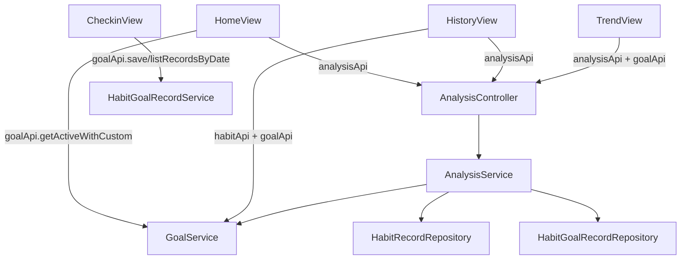

## 用户需求概述

将独立的「任务目标」页面功能迁移合并至首页，并围绕自定义任务目标对打卡页、历史记录页、趋势分析页进行体验升级，同时调整首页 hero 轮换的视觉表现。

## 核心功能

- 删除独立的任务目标页面与导航入口，把任务目标进度、目标达成环、色彩体系等功能完整并入首页。
- 首页 hero 轮播在「每日一语 / 目标达成」等文案轮换时，背景颜色随之切换；移除原有的摇摆浮动动效，仅保留定时轮换。
- 每日打卡页为自定义任务目标动态预留空位：新增自定义目标后自动渲染对应录入卡片，支持页内直接填写数值与备注并保存（调用自定义目标打卡接口）。
- 历史记录页同理为自定义目标动态增加展示列/卡片，并将原本单调的表格升级为「日历/卡片视图 + 趋势迷你图」的丰富展示。
- 趋势分析页按用户实际自定义目标动态追加对应趋势图表与雷达维度，数据来源于自定义目标打卡记录。

## 技术栈

- 前端：Vue3 + Vite + Vue Router + Element Plus + ECharts（vue-echarts）+ Tailwind CSS + 现有自建 Canvas 粒子组件
- 后端：Spring Boot 4 + Spring Data JPA + H2 + 分层架构（Controller / Service / Repository / Entity / VO）
- 复用既有：`api/goal.js`、`api/habit.js`、`api/analysis.js`、`constants/theme.js`（GRADIENTS / GOAL_COLORS / goalColor）、ParticleCanvas、后端 GoalController / HabitGoalRecordService / GoalService / AnalysisService

## 实现方案

### 总体策略

以「前端页面整合 + 后端分析接口动态化扩展」两条线推进。前端负责页面合并、hero 背景切换、自定义目标录入位与历史/趋势丰富化；后端负责让 `/api/analysis` 系列接口按用户真实 CUSTOM 目标动态生成维度（趋势序列、雷达维度、达成率维度），数据取自 `habit_goal_record`。

### 关键技术决策

1. **首页合并任务目标**：将原 GoalView 的进度环、色彩体系迁移为 HomeView 内的「目标达成」区块；hero 区保留轮换，但按 `heroSlides` 索引绑定 `GRADIENTS` 中的渐变（primary/sleep/water/exercise/mood/custom）切换背景，移除 `animate-float-slow` 类，仅用 `setInterval` 轮换。
2. **自定义目标录入（打卡页）**：CheckinView 在加载时调用 `goalApi.getActiveWithCustom()` 过滤 CUSTOM 类型，动态渲染录入卡片；保存复用 `goalApi.save(record)`，record 含 `goalId/goalType/recordDate/value/remark`。今日已有记录时回显（调用 `listRecordsByDate`）。
3. **历史记录丰富化**：HistoryView 新增「表格 / 日历卡片」视图切换；日历卡片按日期聚合当日各维度与自定义目标数值；顶部保留概览统计卡；每内置维度（睡眠/运动/饮水/饮食/心情）加 ECharts sparkline 迷你趋势图；自定义目标按列/卡片动态展示。
4. **趋势分析动态维度**：TrendView 在加载分析数据的同时拉取 `active-with-custom`，过滤 CUSTOM 目标，为每个目标动态生成一张趋势图（标题=displayName，颜色=goalColor），并调用扩展后的 `/api/analysis/radar` 拿到含自定义维度的雷达。
5. **后端分析动态化**：AnalysisService 新增/改造方法，使 Radar、Achievement、Trend 能接收 CUSTOM 目标列表，按 `HabitGoalRecordRepository.findByGoalIdAndRecordDateBetween` 聚合每个自定义目标的均值/趋势，而非把 CUSTOM 错误映射成心情。VO（RadarDataVO / TrendDataVO / AchievementRateVO）通过动态 List 维度支持可变长度。

### 性能与可靠性

- 前后端均通过 `Promise.all` 并发请求，避免串行阻塞。
- 后端聚合为纯内存计算（复用既有 Repository），无新增重查询；自定义目标数量通常较少，O(n*days) 可接受。
- ECharts 迷你图使用 `autoresize` 但限制高度（约 48-60px），避免重渲染开销。
- 自定义目标录入后局部刷新，不整页重载；保存失败沿用既有拦截器提示。

### 避免技术债务

- 完全复用现有 `goalColor`、GRADIENTS、api 封装与 VO，不新增配色体系或重复接口。
- 删除 `/goals` 路由后，所有「去任务目标」入口改为跳转 `/checkin` 或 `/ai-chat`，保持导航一致性。
- 后端仅在 AnalysisService 内扩展，不改变实体与既有内置目标逻辑。

## 实现注意事项

- `GoalController.getRecords` 当前用 `getRecent` 按天数近似，前端按日期范围查询时应确保后端按 startDate~endDate 精确过滤（必要时微调 getRecords 实现，使用 `findByUserIdAndRecordDateBetween`）。
- hero 背景切换需与文案同步（同一索引对应同一渐变），过渡用 CSS `transition: background` 平滑。
- 历史记录日历视图需处理无记录日期的空态，避免布局塌陷。
- 所有改动保持 Tailwind 玻璃拟态 + 渐变风格统一。

## 架构设计



## 目录结构与文件清单

```
frontend/src/
├── router/index.js                 # [MODIFY] 删除 /goals 路由条目
├── layouts/MainLayout.vue          # [MODIFY] 移除「任务目标」导航；粒子密度改为趋势页 heavy
├── constants/theme.js              # [复用] GRADIENTS/GOAL_COLORS/goalColor（无需改动）
├── api/goal.js                     # [复用] getActiveWithCustom/save/listRecordsByDate
├── api/analysis.js                 # [MODIFY] 按需补充自定义维度接口（若后端扩展）
├── views/
│   ├── HomeView.vue                # [MODIFY] 合并任务目标区块；hero 背景随轮换切换；去 animate-float-slow
│   ├── GoalView.vue                # [DELETE] 删除独立任务目标页
│   ├── CheckinView.vue             # [MODIFY] 底部动态渲染自定义目标录入卡片（页内保存）
│   ├── HistoryView.vue             # [MODIFY] 表格/日历卡片视图切换 + 概览卡 + 迷你趋势图 + 自定义目标列
│   └── TrendView.vue               # [MODIFY] 动态追加自定义目标趋势图；雷达含自定义维度
src/main/java/com/habit/agent/
├── controller/AnalysisController.java   # [MODIFY] 透传 days，委托 Service 动态聚合
├── service/AnalysisService.java         # [MODIFY] Radar/Achievement/Trend 动态纳入 CUSTOM 目标
├── service/HabitGoalRecordService.java  # [复用] getByGoalIdRecent/calcAverage
├── common/vo/RadarDataVO.java           # [MODIFY] 支持动态 indicators/values（已兼容）
└── common/vo/TrendDataVO.java           # [MODIFY] 预留自定义目标序列扩展字段
```

## 关键代码结构（后端 VO 扩展示意）

```java
// TrendDataVO 增加自定义目标动态序列
private List<CustomTrendSeries> customSeries; // goalId, name, color, data(List<BigDecimal>)

// RadarDataVO 已支持动态 indicators/values/targets，无需改结构
// AchievementRateVO.DimensionRate 已支持 label/target/actual/rate，无需改结构
```

## 设计风格

延续现有玻璃拟态 + 流动渐变美学，整体保持青绿→靛蓝→紫的科技通透感。首页 hero 取消摇摆，改为随文案轮换平滑切换渐变背景（primary/sleep/water/exercise/mood/custom），营造「每日一语 / 目标达成」等不同氛围。任务目标区块以进度环 + 类型色卡呈现，色彩体系说明保留为轻量色板。打卡页自定义目标录入卡与内置模块同款玻璃风，自动占位。历史记录页新增日历卡片视图（按日期聚合、悬停高亮）与顶部概览卡、维度迷你 sparkline。趋势页图表网格按自定义目标数量动态扩展，保持统一玻璃卡片间距。

## 页面规划

1. 首页：hero 轮换（背景换色）、四统计卡、心情饼图+趋势折线、目标达成进度区（合并自目标页）、习惯贴士横滑。
2. 每日打卡：内置模块 + 底部自定义目标动态录入卡（页内保存）。
3. 历史记录：概览卡 + 视图切换（表格/日历卡片）+ 维度迷你趋势图 + 自定义目标动态列。
4. 趋势分析：内置四图 + 自定义目标动态追加图 + 雷达（含自定义维度）。