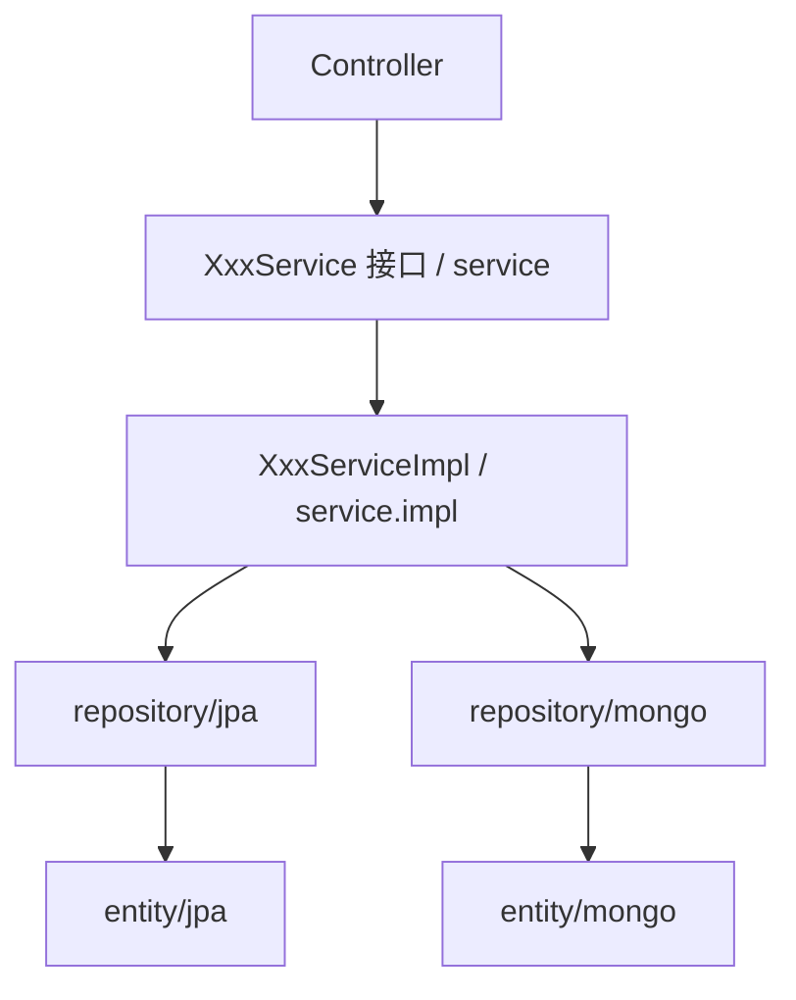

## 用户需求

将 service 包下的实现类统一移入新建的 `service/impl` 子包中（平铺，不再按模块二次分包），使项目分层结构更清晰规范。

## 关于"两个 jpa"的说明

项目中实际存在 `entity/jpa`（JPA 实体）与 `repository/jpa`（JPA Repository）两个包，这是按**持久化技术**分组的常规工程实践，并非重复或错误。项目同时使用了关系型数据库（JPA）与文档数据库（MongoDB），因此实体与仓储分别归入 `jpa` / `mongo` 子包加以区分。用户确认**保留现状，不做改动**。

## 核心改动

- 新建包 `com.habit.agent.service.impl`
- 将 6 个 `XxxServiceImpl` 文件移入该包，更新其 `package` 声明
- 更新所有引用这些实现类的 import（主要为 5 个 Controller，以及互相注入处）包路径
- Spring 按类型装配，bean 名称与 `@Service` 注解无需改动

## 技术栈

- 后端：Spring Boot 4 + Java，Spring Data JPA / Spring Data MongoDB
- 构建：Maven（`mvn -q compile` 验证）

## 实现方案

将 `service/` 下的 6 个实现类（`AnalysisServiceImpl`、`ChatServiceImpl`、`GoalServiceImpl`、`HabitGoalRecordServiceImpl`、`HabitServiceImpl`、`SessionServiceImpl`）移动到新建的 `service/impl/` 包，每个文件顶部 `package com.habit.agent.service.impl;`。接口类（`XxxService.java`）保留在 `service/` 包。

关键决策：

1. **仅移动实现类、接口不动**：符合"接口与实现分离"的标准分层，Controller 依赖接口而非实现，改动影响面最小。
2. **impl 下平铺**：用户明确选择不二次分包，避免不必要的目录深度。
3. **不动 entity/jpa 与 repository/jpa**：按用户确认保留现状，二者职责不同（实体 vs 仓储），非冗余。
4. **Spring 注入不受影响**：`@Autowired`/`@Resource`/构造器注入均按类型解析，`@Service` 默认 bean 名仍为类名（首字母小写），移动包不影响装配。

## 执行注意

- 全量搜索 `import com.habit.agent.service.*ServiceImpl`，逐一更新为 `import com.habit.agent.service.impl.*ServiceImpl`，避免遗漏导致编译失败。
- 使用 git 移动（IDE 重构或 `git mv`）以保留文件历史；在 git 中表现为 delete+add。
- 移动后执行 `mvn -q compile` 确认 exitCode 为 0。
- 不改动任何业务逻辑、方法签名、注解，仅调整包声明与 import。

## 架构设计

保持现有分层不变：
Controller → Service 接口（service/）→ ServiceImpl（service/impl/）→ Repository（repository/jpa、repository/mongo）→ Entity（entity/jpa、entity/mongo）。



## 目录结构

```
src/main/java/com/habit/agent/
├── service/
│   ├── AnalysisService.java          # [保留] 接口，package 不变
│   ├── ChatService.java              # [保留] 接口
│   ├── GoalService.java              # [保留] 接口
│   ├── HabitGoalRecordService.java   # [保留] 接口
│   ├── HabitService.java             # [保留] 接口
│   ├── SessionService.java           # [保留] 接口
│   └── impl/                         # [新建] 实现类子包
│       ├── AnalysisServiceImpl.java      # [MOVE] package 改为 service.impl
│       ├── ChatServiceImpl.java          # [MOVE] package 改为 service.impl
│       ├── GoalServiceImpl.java          # [MOVE] package 改为 service.impl
│       ├── HabitGoalRecordServiceImpl.java # [MOVE] package 改为 service.impl
│       ├── HabitServiceImpl.java         # [MOVE] package 改为 service.impl
│       └── SessionServiceImpl.java       # [MOVE] package 改为 service.impl
├── controller/                       # [MODIFY] 更新引用 XxxServiceImpl 的 import
│   ├── AnalysisController.java
│   ├── ChatController.java
│   ├── GoalController.java
│   ├── HabitController.java
│   └── SessionController.java
├── entity/jpa/                       # [保留] 不改动
├── entity/mongo/                     # [保留] 不改动
├── repository/jpa/                   # [保留] 不改动
└── repository/mongo/                 # [保留] 不改动
```