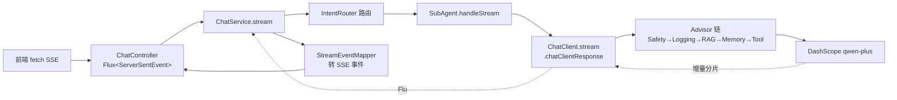

## 用户需求

将当前「生活习惯助手 Agent」项目中被降级为「方案 B：一次性伪 SSE 输出」的 AI 对话能力，改造为 **Spring AI 2.0.0 官方标准的真流式输出**，并按 2.0.0 的架构变更对现有代码做一次系统性对齐与升级。

用户明确否决了「工具轮次非流式 + 最终回复流式」的折中方案，要求采用官方文档所述的、常规的流式用法；接口层要求从 `SseEmitter` + 手工拼 JSON 改为 `Flux<ServerSentEvent>` 响应式写法；并要求一并落地 Token 统计、真实停止生成、子 Agent 流式化、错误处理与重试四项优化。

## 产品概述

AI 对话页在用户提问后，回复以**逐字打字机效果**实时呈现，而不再是等待数秒后整段弹出。当 AI 需要查询打卡数据、统计达成率或执行打卡时（工具调用轮次），页面显示「正在查询数据…」的状态提示，工具执行完毕后最终回复继续逐字流出。用户可随时点击「停止生成」立即中断输出，已输出内容保留。对话结束后展示本轮 Token 消耗与耗时。

## 核心功能

### 1. 真流式对话输出

- 后端基于 Spring AI 2.0.0 `ChatClient.stream()` 输出真实增量文本流。
- 支持纯文本轮次与工具调用轮次两种场景，工具调用循环由框架自动完成，最终回复真流式逐字输出。
- 首字延迟显著降低，用户可见 AI「边想边说」。

### 2. 响应式 SSE 接口

- 对话接口返回标准 SSE 事件流，事件体由结构化对象序列化产生，不再手工拼接字符串。
- 事件类型：会话元信息、文本增量、工具调用状态、结束汇总、错误。
- 前端沿用现有解析逻辑，事件协议保持向后兼容。

### 3. 停止生成

- 用户点击停止后，服务端真正中断上游模型调用并释放连接，而非继续消费后丢弃。
- 中断时正常下发结束事件，已生成内容完整保留至对话记忆。

### 4. Token 统计与可观测

- 结束事件返回本轮真实的输入/输出/总 Token 数与耗时。
- 日志记录会话 ID、意图路由结果、工具调用次数、Token 用量与首字延迟。

### 5. 多智能体流式路由

- 数据分析、改善建议、闲聊三个子智能体均支持流式输出，路由结果通过元信息事件告知前端。

### 6. 错误处理与重试

- 模型超时、网络抖动、知识库不可用等异常统一转为错误事件下发，并对可重试异常做有限次退避重试。
- 任一环节失败均不影响已输出内容，且对话记忆保持一致。

### 7. 视觉效果

- 对话气泡内文本逐字追加，底部光标闪烁；工具调用期间显示带图标的状态条；停止按钮在生成期间替换发送按钮；消息底部以浅色小字展示 Token 与耗时。

## 一、技术栈（沿用现有，不引入新框架）

| 层次 | 技术 | 说明 |
| --- | --- | --- |
| 框架 | Spring Boot 4.1.0 + Java 21 | 现有 |
| AI | Spring AI 2.0.0（BOM 统一版本） | 现有 |
| 模型 | 通义千问 DashScope（OpenAI 兼容模式，qwen-plus） | 现有 `spring-ai-starter-model-openai` |
| 流式栈 | `spring-boot-starter-webflux`（Reactor） | pom 已含，官方要求「Streaming is only supported via the Reactive stack」 |
| 记忆 | `spring-ai-starter-model-chat-memory-repository-mongodb` | 现有 |
| RAG | `spring-ai-rag` + MongoDB Atlas VectorStore | 现有 |
| 序列化 | Jackson（Spring Boot 内置） | 替代手工拼 JSON |
| 前端 | Vue3 + Vite + fetch/ReadableStream | 现有 `frontend/src/api/chat.js` |


**不新增任何 Maven 依赖。**

---

## 二、根因诊断（本次改造的技术依据）

经核对 Spring AI 2.0.0 官方文档（`chatclient.html` / `tools.html` / `upgrade-notes.html`）与项目代码，此前判定「真流式在工具调用场景不可用」的结论**不成立**，真实原因有三：

### 根因 1：Advisor order 与自动注册的 ToolCallingAdvisor 冲突（核心）

官方文档明确：`ToolCallingAdvisor` 默认 order 为 `Ordered.HIGHEST_PRECEDENCE + 300`。而项目 `SafeRetrievalAdvisor.getOrder()` 返回的**恰好也是 `HIGHEST_PRECEDENCE + 300`**。

order 相同导致两者相对顺序未定义。当 `SafeRetrievalAdvisor` 排在 `ToolCallingAdvisor` 之前时，**整个工具调用循环被包进了 `SafeRetrievalAdvisor.adviseStream` 的 `onErrorResume` 里**：

```java
return delegate.adviseStream(request, chain)
        .onErrorResume(e -> chain.nextStream(request));  // 危险：重入整条下游链
```

工具循环内部任何一次瞬时异常都会被静默吞掉，并 `chain.nextStream(request)` **重新进入下游链**，造成流式输出错乱、重复、或提前终止。这正是被误记为「ChunkMerger 崩溃」的表象来源。

### 根因 2：把官方预期行为误判为故障

2.0.0 已**彻底移除** `streamToolCallResponses` 选项。官方说明其原因为：中间工具调用块下推但配对的 `ToolResponseMessage` 未下推，会污染 memory advisor 历史，属设计缺陷不可修复。

因此**工具调用轮次不发出中间文本分片、只流式输出最终回复，是 2.0.0 的预期行为**。项目此前观察到「工具轮次流式无输出」，将其判定为故障并退回非流式，属误判。

### 根因 3：治标式配置掩盖了真因

`parallelToolCalls(false)` 是针对「ChunkMerger 缺 index」理论的治标手段。在 order 冲突修复后应恢复默认值重新评估，避免长期牺牲多工具并行能力。

**结论**：修复 order 冲突 + 收敛 `onErrorResume` 语义后，采用官方标准 `.stream()` 即可正常工作，无需任何伪流式/降级代码。

---

## 三、实现方案

### 3.1 总体策略

采用**官方 Framework-Controlled 模式**（文档推荐）：保留 `ToolCallingAdvisor` 自动注册，工具循环全交由框架处理，业务侧只需调用 `.stream().chatClientResponse()`。**不采用** User-Controlled 手动聚合模式——后者需自行用 `ChatClientMessageAggregator` 聚合、判断 `hasToolCalls()`、调 `ToolCallingManager.executeToolCalls` 并回灌历史，复杂度高、易与 ChatMemory 冲突，且官方仅在需要观测每轮迭代时才推荐。

选择 `.stream().chatClientResponse()` 而非 `.content()`，因为需要同时拿到：

- 增量文本 → 下发 chunk 事件
- `ChatResponseMetadata.Usage` → Token 统计
- `ChatClientResponse.context()` → RAG 检索文档、路由意图等上下文

### 3.2 Advisor 链 order 重排（关键修复）

| order | Advisor | 说明 |
| --- | --- | --- |
| HIGHEST+10 | `SafetyFilterAdvisor` | 前置拦截，不变 |
| HIGHEST+20 | `LoggingAdvisor` | 全链路观测，不变 |
| HIGHEST+150 | `SafeRetrievalAdvisor` | **由 +300 前移至 +150** |
| HIGHEST+200 | `MessageChatMemoryAdvisor` | 官方常量，不变 |
| HIGHEST+300 | `ToolCallingAdvisor`（框架自动） | 保持独占该 order |


**前移理由**：RAG 增强属于「查询改写」阶段，应在记忆与工具之前完成；置于 +150 后，`SafeRetrievalAdvisor` 的异常兜底范围**仅覆盖检索本身**，不再包裹工具循环，从根本上消除重入风险。

同时收敛 `onErrorResume` 语义：仅在检索阶段异常时降级，改用「先执行检索、失败则以原始 request 继续」的写法，避免 `chain.nextStream` 二次重入。

### 3.3 流式数据流



### 3.4 SSE 事件协议（向后兼容）

沿用现有 5 类事件名，仅将 data 由手工字符串改为 Jackson 序列化的 record：

| 事件 | 字段 | 变更 |
| --- | --- | --- |
| `meta` | conversationId, timestamp, model, **intent** | 新增 intent（路由意图） |
| `chunk` | content, index | 语义变为**真增量分片** |
| `tool_call` | status, message, **toolName** | 恢复发出（工具轮次） |
| `done` | conversationId, **promptTokens, completionTokens, totalTokens**, duration, **firstTokenLatency**, streaming_mode | totalTokens 变为真实值；streaming_mode 固定 `"streaming"` |
| `error` | errorCode, message, conversationId, **retryable** | 新增 retryable |


前端仅需移除 `one_shot` 相关注释、新增 Token 展示，解析逻辑不动。

### 3.5 停止生成机制

废弃 `ConcurrentHashMap<String, Boolean>` 轮询标志，改用响应式信号：

- 以 `Sinks.Many<Void>`（或 `Sinks.Empty`）按 conversationId 注册停止信号，配 `Map` 管理生命周期。
- 主流 `.takeUntilOther(stopSink.asFlux())` —— 信号到达即**真正取消上游订阅**，切断与 DashScope 的 HTTP 连接，停止计费。
- `doFinally` 中清理 Map 条目，防内存泄漏。
- 中断时补发 `done` 事件（携带已产出 Token 数）。

### 3.6 Token 统计

从 `ChatClientResponse.chatResponse().getMetadata().getUsage()` 提取。注意：流式下 Usage 通常仅在**最后一个分片**携带，需用 `AtomicReference` 暂存最后一次非空 Usage，在 `doOnComplete` 时汇总下发。首字延迟用 `AtomicLong` 记录首个非空 chunk 时间戳。

### 3.7 子 Agent 流式化

`SubAgent` 接口新增 `Flux<ChatClientResponse> handleStream(String message, String conversationId)`，`handle()` 保留供非流式接口与报告生成复用。

三个子 Agent 的 system 提示词与 `advisors(...CONVERSATION_ID...)` 参数完全复用，仅将 `.call().content()` 换为 `.stream().chatClientResponse()`。为消除三处重复，抽取受保护的模板方法到新增抽象基类 `AbstractSubAgent`（DRY），子类只提供 system 提示词与角色名。

### 3.8 错误处理与重试

- 新建 `ChatStreamException`（继承现有 `AiCallException` 体系），携带 errorCode 与 retryable 标记。
- 对可重试异常（超时、5xx、连接重置）使用 `Retry.backoff(2, Duration.ofSeconds(1))` + `filter` 限定类型；不可重试异常（4xx、鉴权失败、安全拦截）直接透传。
- 全局超时 `.timeout(Duration.ofSeconds(120))`，超时转 `AI_TIMEOUT` 错误事件。
- `onErrorResume` 统一转为 `error` 事件下发而非断开连接，保证前端能收到明确原因。

---

## 四、实现注意事项

1. **ChatMemory conversationId 必填**：2.0.0 已移除 `DEFAULT_CONVERSATION_ID` 常量与 `.conversationId()` 构建器方法。所有子 Agent 现有的 `a.param(ChatMemory.CONVERSATION_ID, cid)` 写法正确，改造时务必保留；`reportChatClient` 不挂 memory advisor 的现有设计也需保留。

2. **`@Tool` 方法不得返回 Flux/Mono/Optional/CompletableFuture**。现有 14 个工具方法均返回 String/POJO，符合约束，**本次不改动任何工具类**。

3. **`ToolAdvisor` 标记接口**：若后续需自定义工具生命周期 advisor，必须实现该接口，否则 `DefaultChatClient` 会重复注册。本次不涉及。

4. **Servlet 与 Reactive 共存**：项目同时含 web 与 webflux，仍以 Tomcat 启动。`@RestController` 返回 `Flux<ServerSentEvent>` 在 Servlet 栈下由 Spring MVC 通过 `ReactiveTypeHandler` 适配，可正常工作，**无需改为 WebFlux 启动**，不影响其余 8 个 Controller。

5. **阻塞调用隔离**：`ensureSession` / `touchSession` 含 MongoDB 同步写。在响应式链中必须包 `Mono.fromCallable(...).subscribeOn(Schedulers.boundedElastic())`，严禁在 Reactor 线程直接阻塞。

6. **限流兼容**：`RateLimitInterceptor` 作用于 `/api/chat`，改造后路径不变，拦截器无需调整；但需确认其对 SSE 长连接不做超时误判。

7. **日志防刷屏**：`LoggingAdvisor` 在流式下会对每个分片触发。须仅在 `doOnComplete` 记录一次汇总（Token/耗时），分片级日志降为 TRACE，避免高频日志拖慢流。

8. **爆炸半径控制**：本次仅改动 chat 相关链路。`AiAnalysisServiceImpl`（`reportChatClient` + `@Async` + `.entity()`）与 `RagServiceImpl` **不改动**；`/api/chat`（非流式 POST）保留，作为流式失败时前端可切换的兜底。

9. **`parallelToolCalls` 复评**：order 修复后先在探针中恢复默认值验证；若 DashScope 确有分片 index 缺失问题再改回 false，并在注释中记录实测结论而非推测。

10. **探针测试重写**：`StreamingProbeTest` 现有断言基于「方案 B」假设，须改为验证真流式：分片数 > 1、首字延迟 < 3s、工具轮次能拿到最终文本、Usage 非空。用 `StepVerifier`（reactor-test 已在 pom）。

---

## 五、目录结构

```
d:/javacode/agent_demo/
├── src/main/java/com/habit/agent/
│   ├── config/
│   │   └── ChatClientConfig.java          # [MODIFY] 移除过时注释（streamToolCallResponses/ChunkMerger 推测）；
│   │                                      #   复评 parallelToolCalls；更新 Advisor order 顺序表文档；
│   │                                      #   确认 defaultTools 触发 ToolCallingAdvisor 自动注册
│   ├── controller/
│   │   └── ChatController.java            # [MODIFY] /stream 由 SseEmitter 改为 Flux<ServerSentEvent<Object>>；
│   │                                      #   删除手工拼 JSON 与 jsonStr()；删除 stopFlags 轮询；
│   │                                      #   /stop 改为触发 StopSignalRegistry 信号；保留其余 4 端点
│   ├── service/
│   │   ├── ChatService.java               # [MODIFY] stream() 返回类型改为 Flux<ChatStreamEvent>，
│   │   │                                  #   承载 meta/chunk/tool_call/done/error 语义；chat() 保留
│   │   └── impl/
│   │       └── ChatServiceImpl.java       # [MODIFY] 删除"方案 B"一次性输出逻辑与相关类注释；
│   │                                      #   stream() 走 IntentRouter → SubAgent.handleStream；
│   │                                      #   接入 Token 汇总、首字延迟、停止信号、超时重试；
│   │                                      #   ensureSession/touchSession 包 boundedElastic
│   ├── agent/
│   │   ├── advisor/
│   │   │   └── SafeRetrievalAdvisor.java  # [MODIFY] getOrder 由 HIGHEST+300 改为 HIGHEST+150（消除与
│   │   │                                  #   ToolCallingAdvisor 的 order 冲突）；收敛 onErrorResume，
│   │   │                                  #   避免 chain.nextStream 重入下游链
│   │   ├── advisor/LoggingAdvisor.java    # [MODIFY] 流式下分片级日志降 TRACE，仅完成时记一次
│   │   │                                  #   Token/耗时汇总，防日志刷屏
│   │   └── router/
│   │       ├── SubAgent.java              # [MODIFY] 新增 handleStream(message, conversationId)
│   │       │                              #   返回 Flux<ChatClientResponse>；保留 handle()
│   │       ├── AbstractSubAgent.java      # [NEW] 抽象基类，封装 prompt 构建、CONVERSATION_ID 注入、
│   │       │                              #   call/stream 双模板与统一异常降级；子类仅提供
│   │       │                              #   systemPrompt() 与 roleName()，消除三处重复
│   │       ├── DataAnalysisAgent.java     # [MODIFY] 继承 AbstractSubAgent，仅保留 system 提示词
│   │       ├── SuggestionAgent.java       # [MODIFY] 同上
│   │       └── ChatAgent.java             # [MODIFY] 同上
│   └── common/
│       ├── vo/
│       │   └── ChatStreamEvent.java       # [NEW] SSE 事件载体（sealed interface + 5 个 record：
│       │                                  #   Meta/Chunk/ToolCall/Done/Error），由 Jackson 序列化，
│       │                                  #   字段与 PRD 协议一致并向后兼容
│       ├── stream/
│       │   └── StopSignalRegistry.java    # [NEW] 按 conversationId 管理 Sinks 停止信号，
│       │                                  #   提供 register/stop/cleanup；含 TTL 兜底防泄漏
│       └── exception/
│           └── ChatStreamException.java   # [NEW] 流式异常，携带 errorCode 与 retryable 标记，
│                                          #   供重试过滤与 error 事件生成
├── src/main/resources/
│   └── application.yml                    # [MODIFY] 复评 parallel-tool-calls；补充流式超时与
│                                          #   日志级别（com.habit.agent.agent.router=DEBUG）
├── src/test/java/com/habit/agent/
│   └── StreamingProbeTest.java            # [MODIFY] 重写为真流式验证：用 StepVerifier 断言
│                                          #   分片数>1、首字延迟、工具轮次可用、Usage 非空
├── frontend/src/
│   ├── api/chat.js                        # [MODIFY] 更新注释（移除 one_shot 说明）；恢复
│   │                                      #   onToolCall 生效；done 回调解析真实 Token 字段
│   └── views/AiChatView.vue               # [MODIFY] 逐字追加渲染 + 光标闪烁；工具调用状态条；
│                                          #   生成期间显示停止按钮；消息底部展示 Token 与耗时
└── PRD/
    └── 详细模块开发流程.md                 # [MODIFY] 阶段五 5-2 更新为真流式已落地；记录 order
                                            #   冲突根因与官方文档依据；追加修订记录
```

---

## 六、关键代码结构

```java
// common/vo/ChatStreamEvent.java —— SSE 事件契约（Jackson 序列化，字段名对齐前端）
public sealed interface ChatStreamEvent {
    String eventName();

    record Meta(String conversationId, String timestamp,
                String model, String intent) implements ChatStreamEvent {}

    record Chunk(String content, int index) implements ChatStreamEvent {}

    record ToolCall(String status, String message, String toolName) implements ChatStreamEvent {}

    record Done(String conversationId, Integer promptTokens, Integer completionTokens,
                Integer totalTokens, long duration, Long firstTokenLatency,
                String streamingMode) implements ChatStreamEvent {}

    record Error(String errorCode, String message,
                 String conversationId, boolean retryable) implements ChatStreamEvent {}
}

// agent/router/SubAgent.java —— 新增流式能力
public interface SubAgent {
    String handle(String message, String conversationId);
    Flux<ChatClientResponse> handleStream(String message, String conversationId);
    IntentRouter.Intent intent();
    String roleName();
}

// common/stream/StopSignalRegistry.java —— 响应式停止信号
public interface StopSignalRegistry {
    Flux<Void> register(String conversationId);
    void stop(String conversationId);
    void release(String conversationId);
}
```

## Agent Extensions

### SubAgent

- **code-explorer**
- Purpose: 在改造前完整梳理 `ChatServiceImpl`、`ChatController`、三个子 Agent、四个 Advisor 之间的调用链与 order 依赖关系，确认无遗漏的 `.call()` 调用点与受影响的 Controller
- Expected outcome: 输出精确的改造点清单（文件路径 + 行号 + 现状代码），确保 order 重排与流式化不遗漏任何调用方，且不误伤 `AiAnalysisServiceImpl` / `RagServiceImpl`

### Skill

- **webapp-testing**
- Purpose: 改造完成后驱动浏览器实际访问 AI 对话页，验证逐字流式渲染、工具调用状态提示、停止生成按钮、Token 展示的真实表现
- Expected outcome: 截图与浏览器日志证明前端确实收到多条 chunk 事件（而非单条），打字机效果生效，停止按钮可即时中断输出