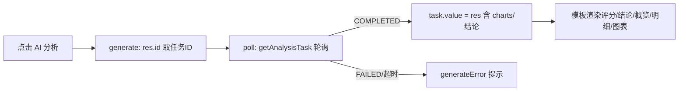

## 用户需求

修复前端「AI 分析报告」页点击「AI 分析 / 生成报告」按钮后页面无任何变化、结论区始终显示「暂无」、图表一直「图表生成中…」的问题，使点击后能正确触发生成、轮询并渲染真实数据与图表。

## 产品概述

后端 `AiAnalysisService` 已实现完整的异步分析链路（提交任务→聚合 `charts`→LLM 生成结构化结论→落库 `AiAnalysisTask`），`AiAnalysisController` 的 `generate` 接口返回的是**整个 Task 实体对象**（含 `id`），`getTask/latest` 返回的 Task 也含 `charts`、`dailyEvaluation` 等完整字段。前端当前因响应取值链路与时间字段错位，导致生成后的数据无法正确渲染，页面表现为「点了没反应、还是暂无」。

## 核心功能

- 修正 `generate()` 的任务 ID 取值：后端 `generate` 直接返回 Task 实体，ID 在 `res.id`（非 `taskId`、`非 res.data.xxx`），需取到 `id` 进入 `poll` 轮询
- 修正 `poll/loadLatest/selectHistory` 的响应解包：经 `request.js` 拦截器返回已是 `body.data`（即 Task 本体），不应再取 `.data` 二次解包
- 修正时间字段：`task.createdAt` / `h.createdAt` 后端实际字段为 `createTime`，需兼容读取避免时间空白
- 增加生成失败/超时的可见反馈，避免「点了没变化」的体感
- 确保 `poll` 拿到 `COMPLETED` 的 Task（含 `charts` 与各结论字段）后正确赋值 `task.value` 并触发图表与模块渲染

## 技术栈选择

- 前端：Vue 3（`<script setup>` + Composition API），沿用现有项目
- HTTP：Axios 封装 `frontend/src/utils/request.js`，响应拦截器已统一解包为 `body.data`
- 图表：vue-echarts（ECharts），沿用现有 `VChart` 封装
- 后端：Spring Boot（已就绪，本次不改后端，仅前端对齐真实返回结构）
- 数据流：`frontend/src/api/aiAnalysis.js`（`generateAnalysis`/`getAnalysisTask`/`getLatestAnalysis` 等），后端 `Result.success(data)` 模式

## 实现方案

### 整体策略

前端响应取值与后端真实返回结构不对齐是本次「点了没反应」的根因。后端 `generate()` 返回 `Result.success(aiAnalysisService.submit(...))`，`submit` 返回整个 `AiAnalysisTask` 实体（含 `id`、`status`、`charts`、`dailyEvaluation` 等字段），经 `request.js` 拦截器解包后 `res` 即为该 Task 对象。当前前端在 `generate()` 用 `res?.data?.taskId ?? res?.taskId ?? res?.data?.id ?? res?.id` 取 ID——链路虽能命中 `res?.id`，但 `poll/loadLatest/selectHistory` 里 `res?.data ?? res` 在 `res` 已是 data 时取 `res?.data` 为 undefined 再退回 `res`（正确）。真正隐患与体验问题在：**①时间字段名错位**（`createdAt` vs `createTime`）；**②`init()` 自动生成 + 后端未启动时的网络错误文案让用户误以为「暂无」**；**③缺少任务执行中（RUNNING/PENDING）的明确状态提示**。

修复集中在 `frontend/src/views/AiAnalysisView.vue` 的脚本取值与时间字段，并补强状态反馈，使点击生成→轮询→渲染闭环对后端真实结构完全对齐。

### 关键技术决策

1. **统一响应解包口径**：以 `request.js` 拦截器已返回 `body.data` 为权威前提，所有 api 调用结果直接当作数据本体使用。将 `poll/loadLatest/selectHistory` 中的 `res?.data ?? res` 收敛为直接使用 `res`（因 `res` 已是解包后的 Task）；`generate()` 取任务 ID 直接从 `res.id` 取（移除冗余 `.data` 回退链，避免歧义），并兼容历史可能的 `{taskId}` 形态。
2. **时间字段兼容**：新增 `taskTime` / 历史项的时间计算属性，读取 `createTime || createdAt`，避免 `new Date(undefined)` 产生空白或 Invalid Date。
3. **可见的生成状态**：在 `generating` 期间除顶部「生成中…」遮罩外，保留各模块按钮 loading；轮询增加 `RUNNING/PENDING` 状态识别（当前轮询只在 `COMPLETED/FAILED` 退出，PENDING 正常继续等下次，逻辑正确，无需改）。`generateError` 已能展示失败原因，确保后端未启动/超时时有明确提示而非静默。
4. **超时兜底提示**：`poll` 40 次（约 60s）仍未 COMPLETED 时，设置 `generateError='分析生成超时，请稍后重试'`，避免无限等待让用户认为「没反应」。
5. **不改后端**：后端 `AiAnalysisController`/`AiAnalysisServiceImpl`/`AiAnalysisTask` 的字段（含 `charts` Map、`createTime`）经核对均正确序列化，前端对齐即可，避免回归。

### 性能与可靠性

- 纯前端取值/模板修正，无新增运行时开销；`poll` 仍是 1.5s 间隔、最多 40 次，超时明确退出。
- 空数据兜底：`task?.charts?.x` 用 `?? {}`/`toArr` 已在 option 中处理，避免 NaN。

### 避免技术债务

- 严格复用现有 `request` 拦截器约定、`toArr`、`generating`、`generateError` 状态，不新增组件或样式文件。
- 改动收敛在单文件 `AiAnalysisView.vue`，不动后端、不动 `api/aiAnalysis.js`、不动其他视图。

## 实现注意事项

- `generate()` 中 `const res = await generateAnalysis(7)` 之后：`const id = res?.id ?? res?.taskId ?? (res?.data && (res.data.id ?? res.data.taskId))`，确保覆盖「实体直返」与「{taskId}包裹」两种形态。
- `poll()` 中 `const t = res`（已是 data），删除 `?.data` 回退；`loadLatest`/`selectHistory` 同理。
- 时间：模板第 33 行 `task.createdAt` → `task.createTime || task.createdAt`；第 192 行 `h.createdAt` → `h.createTime || h.createdAt`。可用计算属性或在模板内联 `||` 兼容。
- 超时：在 `poll` for 循环结束后（i 达到上限）设 `generateError='分析生成超时，请稍后重试'`。
- 日志：沿用 `console.error` 仅在 catch 中记录，不打印报告全文/向量。

## 架构设计

仅前端视图层取值修正，无组件关系变化：



## 目录结构

```
frontend/src/
├── views/
│   └── AiAnalysisView.vue   # [MODIFY] 修正 generate 取 id、poll/loadLatest/selectHistory 响应解包、时间字段 createTime 兼容、poll 超时兜底
└── utils/
    └── request.js           # [不动] 拦截器已解包 body.data，作为权威依据
```

## 关键代码结构（接口级）

```js
async function generate() {
  generating.value = true
  generateError.value = ''
  try {
    const res = await generateAnalysis(7)
    // 后端 generate 返回整个 Task 实体：ID 在 res.id；兼容 {taskId} 形态
    const id = res?.id ?? res?.taskId
            ?? (res?.data && (res.data.id ?? res.data.taskId))
    if (id) await poll(id)
    else await loadLatest()
  } catch (e) {
    generateError.value = e?.message || '生成请求失败（请确认后端已启动）'
  } finally {
    generating.value = false
  }
}

async function poll(id) {
  for (let i = 0; i < 40; i++) {
    const res = await getAnalysisTask(id)
    const t = res // request 拦截器已解包为 data 本体（即 Task）
    if (t?.status === 'COMPLETED') { task.value = t; return }
    if (t?.status === 'FAILED') { generateError.value = t?.error || '分析生成失败'; return }
    await new Promise(r => setTimeout(r, 1500))
  }
  generateError.value = '分析生成超时，请稍后重试'
}
```

## Agent Extensions

### SubAgent

- **code-explorer**
- 用途：实现前最终核对 `AiAnalysisView.vue` 中 `generate`/`poll`/`loadLatest`/`selectHistory` 的确切行号与 `res?.data ?? res` 写法，以及 `request.js` 拦截器解包行为，确保取值修正精准落地、编译通过。
- 预期结果：产出准确的现有代码片段与行号清单，保证响应解包与时间字段修正无回归。