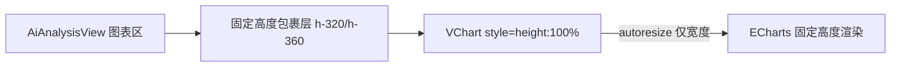

## 用户需求

前端「AI 分析报告」页面中，「趋势分析」与「维度达成率」两个图表模块存在展示 bug：图表会一直往下拉长，导致页面高度失控。

## 产品概述

修复 AiAnalysisView 图表区的布局缺陷——三个可视化图表（趋势分析 line、维度达成率 pie、能力雷达 radar）因 VChart 容器缺少确定高度，在 `fade` 过渡与滚动容器叠加环境下触发「无限测量→撑高」循环，使趋势分析与达成率两块无限拉长。

## 核心功能

- 为「趋势分析」「维度达成率」图表容器设置固定高度（320px），为「能力雷达」设置固定高度（360px），阻断 VChart 自适应撑高循环
- 占位分支（图表未生成时）高度与对应图表高度对齐，避免显隐切换时高度跳动
- 保留 `autoresize`（仅宽度自适应），高度固定后不再引发无限拉伸
- 不改动后端、API、图表 option 计算逻辑与既有视觉风格

## 技术栈选择

- 前端框架：Vue 3（`<script setup>` + Composition API），沿用现有项目
- 图表库：vue-echarts（基于 ECharts），沿用现有 `VChart` 封装
- 样式方案：Tailwind CSS（已有 `glass-card` 工具类）+ 少量 scoped 样式
- 数据流：不改后端 `/api/ai-analysis/*` 与 `src/api/aiAnalysis.js`

## 实现方案

### 整体策略

问题根因是 `AiAnalysisView.vue` 图表区（第 80–106 行）的三个 `<VChart>` 标签直接放在 `<div class="glass-card p-4">` 内，父容器无确定高度；VChart（vue-echarts）在容器无显式高度时会按"自适应内容"策略反复测量，叠加 `MainLayout` 的 `fade` 过渡（`transform: translateY`）与 `main` 滚动容器，触发「测量→撑高→resize→再撑高」死循环，趋势分析（line）与维度达成率（pie）因此无限拉长。

修复方式：为三个图表块增加一个**固定高度的图表包裹层**，将 `VChart` 放入其中（`style="height:100%"` 或包裹层直接给高度），使 VChart 获得确定渲染高度，`autoresize` 仅在宽度变化时触发，循环即被阻断。

### 关键技术决策

1. **固定高度包裹层**：将每个图表的 `<VChart>` 用 `<div class="h-[320px]">`（雷达 `h-[360px]`）包裹，VChart 加 `style="height:100%;width:100%"`。`glass-card` 本身不设高度，由内部图表层决定，图表高度恒定。
2. **占位对齐**：`v-else` 分支的占位 `<div>` 高度由 `min-h-[320px]` 改为与图表一致的固定 `h-[320px]` / `h-[360px]`，防止 `hasX` 在生成过程中于 true/false 间切换时产生高度跳动。
3. **保留 autoresize**：`autoresize` 仅监听容器宽度变化（窗口/容器尺寸改变），高度已固定，不会因高度重测触发循环。
4. **不改 option 逻辑**：`trendOption` / `achievementOption` / `radarOption` 计算属性与 `hasX` 判定保持不变，避免回归。

### 性能与可靠性

- 改动仅涉及模板结构与 Tailwind 高度类，无新增运行时逻辑；`autoresize` 在固定高度下只响应宽度事件，开销可忽略。
- 不引入新的响应式状态或定时器，无内存泄漏风险。

### 避免技术债务

- 严格复用现有 `glass-card`、Tailwind 类与 `VChart` 用法，不新增组件或样式文件。
- 不触碰后端、API 封装、图表 option 计算逻辑，改动面收敛在单文件模板区。

## 实现注意事项

- 高度取值：趋势分析/达成率 `h-[320px]`，雷达 `h-[360px]`（跨两列可略高）；占位分支高度须与之一致。
- 注意不要给 `glass-card` 本身加高度，否则会与内部图表层叠加导致外卡多余留白。
- 改动后通过 Vite HMR（已在 5173 运行）热更新验证，确认三块图表高度固定、页面不再无限下滑、窗口缩放时宽度自适应。

## 架构设计

仅前端视图层局部修复，无组件关系变化：



## 目录结构

```
frontend/src/views/
└── AiAnalysisView.vue   # [MODIFY] 第 80-106 行图表区：为三个 VChart 增加固定高度包裹层（趋势/达成率 320px、雷达 360px），占位分支高度对齐
```

## 关键代码结构（接口级）

无需新增接口或类型。改动示意（模板片段）：

```
<div class="glass-card p-4">
  <div class="flex items-center justify-between mb-2">
    <h3 class="text-sm font-medium text-slate-700">趋势分析</h3>
    <el-button size="small" type="primary" plain :icon="MagicStick" :loading="generating" :disabled="generating" @click="generate">AI 分析</el-button>
  </div>
  <div v-if="hasTrend" class="h-[320px]">
    <VChart autoresize :option="trendOption" style="height:100%;width:100%" />
  </div>
  <div v-else class="h-[320px] flex items-center justify-center text-slate-400 text-sm">图表生成中…</div>
</div>
```

（维度达成率同 `h-[320px]`；能力雷达用 `h-[360px]` 且外层 `lg:col-span-2` 不变）

## Agent Extensions

### SubAgent

- **code-explorer**
- 用途：核对 `AiAnalysisView.vue` 当前图表区确切行号、Tailwind 类命名约定与 `VChart` 使用方式，确保包裹层高度类与现有类名一致、无拼写错误。
- 预期结果：产出准确的现有模板片段与类名清单，保证改动精准落地、编译通过。