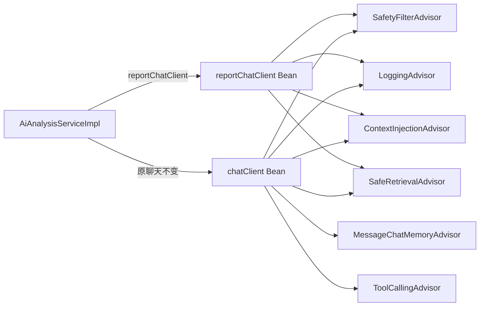

## 用户需求

前端 AI 分析结论区（每日评价、趋势总结、风险提示、改进建议、评分、完整报告）一直显示"暂无"。后端日志显示报告生成时抛出 `IllegalArgumentException: conversationId cannot be null`，导致 LLM 调用在记忆增强器阶段即失败并降级。

## 产品概述

修复 AI 分析报告生成链路：为一次性报告生成任务单独提供"无对话记忆"的专用 ChatClient，避免调用 `MessageChatMemoryAdvisor` 时因缺少 conversationId 而抛异常降级，使结论区能展示真实 AI 生成内容；同时保证原多轮聊天会话的记忆能力不受影响。

## 核心功能

- 新增报告专用 `reportChatClient` Bean（去掉记忆增强器与工具，保留安全/日志/上下文注入/RAG 增强顾问）
- `AiAnalysisServiceImpl` 改用 `reportChatClient` 生成结构化 JSON 与 Markdown 报告
- 原有 `/api/chat` 会话记忆与工具调用链路保持不变

## 技术栈

- 语言/框架：Java 17 + Spring Boot 4 + Spring AI 2.0.0
- 依赖注入：Lombok `@RequiredArgsConstructor` 构造器注入
- LLM 客户端：Spring AI `ChatClient`（通义千问 DashScope，OpenAI 兼容接口）

## 实现方案

### 总体策略

在 `ChatClientConfig` 内新增第二个 `ChatClient` Bean（`reportChatClient`），复用同一个 `ChatClient.Builder`（builder 为单例，每次 `.build()` 生成独立实例，互不干扰），仅挂载"对无 conversationId 安全"的顾问链：

- 保留：`SafetyFilterAdvisor`（HIGHEST+10，无 ID 依赖）、`LoggingAdvisor`（HIGHEST+20，取不到 ID 返回 "-"，不抛异常）、`ContextInjectionAdvisor`（HIGHEST+100，注入今日打卡概况，失败静默跳过）、`SafeRetrievalAdvisor`（HIGHEST+300，VectorStore 失败 try-catch 降级）
- 移除：`MessageChatMemoryAdvisor`（唯一致命点，缺 ID 抛异常）
- 不挂 `defaultTools`：报告生成为一次性数据→文本任务，无需工具调用；去掉后更轻量且避免工具循环引入无关消息

`AiAnalysisServiceImpl` 将注入的 `ChatClient` 改为 `reportChatClient`，第 139、187 两处报告生成调用切换至该客户端。其余字段（`taskRepository`、`analysisService`）不变。

### 关键技术决策

1. **独立 Bean 而非运行时传参**：方案 1 比"调用处补 conversationId"语义更正确——报告无需记忆，不会污染 Mongo `ai_chat_memory` 集合与 20 条记忆窗口；且零侵入原聊天链路。
2. **复用 builder 而非 new**：Spring AI 的 `ChatClient.Builder` 自动读取 `application.yml` 的 model/temperature/API key 配置，新建 Bean 时复用保证配置一致，符合现有 `chatClient` Bean 的构建模式。
3. **保留非记忆顾问**：安全过滤、日志、上下文注入、RAG 对报告生成仍有价值（如防越界、记录耗时、注入今日概况、知识增强），且经代码确认它们在无 conversationId 时均安全不抛异常。

### 性能与可靠性

- 无额外 DB 写入（去掉记忆顾问后，报告生成不再写 Mongo 记忆集合），降低写入开销。
- RAG 顾问保留但带降级，向量库故障时不影响报告生成。
- 原有聊天记忆链路完全不变，blast radius 仅限报告生成。

## 实现注意事项

- `ChatClientConfig.chatClient` 方法参数需新增 `reportChatClient` 方法，接收除 `memoryAdvisor` 外的顾问（safetyFilterAdvisor、loggingAdvisor、contextInjectionAdvisor、safeRetrievalAdvisor），工具参数可省略。
- `AiAnalysisServiceImpl` 使用 `@RequiredArgsConstructor`，新增 `reportChatClient` 字段即自动注入；原 `chatClient` 字段仅用于报告生成，直接替换字段名与两处调用即可，无需保留双客户端。
- 修改后需重启后端进程（当前 8080 端口被旧进程占用），加载新配置后验证结论区。

## 架构设计



报告生成走无记忆链路，聊天走含记忆+工具链路，二者解耦。

## 目录结构

```
src/main/java/com/habit/agent/
├── config/
│   └── ChatClientConfig.java              # [MODIFY] 新增 reportChatClient Bean，复用 builder，去掉记忆顾问与工具
└── service/impl/
    └── AiAnalysisServiceImpl.java         # [MODIFY] 将报告生成用的 ChatClient 改为 reportChatClient（字段+两处调用）
```

## 关键代码结构

```java
// ChatClientConfig.java 新增 Bean（示意签名）
@Bean
public ChatClient reportChatClient(ChatClient.Builder builder,
        SafetyFilterAdvisor safetyFilterAdvisor,
        LoggingAdvisor loggingAdvisor,
        ContextInjectionAdvisor contextInjectionAdvisor,
        SafeRetrievalAdvisor safeRetrievalAdvisor) {
    return builder
        .defaultSystem(systemPromptResource)
        .defaultAdvisors(safetyFilterAdvisor, loggingAdvisor,
                contextInjectionAdvisor, safeRetrievalAdvisor)
        .build();
}
```

## Agent Extensions

### SubAgent

- **code-explorer**
- Purpose: 在实施前二次确认 ChatClientConfig 与 AiAnalysisServiceImpl 的精确行号、顾问 Bean 名称及注入方式，避免字段名/参数顺序错误
- Expected outcome: 输出准确的修改点清单（含方法签名、字段定义行），供编码阶段直接对照