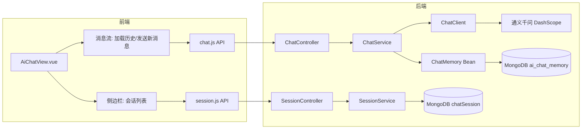

## 用户需求

### 1. 修复前端 AI 聊天页面发送键 Bug

当前 AI 聊天页面（AiChatView.vue）中，用户手动输入文字后点击发送按钮或按 Enter 键，无法正确发送消息。经定位，根因在于 `send(text)` 函数被 Vue 事件绑定调用时，传入的是 DOM Event 对象而非输入文本，导致发送 `"[object MouseEvent]"` 垃圾字符串。

### 2. 增加查看历史聊天记录功能

在 AI 聊天页面左侧新增会话历史列表侧边栏，用户可以查看所有历史会话、切换会话加载历史消息、新建会话、删除会话。

### 3. 自动生成聊天标题

当新会话完成首轮对话后，后端利用 AI 自动生成不超过 15 字的会话标题，替代当前取首条消息前 20 字符的简单截断方案。

## 产品概述

在现有 habits-agent AI 对话页面基础上，增加会话管理侧边栏，支持历史会话列表展示、切换加载历史消息、会话删除与自动标题生成，并修复发送按键无法推送用户输入文本的 Bug。

## 核心功能

- **发送键修复**：`send()` 函数正确区分 Event 对象与字符串参数，保证输入框文字与建议快捷词均可正常发送
- **会话历史侧边栏**：左侧固定宽度面板，按最后消息时间倒序展示会话列表，支持点击切换、新建、删除
- **历史消息加载**：切换历史会话时，从后端 ChatMemory 拉取该会话的消息数组并渲染到消息流中
- **AI 自动标题**：新会话首轮对话完成后，后端用 ChatClient 非流式调用 AI 生成不超过 15 字的会话标题并更新到 MongoDB

## 技术栈

- 后端：Spring Boot 4.1 + Spring AI 2.0.0 + Java 21，复用现有 ChatService / ChatController / ChatMemory / ChatSessionRepository
- 前端：Vue 3 + Vite + Element Plus + TailwindCSS + lucide-vue-next 图标库

## 实现方案

### 策略概述

最小侵入原则：后端新增 2 个方法（getMessages、generateTitle）+ 1 个端点（GET /api/chat/history）；前端新增 1 个 API 模块（session.js）+ 1 个 API 方法（getChatHistory），重构 AiChatView.vue 增加侧边栏布局与历史加载逻辑，修复 send() Bug。

### 关键技术决策

**1. 历史消息加载方案**
使用 Spring AI 的 `ChatMemory.get(conversationId, Integer.MAX_VALUE)` 从 MongoDB `ai_chat_memory` 集合读取指定会话的全部消息（窗口 20 条）。前端通过新的 REST 端点获取后，直接映射为 `{ role, text }` 数组渲染到消息流中。

选择理由：ChatMemory 是 Spring AI 官方持久化接口，无需直接操作 MongoDB 集合；与现有流式对话的消息格式一致。

**2. 自动标题方案**
首轮对话完成后，后端异步调用 ChatClient（非流式）生成标题，prompt 为「用不超过15个字总结这段对话主题：{用户问题}」。生成后通过 MongoDB 更新 chatSession 的 title 字段。前端在 onDone 回调中调用后端标题生成端点。

选择理由：AI 生成标题比简单截断首条消息更智能、更可读；异步更新的方式不阻塞对话主流程。

**3. 前端侧边栏布局**
保留现有 Glassmorphism 设计风格，左侧新增 260px 宽会话列表面板（可折叠），右侧为现有消息区域。使用 `flex` 布局，列表项显示会话标题、最后消息时间、删除按钮，当前激活项高亮。

### 实现注意事项

- 后端 `getMessages()` 需注入 `ChatMemory` Bean（已在 ChatMemoryConfig 中暴露为 `chatMusic` Bean），调用 `get(conversationId, Integer.MAX_VALUE)` 获取历史消息列表
- `generateTitle()` 使用 `chatClient.prompt().user("...").options(builder->builder.temperature(0.3)).call().content()` 非流式生成标题，降低随机性
- ChatController 新增端点路径为 `GET /api/chat/history?conversationId=xxx`，避免与现有 `/api/chat/stream` 冲突
- 前端侧边栏需处理空状态（无历史会话时显示引导文案）、加载态、错误态
- send() Bug 修复使用 `typeof text === 'string'` 精确判断参数类型，同时模板 `@click="send(input)"`、`@keyup.enter="send(input)"` 改为显式传值，`@click="send(s)"` 保持传字符串

## 架构设计



## 目录结构

```
src/main/java/com/habit/agent/
├── service/
│   ├── ChatService.java              # [MODIFY] 新增 getMessages()、generateTitle() 方法声明
│   └── impl/
│       └── ChatServiceImpl.java      # [MODIFY] 注入 ChatMemory，实现 getMessages() + generateTitle()
├── controller/
│   └── ChatController.java           # [MODIFY] 新增 GET /api/chat/history 端点

frontend/src/
├── api/
│   ├── chat.js                       # [MODIFY] 新增 getChatHistory() 方法
│   └── session.js                    # [NEW] 封装会话列表/详情/重命名/删除 API
└── views/
    └── AiChatView.vue                # [MODIFY] 修复 send() Bug + 左侧会话侧边栏 + 历史消息加载 + 标题生成
```

## 关键代码结构

### ChatService 新增方法签名

```java
// 获取指定会话的历史消息（角色+文本）
List<Map<String, String>> getMessages(String conversationId);

// 生成会话标题（首次对话完成后调用）
String generateTitle(String userMessage);
```

### SessionVO 对应前端解构

```javascript
// session.js 返回数据映射
{ conversationId, title, status, messageCount, lastMessageTime, createTime }
```

## 设计风格

延续项目现有 Glassmorphism（玻璃拟态）视觉体系，保持渐变导航栏 + 粒子背景 + 毛玻璃卡片的整体风格。AI 聊天页面从单栏布局升级为双栏布局：左侧新增 260px 宽半透明玻璃面板作为会话历史侧边栏，右侧保持现有消息流 + 输入区。

## 页面区块设计

### 1. 顶部标题区（保留现有）

展示 Sparkles 渐变图标 +「AI 建议」标题 + 副标题，右侧保留重置对话按钮。

### 2. 会话历史侧边栏（新增）

左侧固定 260px 宽面板，Glassmorphism 半透明背景。顶部「历史会话」标题 +「新建」按钮（Plus 图标）。中部为会话列表，每项包含：标题（单行截断）、最后消息时间（相对时间如"3分钟前"）、删除按钮（Trash2 图标，hover 显示）。当前激活会话高亮（渐变左侧边条 + 浅蓝背景）。空态展示引导文案「暂无历史会话」。底部可折叠按钮控制面板显隐。

### 3. 消息流区（保留现有 + 支持历史加载）

右侧区域保持用户/助手气泡左右分列 + 流式打字效果。新增：切换会话时清空消息列表并从后端加载该会话的全部历史消息，逐条渲染到消息流中。

### 4. 输入区（保留现有）

圆角输入框 + 渐变发送按钮 + 停止按钮，发送中禁用并 loading。

## 交互与响应式

- 桌面端：双栏布局（侧边栏 260px + 消息区自适应），侧边栏可折叠为 0px
- 移动端：侧边栏通过汉堡菜单从左侧滑入覆盖
- 会话切换：点击列表项时中止当前 SSE 流式连接，清空消息，加载新会话历史
- 会话删除：二次确认后删除，若为当前激活会话则切换到最新会话或空态
- 标题生成：发送消息后后端异步生成标题，前端轮询或在下次刷新列表时自动更新