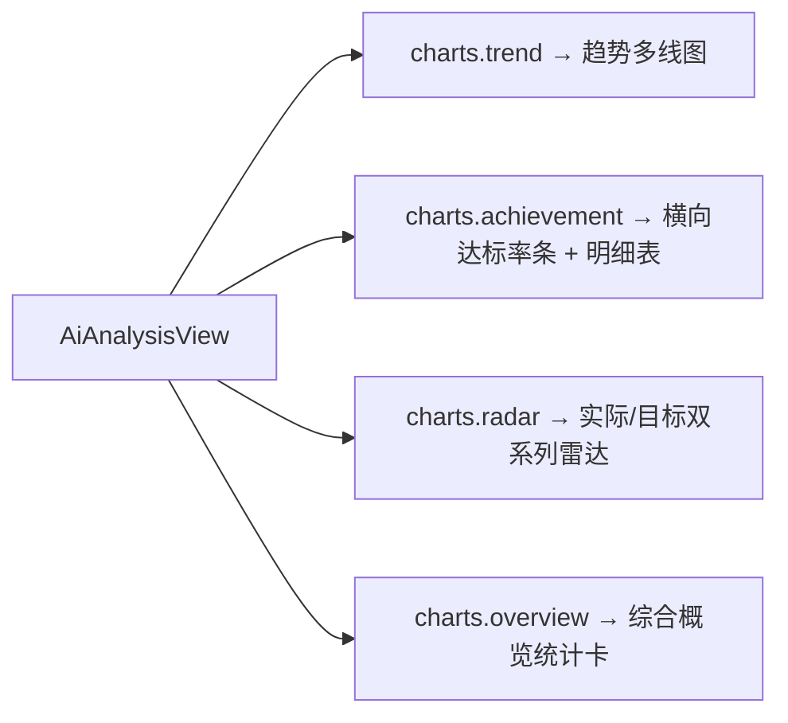

## 用户需求

前端「AI 分析报告」页中，维度达成率、趋势分析、能力雷达等图表显示不全（实际为空），需对照后端 Agent 模型与 PRD 开发要求，补全分析页全功能可视化。

## 产品概述

分析报告页后端已通过 `AiAnalysisService` 聚合出 `charts`（trend/overview/achievement/radar）真实数据并存储于 `AiAnalysisTask.charts`，但前端 `AiAnalysisView.vue` 的三处图表 option 读取的字段与后端真实结构不匹配（如趋势读 `checkin/goal`、达成率读 `items`、雷达未用 `targets`），导致图表空白、维度达成率等展示不全。需按后端真实字段重写图表 option，并补充「综合概览统计卡」与「各维度达标率明细」，实现 PRD 4.4.2 要求的图表展示趋势与达成率统计全功能。

## 核心功能

- 重写趋势图 option：基于 `charts.trend`（dates/sleep/exercise/water/mood/diet/customSeries）展示睡眠/运动/饮水/心情多线，动态追加自定义目标序列
- 重写达成率可视化：基于 `charts.achievement.dimensions`（label/target/actual/rate）用横向条形图展示各维度达标率，并补充「各维度达标率明细」卡片（维度/实际/目标/达标率%）
- 重写雷达图 option：基于 `charts.radar`（indicators/values/targets）双系列展示实际值 vs 目标值
- 新增「综合概览」统计卡：基于 `charts.overview`（recordDays/avgSleep/avgExercise/avgWater/avgMood）
- 为空数据做兜底，保证图表在缺数据时显示空态而非报错

## 技术栈

- 前端：Vue 3（`<script setup>` + Composition API），沿用现有项目
- 图表：vue-echarts（基于 ECharts），沿用现有 `VChart` 封装与 `use([...])` 注册
- 样式：Tailwind CSS（glass-card 工具类）+ scoped 样式，沿用既有玻璃拟态视觉
- 数据流：复用 `src/api/aiAnalysis.js`，后端 `GET /api/ai-analysis/{id}` 已返回含 `charts` 的完整 `AiAnalysisTask`

## 实现方案

### 整体策略

仅前端 `AiAnalysisView.vue` 单文件改动：重写三个图表 option 计算属性使其字段严格匹配后端 `TrendDataVO`/`AchievementRateVO`/`RadarDataVO` 真实结构；新增「综合概览」统计卡与「各维度达标率明细」区块，复用既有 `h-[320px]`/`h-[360px]` 固定高度包裹层（避免无限拉长）。不动后端、不动 API 封装、不动 `hasTrend/hasAchievement/hasRadar` 判定。

### 关键技术决策

1. **趋势图字段映射**：后端 trend 无 `checkin/goal`，改为系列：睡眠(sleep)、运动(exercise)、饮水(water)、心情(mood)、饮食(diet)，x 轴 `dates`；`customSeries` 按 `name/colorFrom/colorTo/data` 动态追加线。单位不同（睡眠小时/运动分钟/饮水 ml/心情分），采用多 yAxis 或归一化提示；为简洁用单一数值轴 + tooltip 内标注单位，避免多轴拥挤。
2. **达成率改横向条形图**：`AchievementRateVO.dimensions` 每项含 `label/target/actual/rate`，用横向 bar（`yAxis` 类目为 label，`series` 值为 `rate`）展示达标率%，并在 tooltip 显示实际/目标。相比原饼图更贴合「各维度达成率」语义且信息完整。
3. **雷达双系列**：`radar.indicators`(name/max) + `values`(实际) + `targets`(目标)，series 两项 data 分别绑定，legend 区分「实际/目标」。
4. **综合概览卡**：`charts.overview` 取 `recordDays/avgSleep/avgExercise/avgWater/avgMood`，渲染 4-5 张小统计卡（保持 glass-card 风格）。
5. **明细表**：遍历 `dimensions` 渲染表格（维度名/实际值/目标值/达标率%），确保「维度达成率」文字层面也完整可见。
6. **空数据兜底**：option 内对 undefined/空数组用 `toArr` 兜底，避免 ECharts 渲染异常；`hasX` 判定已存在，无需改。

### 性能与可靠性

- 纯前端模板与 option 计算，无新增运行时逻辑；`autoresize` 仅响应宽度，固定高度包裹层消除重排。
- 空数据兜底防止 NaN/异常，保证后端未返回维度时不白屏。

### 避免技术债务

- 严格复用现有 `glass-card`、Tailwind 类、`VChart` 用法、`toArr` 工具；改动收敛在单文件，不新增组件/样式文件，不触碰后端与 API。

## 实现注意事项

- `achievement.dimensions` 中 `rate` 可能为 `BigDecimal`（JSON 数字），直接用于 bar 值；`target/actual` 同理。
- `radar.values`/`targets` 为 `Double[]`，逐位映射；`indicators` 与 `values`/`targets` 一一对应，长度一致。
- 趋势图 `customSeries` 为动态数组，用 `v-for` 风格在 JS 中 `map` 生成 series，颜色取 `colorFrom`。
- 概览卡字段来自 `task.value?.charts?.overview`，判空显示「—」。

## 架构设计

仅前端视图层局部增强，无组件关系变化：



## 目录结构

```
frontend/src/views/
└── AiAnalysisView.vue   # [MODIFY] 重写 trendOption/achievementOption/radarOption 三处 option；新增综合概览卡与维度达标率明细模板；沿用固定高度包裹层
```

## 关键代码结构（接口级）

无需新增类型。option 计算属性结构示意：

```js
const trendOption = computed(() => {
  const t = task.value?.charts?.trend || {}
  const series = [
    { name: '睡眠', type: 'line', smooth: true, data: toArr(t.sleep) },
    { name: '运动', type: 'line', smooth: true, data: toArr(t.exercise) },
    { name: '饮水', type: 'line', smooth: true, data: toArr(t.water) },
    { name: '心情', type: 'line', smooth: true, data: toArr(t.mood) }
  ]
  for (const c of toArr(t.customSeries)) {
    series.push({ name: c?.name || '自定义', type: 'line', smooth: true, data: toArr(c?.data), itemStyle: { color: c?.colorFrom } })
  }
  return { tooltip: { trigger: 'axis' }, legend: { data: series.map(s => s.name) }, xAxis: { type: 'category', data: toArr(t.dates) }, yAxis: { type: 'value' }, series }
})

const achievementOption = computed(() => {
  const dims = task.value?.charts?.achievement?.dimensions || []
  return {
    tooltip: { trigger: 'axis', axisPointer: { type: 'shadow' },
      formatter: p => { const d = dims[p[0].dataIndex]; return `${d?.label}<br/>实际:${d?.actual} / 目标:${d?.target}<br/>达标率:${d?.rate}%` } },
    grid: { left: 80, right: 24, top: 16, bottom: 16 },
    xAxis: { type: 'value', max: 100 },
    yAxis: { type: 'category', data: dims.map(d => d?.label || '') },
    series: [{ type: 'bar', data: dims.map(d => Number(d?.rate ?? 0)), itemStyle: { color: '#667EEA', borderRadius: [0,6,6,0] }, label: { show: true, position: 'right', formatter: '{c}%' } }]
  }
})

const radarOption = computed(() => {
  const r = task.value?.charts?.radar || {}
  const indicators = toArr(r.indicators).map(it => ({ name: it?.name || '', max: it?.max ?? 100 }))
  const values = toArr(r.values).map(v => v ?? 0)
  const targets = toArr(r.targets).map(v => v ?? 0)
  return {
    tooltip: {},
    legend: { data: ['实际', '目标'], bottom: 0 },
    radar: { indicator: indicators.length ? indicators : [{ name: '默认', max: 100 }] },
    series: [{ type: 'radar', data: [ { value: values, name: '实际' }, { value: targets, name: '目标' } ] }]
  }
})
```

## 设计风格

延续项目既有「玻璃拟态 + 流动渐变」视觉语言，不引入新设计体系。分析报告页在修复数据映射并补全概览卡、达标率明细后，保持清爽、分层、信息密度合理的专业仪表盘观感，符合 PRD「页面展示应直观清晰」要求。

## 页面模块布局（自上而下）

1. 顶部操作条（玻璃卡）：标题 + 刷新/生成按钮（已存在）。
2. 综合概览统计卡（新增，网格 4-5 列）：打卡天数、平均睡眠、平均运动、平均饮水、平均心情，数字突出、单位小字。
3. 评分环 + 结构化结论（已存在）：评分环、今日点评、趋势总结。
4. 风险提示 / 改进建议（已存在）。
5. 图表区（修复数据映射）：趋势分析（多线，h-320）、维度达成率（横向条，h-320）、能力雷达（双系列，h-360，跨两列）。
6. 各维度达标率明细（新增，玻璃卡表格）：维度/实际/目标/达标率%，行 hover 微高亮。
7. 完整报告（已存在）。
8. 历史报告条（已存在）。

## 交互细节

- 图表沿用固定高度包裹层，窗口缩放宽度自适应、高度固定不撑页。
- 达标率条形图右侧显示百分比 label；明细表行 hover 浅色背景过渡。
- 空数据兜底：概览卡显示「—」，图表显示空坐标系不报错。

## Agent Extensions

### SubAgent

- **code-explorer**
- 用途：实现前核对 `AiAnalysisView.vue` 当前 `trendOption/achievementOption/radarOption` 计算属性确切行号、模板中图表包裹层结构、以及 `toArr`/`hasX` 等现有工具，确保重写精准落地、编译通过。
- 预期结果：产出准确的现有代码片段与类名清单，保证三处 option 重写与新增概览/明细区块无回归。