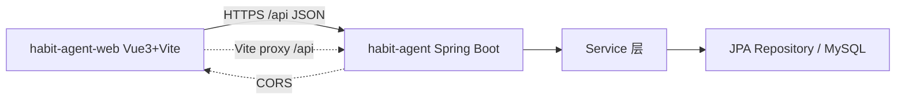

## 用户需求

依据《详细模块开发流程.md》阶段三，对 agent_demo 项目进行实际的前后端分离升级改造：后端彻底移除 Thymeleaf/PageController/SSR 资源并补齐 CORS，前端新建独立仓库 habit-agent-web（Vue 3 + Vite + Pinia + Axios + Vue Router + Element Plus + ECharts），实现阶段三的 5 个页面并调通后端已就绪的 /api 接口。

## 产品概述

将原有"Thymeleaf 混合 SSR"架构升级为"主流前后端分离"架构：后端 Spring Boot 只提供 JSON REST API，前端为独立 Vue 工程，通过 HTTPS/JSON 经 Vite 代理对接后端。

## 核心特性

- 后端删除 PageController.java、resources/templates（6 个 html）、resources/static/js（SSR 脚本），pom 移除 Thymeleaf 依赖，新增 CorsConfig 允许前端域名
- 后端保留 HabitController/GoalController 的 16 个 /api 端点，Result 统一响应与全局异常处理沿用
- 前端新建独立仓库，实现首页/打卡/历史/趋势/AI建议 5 个路由页面与公共布局、Axios 封装、Pinia 状态、路由
- 打卡页提交 POST /api/habits，历史页查询 GET /api/habits，首页调 today/recent，趋势页预留 ECharts 容器，AI 页预留流式对话骨架
- 完成有效修改后按项目惯例执行 git 提交与推送

## 技术栈选择

- 后端：Spring Boot 4.1 + Java 21（现有），移除 Thymeleaf，保留 springdoc-openapi（Swagger UI 可作为 API 文档），新增 CORS 配置
- 前端：Vue 3 + Vite 5 + Pinia 2 + Axios 1 + Vue Router 4 + Element Plus 2 + ECharts 5（独立仓库 habit-agent-web）

## 实现方案

### 总体策略

后端做"减法"（去 SSR、补 CORS）+ 前端做"加法"（独立 Vue 工程）。前后端通过 Axios 调 `/api`，开发期用 Vite `server.proxy` 将 `/api` 转发到 `http://localhost:8080`，规避跨域；生产期由 CORS 或反向代理解决。

### 关键技术决策

1. **彻底去 SSR**：删除 PageController 与 templates/static 资源，pom 移除 `spring-boot-starter-thymeleaf`。后端只保留 `@RestController` 的 /api 端点，编译需通过（mvn compile）。
2. **CORS 显式配置**：新增 `CorsConfig`（WebMvcConfigurer），允许 `http://localhost:5173`（Vite 默认）及生产域名，`AllowedMethods` 含 GET/POST/PUT/DELETE/OPTIONS，暴露 `Authorization` 头。这是前后端分离的必备项，原项目缺失。
3. **Axios 统一封装**：`utils/request.js` 以 `/api` 为 baseURL，响应拦截器统一解析 `Result{code,message,data}`，非 0 用 ElMessage 报错并 reject，减少各页面重复判断。
4. **前端目录与 PRD 阶段三一致**：MainLayout（el-menu 导航）、router 5 路由、stores/habit.js（今日/近7天/加载态）、views 5 个页面、api 目录封装 habit/goal/chat/analysis。趋势页与 AI 页本期仅做容器骨架（对应接口阶段九/五实现），降低本次范围但不破坏可扩展性。
5. **复用现有后端接口**：HabitController/GoalController 已覆盖阶段三所有数据需求，前端直接调用，无需后端改业务逻辑。统计/图表 API（AnalysisController）属阶段九，本次前端仅预留容器。

### 性能与可靠性

- 前端路由懒加载（() => import）降低首屏体积；Axios 单例复用连接。
- 删除 PageController 后后端启动更快、内存占用更低（无模板引擎与 Model 注入）。
- 编译校验：`mvn -q compile` 确认后端去 SSR 后无误；前端 `npm run build` 确认可构建。

## 实现注意事项

- 仅删除 SSR 相关文件，不动 HabitController/GoalController/Service/Repository/Result/GlobalExceptionHandler。
- PageController 引用了 HabitService/GoalService/HabitGoalRecordService，但这些都是被 REST Controller 复用的业务类，删除 PageController 不会影响其余编译（已确认）。
- CORS 不开启 `allowCredentials` 与 `*` 同时（安全），按具体域名配置。
- 前端独立仓库建在 d:/javacode/habit-agent-web（与 agent_demo 同级），独立 git init。
- 不修改 agent模型.md 及任何与本次无关的文件。
- 本次仅做阶段三（前端骨架+5 页+联调）与后端去 SSR，不实现阶段四及以后的 AI/SSE 等业务接口（前端 AI 页仅预留骨架）。

## 架构设计

后端不再渲染页面，仅暴露 /api；前端通过 Axios 调用，Vue Router 管理路由，Pinia 管理状态。

## 目录结构（本次新增/修改文件）

### 后端（d:/javacode/agent_demo）

- pom.xml  # [MODIFY] 移除 spring-boot-starter-thymeleaf 依赖（第 38-46 行区块），其余依赖不变
- src/main/java/com/habit/agent/controller/PageController.java  # [DELETE] 删除 Thymeleaf 页面路由控制器
- src/main/java/com/habit/agent/config/CorsConfig.java  # [NEW] WebMvcConfigurer 实现，配置 CORS（允许前端 localhost:5173 及生产域名）
- src/main/resources/templates/  # [DELETE] 删除 index/checkin/history/trend/ai-chat/fragments 共 6 个 html
- src/main/resources/static/js/  # [DELETE] 删除 SSR 脚本（chat-stream.js 等）

### 前端（d:/javacode/habit-agent-web，新建独立仓库）

- package.json  # [NEW] 依赖 vue/vue-router/pinia/axios/element-plus/echarts + vite 脚本
- vite.config.js  # [NEW] server.proxy['/api'] = http://localhost:8080
- index.html  # [NEW] SPA 入口
- src/main.js  # [NEW] 挂载 Vue + Pinia + Router
- src/App.vue  # [NEW] 根组件，含 router-view
- src/router/index.js  # [NEW] 5 路由（/ /checkin /history /trend /ai-chat）
- src/utils/request.js  # [NEW] Axios 实例，baseURL=/api，拦截器解析 Result
- src/stores/habit.js  # [NEW] Pinia：今日记录/近7天/加载态
- src/layouts/MainLayout.vue  # [NEW] 公共布局（el-menu 渐变导航栏 + 路由出口）
- src/api/habit.js  # [NEW] 习惯记录接口封装（getToday/getRecent/listByRange/saveOrUpdate）
- src/api/goal.js  # [NEW] 目标接口封装（getActive/saveRecord）
- src/api/analysis.js  # [NEW] 分析接口封装（预留 getTrends/getAchievement/getOverview/getRadar）
- src/api/chat.js  # [NEW] 对话接口封装（预留 sendMessage/streamMessage/stop）
- src/views/HomeView.vue  # [NEW] 首页（统计卡片 + 近7天表格）
- src/views/CheckinView.vue  # [NEW] 打卡页（el-form 提交 POST /api/habits）
- src/views/HistoryView.vue  # [NEW] 历史页（el-table 调 /api/habits 范围）
- src/views/TrendView.vue  # [NEW] 趋势页（预留 4 个 ECharts 容器）
- src/views/AiChatView.vue  # [NEW] AI 建议页（对话骨架，预留 EventSource）
- README.md  # [NEW] 前端启动/联调说明

## 设计风格

采用现代简洁的管理后台风格（Apple HIG + 轻量 Glassmorphism 点缀），以渐变导航栏 + 卡片化内容区呈现。主色使用蓝青渐变，圆角卡片、柔和阴影，交互有 hover 微动效，体现" Premium 但务实"的前端工程质感。

## 页面规划

1. 公共布局 MainLayout：顶部渐变导航栏（首页/打卡/历史/趋势/AI建议 5 项，高亮当前路由），内容区 router-view。
2. 首页 HomeView：欢迎标题 + 4 个 el-card 快捷统计（今日睡眠/饮水/运动/心情，未打卡显"未打卡"）+ 近7天 el-table。
3. 打卡页 CheckinView：el-form 分睡眠/饮食/运动/饮水心情 4 区块，提交按钮（未打卡"提交打卡"/已打卡"更新记录"），提交 POST /api/habits。
4. 历史页 HistoryView：el-table 展示最近 30 天记录（日期/睡眠/运动/饮水/心情/操作）。
5. 趋势页 TrendView：4 个图表容器 div（sleep/exercise/water/radar），本期仅空容器 + 概览文字，阶段九接入 ECharts。
6. AI 建议页 AiChatView：消息气泡区（el-scrollbar）+ 输入框 + 发送/停止按钮，本期对话骨架，阶段五接入 SSE。

## 交互与响应式

- 导航栏 hover 高亮、卡片 hover 轻微上浮阴影。
- 表单提交禁用双重点击，成功后 ElMessage 提示并刷新。
- 布局使用 Element Plus 栅格，桌面端优先，移动端纵向堆叠。

## Agent Extensions

### Skill

- **doc-coauthoring**
- Purpose: 在改造完成后同步更新 PRD 阶段三"已完成"状态与前端目录结构说明，保持文档与代码一致
- Expected outcome: PRD 中阶段三标注为已实施，前端仓库结构记录与代码一致

### SubAgent

- **code-explorer**
- Purpose: 在执行删除 PageController 前，跨文件确认 PageController 的 Service 引用无其他页面专属耦合，避免误删影响编译
- Expected outcome: 确认删除安全，后端 mvn compile 通过