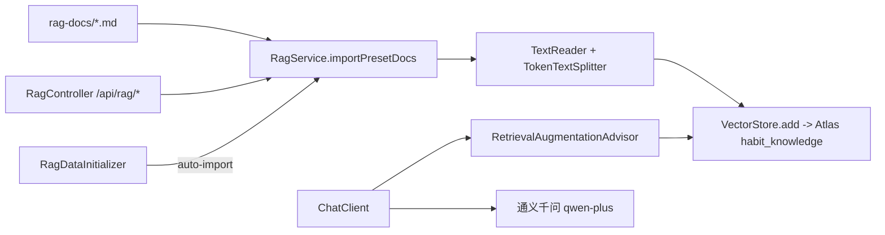

## 用户需求

为本项目的向量库（MongoDB Atlas Vector Search）新增并填充一批与生活习惯相关的 Markdown 知识文档，支撑 RAG 检索增强生成。

## 产品概述

在现有「生活习惯助手 Agent」后端中落地 RAG 知识库：编写若干主题化的健康生活 Markdown 文档（睡眠时长要领、运动情况、饮食营养等），通过后端服务将文档切分、向量化并写入 MongoDB Atlas `habit_knowledge` 集合，使 AI 对话能基于项目知识库给出专业建议。

## 核心功能

- 新增 3~5 份生活习惯主题 Markdown 知识文档（睡眠、运动、饮食、饮水、综合建议），存入 `src/main/resources/rag-docs/`
- 实现 RagService：读取 rag-docs 下 Markdown，经由 TextReader + TokenTextSplitter 分块，使用 DashScope text-embedding-v3 向量化后写入 Atlas 向量库
- 实现 RagController：暴露 `/api/rag/import`（触发灌库）、`/api/rag/status`（查询文档数）、`/api/rag/search`（语义检索验证）等端点
- 在 ChatClient 中注入 RetrievalAugmentationAdvisor，使对话链路自动检索知识库
- 将 application.yml 的 MongoDB 连接与 vectorstore 配置切换为 MongoDB Atlas（集合 habit_knowledge、索引 habit_vector_index、向量路径 embedding、filter 字段 doc_type/source）
- 提供首轮灌库入口（可选：启动时自动导入 + 手动接口触发）

## 技术栈选择

- 后端：Spring Boot 4.1 + Java 21（沿用现有）
- AI 框架：Spring AI 2.0.0（已引入 `spring-ai-starter-vector-store-mongodb-atlas`、`spring-ai-starter-model-openai`、`spring-ai-starter-model-chat-memory-repository-mongodb`，pom.xml:62-77）
- 向量库：MongoDB Atlas Vector Search（集合 `habit_agent.habit_knowledge`，索引 `habit_vector_index`，embedding 路径 `embedding`，1024 维 cosine，filter 字段 `metadata.doc_type`/`metadata.source`）
- Embedding：`text-embedding-v3`（DashScope，OpenAI 兼容模式，已在 application.yml:49-51 配置）
- 文档切分：Spring AI `TokenTextSplitter`（chunkSize=500, overlap=100，对齐 PRD 8-B.2）
- 文档读取：Spring AI `TextReader`（支持 classpath:/file 资源）

## 实现方案

### 整体策略

采用 PRD《向量库搭建计划表.md》8-B.2 已规划的 RAG 导入链路：编写 Markdown 知识文档 → RagService 读取并分块 → 向量化写入 Atlas → 暴露 `/api/rag/*` 端点 → ChatClient 注入 `RetrievalAugmentationAdvisor` 实现对话检索增强。

### 关键技术决策

1. **复用 Spring AI 原生 VectorStore 自动配置**：`MongoDBAtlasVectorStore` 已由 `spring-ai-starter-vector-store-mongodb-atlas` 提供自动装配 Bean，直接 `@Autowired VectorStore` 即可，无需自建客户端。配置项 `spring.ai.vectorstore.mongodb.*` 对齐 Atlas 索引（`collection-name`/`vector-index-name`/`path-name`/`metadata-fields-to-filter`）。
2. **文档读取与切分**：使用 `TextReader` 读取 `classpath:rag-docs/*.md` 生成 `List<Document>`；`TokenTextSplitter` 按 token 切分避免超 Embedding 上下文。每篇文档在读取后补充 `metadata`：`doc_type`（如 sleep_guide）、`source`（文件名）。
3. **RetrievalAugmentationAdvisor 注入**：在 `ChatClientConfig.chatClient` 的 `defaultAdvisors(...)` 中加入 `RetrievalAugmentationAdvisor`（由 `VectorStore` + `SearchRequest` 构建，`topK=3`）。由于 Advisor 在 ChatClient 全局默认链路生效，`ChatServiceImpl` / `ChatController` 无需改动，保持向后兼容。
4. **首轮灌库**：新增 `RagDataInitializer implements CommandLineRunner`，在 Spring 上下文就绪后调用 `ragService.importPresetDocs()`（带开关 `habit.rag.auto-import`，默认 false，避免无 Atlas 环境启动失败）；同时提供手动 `/api/rag/import` 端点供随时触发。
5. **降级安全**：`importPresetDocs` 与 Advisor 检索均需 try/catch 保护，导入失败时仅 WARN 日志不阻断启动；Advisor 检索异常由自定义包装或 Spring AI 默认空结果处理，避免对话 500。

### 性能与可靠性

- 文档总数少（3~5 篇，约 20 个 chunk），向量化调用为个位数 Embedding API 请求，耗时可忽略；`TokenTextSplitter` 为内存同步切分，无热点。
- Embedding 调用走 DashScope 网络 IO，导入接口应异步/带超时；Atlas 写入为批量 `vectorStore.add`，单次小批量，无性能瓶颈。
- 避免启动时强依赖 Atlas：auto-import 默认关闭，确保本地无 Atlas 也能启动。

### 避免技术债务

- 严格遵循现有分层（Controller → Service → impl）、`Result<T>` 统一响应、`@RequiredArgsConstructor` + Lombok 风格、`@Slf4j` 日志、`@Tag`/`@Operation` Swagger 注解（参考 ChatController）。
- 不引入新架构模式；复用 `AgentConstants`、现有异常体系（`AiCallException`/`BusinessException`）与 `GlobalExceptionHandler`。

## 实现注意事项

- **配置安全**：Atlas 连接串含密码，必须写入 `application-local.yml`（已被 .gitignore 忽略）作为 `spring.data.mongodb.uri` 覆盖，禁止硬编码进 application.yml。保留本地 `mongodb://localhost:27017/habit_agent` 作为默认值以便无 Atlas 调试。
- **索引一致**：`application.yml` 的 `vectorstore.mongodb` 配置必须匹配 Atlas 已建索引：`collection-name=habit_knowledge`、`vector-index-name=habit_vector_index`、`path-name=embedding`、`metadata-fields-to-filter=doc_type,source`。若 `initialize-schema` 设 false（PRD 建议手动建索引），需确认 Atlas 索引已处于 Active。
- **日志**：复用 `@Slf4j`，导入时打印成功/失败 chunk 数与耗时；禁止打印文档全文或 Embedding 向量数组，避免日志膨胀。
- **幂等导入**：`importPresetDocs` 每次全量重导会重复写入（Atlas 无去重）；建议在导入前按 `metadata.source` 删除旧文档（若需），或文档 `id` 固定为 `source + hash` 以保证幂等。优先采用固定 id 方案：`Document` 设置 `id = doc_type + "::" + chunkIndex`。
- **blast radius**：不改动 ChatController、ChatServiceImpl、DataInitializer、各业务 Service；仅新增 Rag 相关类与修改 yml 配置，降低回归风险。

## 架构设计

### 组件关系（新增部分）



- 前端仅通过 `/api/rag/*` 与既有 `/api/chat` 间接使用向量能力，不直连 Atlas（与 PRD 口径一致）。
- RAG Advisor 注入为 ChatClient 默认 Advisor，对现有对话接口透明。

## 目录结构

```
src/main/resources/
├── rag-docs/                         # [NEW] 生活习惯知识库 Markdown 源文件
│   ├── sleep-guide.md                # [NEW] 睡眠时长要领：成年人 7-9 小时、最佳入睡 22:00-23:00、睡眠质量提升方法
│   ├── exercise-guide.md             # [NEW] 运动情况：每周 150 分钟中等强度/75 分钟高强度、运动类型与频率建议
│   ├── diet-guide.md                 # [NEW] 饮食营养：三餐搭配、膳食结构、控油控糖要点
│   ├── water-guide.md                # [NEW] 饮水建议：每日 1500-2000ml、分次饮用、信号识别
│   └── habit-overview.md             # [NEW] 综合建议：作息规律、习惯养成与多维度协同
├── application.yml                   # [MODIFY] MongoDB URI 默认仍指向本地；补充完整 vectorstore.mongodb 配置（collection/index/path/filter）；新增 habit.rag.auto-import 开关
└── application-local.yml             # [MODIFY] 追加 Atlas 连接串 spring.data.mongodb.uri 与 vectorstore 覆盖配置（真实凭据，gitignore）

src/main/java/com/habit/agent/
├── service/
│   ├── RagService.java               # [NEW] RAG 知识库服务接口：importPresetDocs()、search(query, topK)、count()
│   └── impl/
│       └── RagServiceImpl.java       # [NEW] 读取 classpath:rag-docs/*.md，TextReader+TokenTextSplitter 分块，固定 id 幂等写入 VectorStore；检索封装 SearchRequest
├── controller/
│   └── RagController.java            # [NEW] /api/rag/import（POST 触发灌库）、/api/rag/status（GET 文档数）、/api/rag/search（GET 语义检索，供验证）
├── config/
│   ├── ChatClientConfig.java         # [MODIFY] 在 chatClient 的 defaultAdvisors 中注入 RetrievalAugmentationAdvisor（topK=3）
│   └── RagConfig.java                # [NEW] 构建 RetrievalAugmentationAdvisor Bean（注入 VectorStore + SearchRequest.builder().topK(3)）
└── config/
    └── RagDataInitializer.java       # [NEW] CommandLineRunner，读 habit.rag.auto-import 开关，true 时调用 importPresetDocs（失败仅 WARN）
```

## 关键代码结构（接口级）

```java
public interface RagService {
    /** 导入 rag-docs 下全部 Markdown 知识文档到向量库，返回导入结果统计 */
    ImportResultVO importPresetDocs();
    /** 语义检索 topK 条最相似知识片段 */
    List<Document> search(String query, int topK);
    /** 当前向量库中文档数量（基于 id 前缀统计或 Atlas count） */
    long count();
}

// ImportResultVO：totalDocs, totalChunks, success, failed, errors
```

## 前置条件（需用户/环境配合）

- MongoDB Atlas M0 集群已创建，`habit_agent.habit_knowledge` 集合与 `habit_vector_index` 索引（1024 维 cosine、embedding 路径、filter doc_type/source）已处于 Active（见 PRD 第三~六章）。
- `application-local.yml` 需填入 Atlas 连接串（含密码）替换本地 URI。
- `DASHSCOPE_API_KEY` 环境变量已配置（application-local.yml 已有）。

## Agent Extensions

### SubAgent

- **code-explorer**
- 用途：在实现 RagServiceImpl 与 RagController 时，深入检索 Spring AI 2.0.0 在当前代码库中 VectorStore / TextReader / TokenTextSplitter / RetrievalAugmentationAdvisor 的具体 API 用法，确认 import 路径与构造方式，避免 API 误用。
- 预期结果：产出准确的类引用与调用示例，确保新增代码编译通过且符合 Spring AI 2.0.0 约定。