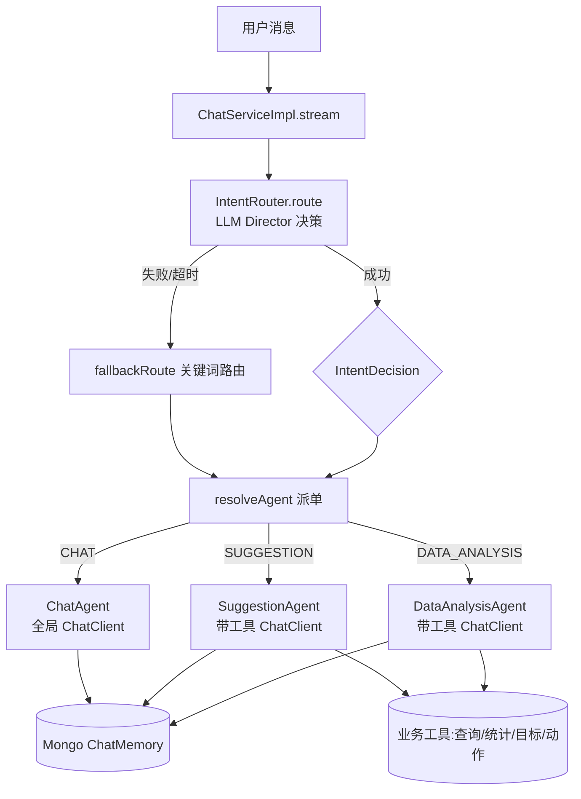

## 用户需求

采用方案 A，将当前"伪多智能体"（静态 `IntentRouter.route()` 关键词匹配 + 子 Agent 直接复用全局带工具 ChatClient）升级为"真正的路由智能体（Director）+ 领域子智能体"架构。路由决策交由 LLM 驱动的 Director 完成，子 Agent 保留自身工具调用与记忆能力，Director 仅负责意图判定与派单（handoff），不重新执行工具循环。

## 产品概述

升级后，用户消息先由一个轻量 LLM 路由智能体识别意图（数据分析 / 改善建议 / 闲聊），再将请求交班给对应领域子智能体。子智能体在独立角色提示词下自行驱动工具（打卡查询、统计分析、目标设定、习惯动作创建）与对话记忆，实现"基于真实数据 + 历史上下文"的专业回复。前端 SSE 协议、事件结构、对话流体验完全不变。

## 核心功能

- LLM 路由智能体（Director）：基于用户消息与可选会话上下文，输出结构化意图（DATA_ANALYSIS / SUGGESTION / CHAT），并交班给对应子 Agent。
- 子 Agent 保留工具与记忆：数据分析 / 改善建议子 Agent 仍通过全局带工具 ChatClient 调用真实业务工具；闲聊子 Agent 走纯对话（无工具）即可。
- 路由意图经 `meta` 事件下发前端（已有逻辑复用），工具状态、文本增量、结束事件协议不变。
- Director 失败时安全降级到既有关键词路由，保证可用性。

## 技术栈（沿用现有，不引入新依赖）

| 层次 | 技术 | 说明 |
| --- | --- | --- |
| 框架 | Spring Boot 4.1.0 + Java 21 | 现有 |
| AI | Spring AI 2.0.0 | 现有 |
| 模型 | 通义千问 DashScope（OpenAI 兼容，qwen-plus） | 现有 |
| 流式栈 | spring-boot-starter-webflux（Reactor） | 现有 |
| 序列化 | Jackson | 现有，复用做结构化输出 |


不新增 Maven 依赖，不改动 `AiAnalysisServiceImpl` / `RagServiceImpl` / `ChatController` / `ChatStreamEvent` 契约。

## 实现方案

### 策略概述

将 `IntentRouter` 从"静态关键词路由"升级为"LLM 路由智能体"：新增一个轻量 Director `ChatClient`（无工具、极低 temperature、结构化输出），调用模型判定意图并返回 JSON `{intent, reason}`；`ChatServiceImpl` 改用 Director 决策结果派单。子 Agent 完全保留现有全局带工具 `ChatClient`（含 `MessageChatMemoryAdvisor` + `SafeRetrievalAdvisor` + `ToolCallingAdvisor`），其工具调用与历史记忆能力原样保留——这是对你此前"子 Agent 需查询数据"质疑的正式落地：工具循环仍由框架 `ToolCallingAdvisor` 在子 Agent 内部透明驱动，Director 不参与工具执行，仅做派单。

### 关键决策与权衡

1. **Director 用独立轻量 ChatClient（无工具、无记忆）**：Director 只做分类，不需要业务工具，也不需要多轮记忆，避免把工具循环和记忆写入带进路由决策，降低延迟与 Token 消耗；与全局 `chatClient` 共用 `ChatClient.Builder`（自动读取 model/api-key）。
2. **结构化输出（Jackson + `OpenAiChatOptions` 或 `.inputType`/`.outputType`）**：确保 LLM 返回可解析的意图枚举，避免自由文本解析脆弱。Spring AI 2.0 支持 `ChatClient` 结构化输出，可用 `ParameterizedTypeReference` 或 `@JsonClassDescription` POJO 接收。
3. **保留现有关键词路由作为降级**：Director 调用失败 / 超时 / 解析异常时，回退到原 `IntentRouter.keywordRoute()`（把现有正则逻辑改名保留），保证可用性（符合"Director 仅决策派单、失败安全降级"）。
4. **子 Agent 工具能力不动**：`DataAnalysisAgent` / `SuggestionAgent` 构造仍注入全局 `chatClient`；闲聊 `ChatAgent` 仍走同一 Bean（无对应工具触发即纯对话）。此点修正了原计划"子 Agent 去工具"的错误方向。
5. **性能**：Director 为单次小模型调用（意图分类，prompt 简短），相较原先零额外成本略增一次 LLM 往返；通过 `timeout` + 降级到关键词路由控制最坏延迟。工具循环收敛在子 Agent 单一入口，与现状一致，不引入新的 `ChunkMerger` 暴露面。

### 实现要点（基于探索事实）

- `IntentRouter`：改为持有 Director `ChatClient` 的 Spring `@Component`；新增 `routeByLlm(String message)` 调用模型返回 `IntentDecision{Intent intent, String reason}`；原正则逻辑保留为 `fallbackRoute(String)`；对外暴露 `Intent route(String)` 仍返回枚举（内部先 LLM 后降级）。
- `ChatClientConfig`：新增 `directorChatClient` Bean（基于同一 `builder`，`defaultSystem` 为路由指令，`defaultAdvisors(safetyFilterAdvisor, loggingAdvisor)`，无工具、无记忆，`temperature` 低，结构化输出开启）；不改动 `chatClient`（子 Agent 仍用）。
- `ChatServiceImpl.stream()`：第 93 行由 `IntentRouter.route(userMessage)` 驱动（内部已是 LLM+降级），其余 `resolveAgent` / `handleStream` / `mapResponseToEvents` 逻辑全部复用，无需改动子 Agent 调用方式。
- 结构化 POJO `IntentDecision`（嵌套于 `IntentRouter` 或单独类）用 Jackson 注解约束 `intent` 取值。

### 容错与爆炸半径

- Director 调用包 `try-catch` + Reactor `timeout`，异常即降级关键词路由；不影响既有 SSE 事件流。
- 不改动子 Agent 类、`AbstractSubAgent`、`ChatClientConfig.chatClient`、`ChatMemoryConfig`、前端协议。
- 仅改 `IntentRouter`（重构）+ `ChatClientConfig`（新增 Bean）+ `ChatServiceImpl`（第 93 行调用点不变，其内部实现升级）+ PRD 补记。

## 架构设计



## 目录结构

```
d:/javacode/agent_demo/
├── src/main/java/com/habit/agent/
│   ├── config/
│   │   └── ChatClientConfig.java          # [MODIFY] 新增 directorChatClient Bean
│   │                                      #   （无工具/无记忆，低 temperature，结构化输出，
│   │                                      #    路由指令 system prompt）；chatClient 不动
│   ├── agent/router/
│   │   ├── IntentRouter.java              # [MODIFY] 由静态工具类升级为 @Component LLM 路由智能体；
│   │   │                                  #   新增 routeByLlm()/fallbackRoute()/IntentDecision POJO；
│   │   │                                  #   对外 route() 内部 LLM 优先 + 关键词降级
│   │   ├── AbstractSubAgent.java          # [保持] 子 Agent 基类不变（已带全局 chatClient + 记忆）
│   │   ├── DataAnalysisAgent.java         # [保持] 构造注入全局 chatClient，保留工具提示词
│   │   ├── SuggestionAgent.java           # [保持] 同上
│   │   └── ChatAgent.java                 # [保持] 同上
│   └── service/impl/
│       └── ChatServiceImpl.java           # [MODIFY] 第93行调用 IntentRouter.route() 内部已升级为
│           │                              #   LLM Director；下游 resolveAgent/handleStream/事件映射全复用
│           └── （可选）Director 超时/降级已内聚在 IntentRouter，本类无需大改
└── PRD/
    └── 详细模块开发流程.md                 # [MODIFY] 阶段九补记：方案A（LLM Director 路由智能体）
                                            #   设计依据、子 Agent 保留工具的决策、Commit 记录
```

## 关键代码结构

```java
// IntentRouter.java —— LLM 路由智能体核心契约
public class IntentDecision {
    public Intent intent;      // DATA_ANALYSIS / SUGGESTION / CHAT
    public String reason;      // 路由依据（可空）
}

@Component
public class IntentRouter {
    private final ChatClient directorChatClient;
    public IntentRouter(ChatClient directorChatClient) { this.directorChatClient = directorChatClient; }

    public Intent route(String message) {
        try {
            IntentDecision d = directorChatClient.prompt()
                    .user(routerUserPrompt(message))
                    .call()
                    .entity(IntentDecision.class);   // 结构化输出
            return (d != null && d.intent != null) ? d.intent : fallbackRoute(message);
        } catch (Exception e) {
            return fallbackRoute(message);          // 安全降级
        }
    }
    // fallbackRoute: 保留原关键词+正则逻辑
}

// ChatClientConfig.java —— 新增 Director Bean
@Bean
public ChatClient directorChatClient(ChatClient.Builder builder,
                                     SafetyFilterAdvisor safetyFilterAdvisor,
                                     LoggingAdvisor loggingAdvisor) {
    return builder
            .defaultSystem(routerSystemPrompt)             // 路由指令
            .defaultAdvisors(safetyFilterAdvisor, loggingAdvisor)
            .defaultOptions(OpenAiChatOptions.builder().temperature(0.0))
            .build();                                       // 无工具、无记忆
}
```

# Agent Extensions

<extensions>

- type: SubAgent
name: code-explorer
Purpose: 在落地前精确核对 ChatClientConfig 中 builder/Advisor 装配、IntentRouter 现有调用点（ChatServiceImpl 第93行及同步 chatOnce 第236行）、子 Agent 构造注入来源，确认 directorChatClient 注入点与所有复用全局 chatClient 的调用方，避免遗漏或误伤。
Expected outcome: 输出改造点清单（文件路径 + 行号 + 现状代码片段），确保方案 A 落地无遗漏调用方，且不破坏 AiAnalysisServiceImpl / RagServiceImpl / ChatController。