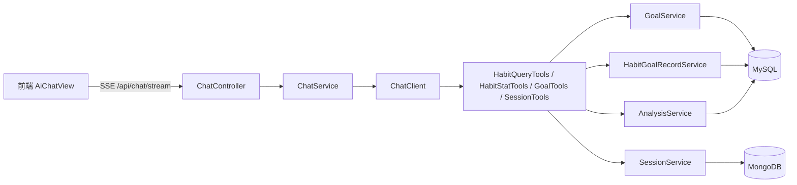

## 用户需求

完成 habit-agent 项目「模块六：Tool Calling 与业务整合」（对应 PRD 阶段六，技术点 3/7/8），并同步升级前端，保证前后端一致。

## 产品概述

将已落地的业务能力（习惯目标、自定义目标打卡、趋势分析、会话管理）封装为 AI 可调用的工具（Tool），挂到 ChatClient，使 AI 助手从「纯聊天」升级为「能查询并操作业务数据的智能助手」。前端 AI 建议页从骨架演示升级为真实 SSE 流式对话，并修正前后端接口路径不一致问题。

## 核心功能

- 后端新建 agent 工具类，把 GoalService、HabitGoalRecordService、AnalysisService、SessionService 的能力暴露为 Spring AI Tool（查目标列表/打卡记录/趋势概览、创建更新目标、查询会话列表等）。
- ChatClient 注册上述工具，使对话中 AI 可自动调用真实业务数据作答。
- 前端 chat.js 修正接口路径为 /api/chat/*，新增 SSE 流式消费与停止方法。
- 前端 AiChatView.vue 接入真实流式对话：实时拼接 chunk、支持 conversationId 续聊、停止生成；可选以结构化卡片展示工具产出的业务数据。
- 编译与构建通过，按规范提交推送。

## 技术栈

- 后端：Spring Boot 4.1 + Spring AI 2.0（ChatClient + ToolCallback / @Tool）+ Java 21，复用现有 JPA/Mongo Repository 与 Service 层。
- 前端：Vue 3 + Vite + Axios + Pinia + Element Plus，SSE 通过 fetch + ReadableStream 解析（保持现有 SSE 事件协议）。

## 实现方案

### 策略概述

新建 `com.habit.agent.agent.tools` 包，按业务域拆分工具类（HabitQueryTools / HabitStatTools / GoalTools / SessionTools），使用 Spring AI 2.0 的 `@Tool` + `@ToolParam` 注解并暴露为 `ToolCallback`，在 `ChatClientConfig` 通过 `.tools(...)` 注册。前端以 fetch 流式读取 `/api/chat/stream` 的 SSE 事件（meta/chunk/done/error），替换骨架演示。

### 关键技术决策

1. **工具粒度**：按 PRD 阶段六规划拆为查询工具（HabitQueryTools/HabitStatTools）与落地工具（SuggestionTools 升级为 GoalTools 含写操作），降低单类复杂度，贴合既有 Service 边界（SoC）。
2. **用户隔离**：当前 demo 为单用户，工具内部固定使用 `AgentConstants.DEFAULT_USER_ID`，方法入参不暴露 userId，避免越权与参数混乱。
3. **返回结构**：工具返回简洁结构化文本（JSON/要点），便于 LLM 解读并转述给用户。
4. **注册方式**：`ChatClientConfig.chatClient(...)` 增加 `defaultTools(...)` 参数注入工具 Bean；`ChatServiceImpl` 无需改动（ChatClient 已携带 tools）。
5. **System Prompt 增强**：在 `system-prompt.st` 补充一句指引：当用户询问自己的习惯数据/目标/趋势时优先调用工具查询真实数据。

### 性能与可靠性

- 工具均为只读或轻量写操作，走既有 Repository，无新增 N+1；写操作（保存目标/打卡）复用 Service 的幂等逻辑。
- SSE 前端采用增量拼接，避免整段重渲染；停止通过 `POST /api/chat/stop` 下发标记位，符合后端既有协议。

## 实现注意事项

- 复用现有 `GoalService`/`HabitGoalRecordService`/`AnalysisService`/`SessionService`，不要重复写数据访问逻辑。
- 工具方法命名与 `@Tool` description 需清晰，便于模型路由调用。
- 前端 SSE 解析严格匹配后端事件名（meta/chunk/done/error），不要臆造字段。
- 保持 lombok `@RequiredArgsConstructor` + `@Service`/`@Component` 既有风格，不引入新依赖。

## 架构设计



## 目录结构

```
src/main/java/com/habit/agent/
├── agent/
│   └── tools/
│       ├── HabitQueryTools.java      # [NEW] 查询最近/范围习惯记录（调 HabitRecordRepository/HabitGoalRecordService）
│       ├── HabitStatTools.java       # [NEW] 趋势概览/达成率（调 AnalysisService）
│       └── GoalTools.java            # [NEW] 查询/创建/更新目标（调 GoalService/HabitGoalRecordService）
├── config/
│   └── ChatClientConfig.java         # [MODIFY] 注册上述 ToolCallback 到 ChatClient
└── resources/prompts/
    └── system-prompt.st              # [MODIFY] 增加工具调用指引

frontend/src/
├── api/
│   └── chat.js                       # [MODIFY] 路径改为 /api/chat/*，新增 SSE 流式消费 + 停止方法
└── views/
    └── AiChatView.vue                # [MODIFY] 接入真实流式对话、续聊、停止、业务卡片展示
```

## 关键代码结构（可选）

工具类约定（接口级）：

```java
@Component
public class HabitQueryTools {
    @Tool(description = "查询用户最近N天的习惯打卡记录")
    public String getRecentHabits(@ToolParam(description = "最近天数") int days) { ... }
}
```

## 设计风格

沿用现有前端玻璃拟态（Glassmorphism）+ 渐变主色的视觉体系，AiChatView 升级为真实流式对话界面。保持顶部标题区、中部消息流（glass-strong 卡片）、底部输入区三段式布局。

## 页面区块设计（AiChatView）

1. 顶部标题区：助手图标 + 「AI 建议」标题 + 副标题，渐变高亮。
2. 消息流区：用户/助手气泡左右分列，助手气泡流式打字效果（逐 chunk 拼接）；可嵌入工具产出的业务卡片（目标列表/趋势要点）。
3. 输入区：圆角输入框 + 发送按钮（渐变）+ 停止按钮；发送中禁用并 loading。
4. 空态/骨架：首次进入显示欢迎语与示例提问（如「我最近一周睡眠怎么样」）。
5. 停止反馈：点击停止即中断流式并提示已停止。

## 交互与响应式

- 桌面端 max-w-3xl 居中，移动端全宽；消息流 flex-1 自适应滚动。
- 流式输出配合 animate-rise 微动效；发送/停止按钮 hover 态过渡。