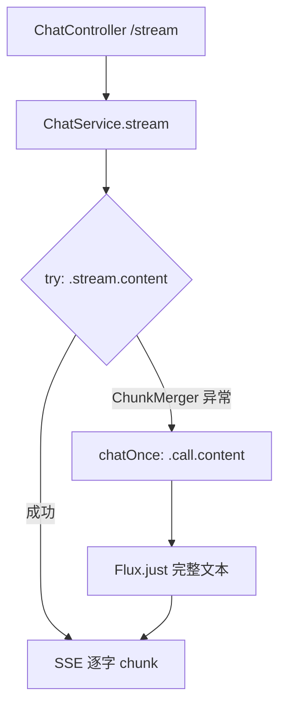

## 用户需求

habit-agent（Spring Boot 4 + Spring AI 2.0.0，接入通义千问 qwen-plus）流式对话接口 `/api/chat/stream` 连续两次崩溃：先是 `IllegalArgumentException: no more than one tool call per message currently supported`，修复（关闭并行工具调用）后再次出现 `NoSuchElementException: No value present`，均位于 `OpenAiChatModel$ChunkMerger`。用户要求给出 Spring AI 2.0 流式合理适配方式，需手动配置的部分明确告知由用户自主修改。

## 产品概述

在保留纯文本流式体验的前提下，彻底规避 Spring AI 2.0.0 流式 chunk 合并器（ChunkMerger）对"通义千问 + 流式 + 工具调用"组合的已知缺陷，使 `/api/chat/stream` SSE 接口在涉及工具调用的复杂意图下也能稳定返回完整回复，不再 500。

## 核心功能

- 流式优先：纯文本轮次继续走 `.stream().content()`，逐字输出。
- 异常降级：当流式链路抛出 ChunkMerger 相关异常（NoSuchElementException 或含 "tool call" 的 IllegalArgumentException）时，自动改用 `.call().content()`（非流式、带工具）拿到完整文本，以 `Flux.just(content)` 一次性返回。
- 复用同一非流式逻辑（抽取私有方法 `chatOnce`），避免重复代码，保证 chat() 与 stream() 降级路径一致。
- 工具能力完整保留，前端在工具轮次表现为一次性返回而非逐字流式，不影响功能。

## 技术栈

- 后端：Spring Boot 4.1.0 + Spring AI 2.0.0（spring-ai-starter-model-openai），通义千问 DashScope OpenAI 兼容端点，模型 qwen-plus。
- 流式：ChatClient `.stream().content()` + SSE（SseEmitter）；非流式：`.call().content()`。
- 响应式：reactor `Flux<String>`。

## 实现方案

### 根因（两次报错同源）

均为 `OpenAiChatModel$ChunkMerger` 的流式合并逻辑对通义千问（OpenAI 兼容）返回格式不健壮：

1. `mergeDeltas` 断言单条消息至多 1 个 tool call（已通过 `parallelToolCalls(false)` 缓解）。
2. `chunkToChatCompletion` 对某个 `Optional`（tool call index / finishReason）直接 `.get()`，模型返回为空即抛 `NoSuchElementException`。
`.call()` 非流式走不同合并路径，不经 ChunkMerger，故安全。结论：只要流式路径触发工具调用轮次，就可能崩溃；`parallelToolCalls=false` 无法根除。

### 关键决策

1. **流式优先 + 异常降级（主修复）**：在 `ChatServiceImpl.stream()` 包一层 try/catch。优先尝试 `.stream().content()`；捕获异常后判断是否为 ChunkMerger 相关（cause 链包含 `OpenAiChatModel$ChunkMerger`，或直接为 `NoSuchElementException` / 消息含 "tool call" 的 `IllegalArgumentException`），是则降级为 `chatOnce(...)` 非流式返回 `Flux.just(content)`。理由：不牺牲纯文本流式体验，又能 100% 规避崩溃，工具能力无损。
2. **抽取 `chatOnce` 私有方法**：将现有 `chat()` 的非流式 prompt 逻辑抽出，供 `chat()` 与 `stream()` 降级共用，消除重复、单一数据源。
3. **保留 `parallelToolCalls(false)`**：继续降低并行概率，减少降级发生频率。
4. **降级日志**：降级时打印 `log.warn` 说明已从流式降级为非流式（含 conversationId），便于观测但不过度打栈。

### 性能与可靠性

- 降级仅在工具轮次触发，纯文本高频轮次无额外开销。
- 降级走 `.call()` 为一次性完整返回，不引入额外网络往返；工具仍由 Spring AI 内置执行循环串行完成。
- 不修改 Controller / 配置，仅改 Service 实现，影响面收敛在 `ChatServiceImpl`。

## 实现要点

- `stream()` 返回 `Flux<String>`，降级分支用 `Flux.just(content)` 保持类型一致，前端 SSE 仅收到一个 chunk（name=chunk）。
- 异常判定用工具方法 `isChunkMergeFailure(Throwable)`，沿 cause 链遍历，匹配类名包含 `ChunkMerger` 或 `NoSuchElementException`，或 `IllegalArgumentException` 且 message 含 "tool call"。
- `chatOnce(userMessage, cid)` 复用既有 `.call().content()`，统一关闭并行调用 options。

## 架构设计

维持现有分层（Controller → Service → ChatClient/Model），新增内部降级分支，无新组件。



## 目录结构

```
src/main/java/com/habit/agent/service/impl/ChatServiceImpl.java   # [MODIFY] stream() 增加 try/catch 降级；抽取私有 chatOnce(userMessage,cid)；新增 isChunkMergeFailure(Throwable) 判定方法。
```

（ChatClientConfig.java、ChatController.java 前序改动已生效，本次不重复修改；application.yml 双保险 parallel-tool-calls:false 仍可选保留，由用户自主决定。）

## 关键代码结构

无需新增类型，复用既有 `OpenAiChatOptions` 与 `ChatClient`。

## Agent Extensions

### Skill

- **claude-api**
- Purpose: 核对 Spring AI 2.0 流式与 tool use 在 OpenAI 兼容模型下的已知限制与降级策略，确认 `parallelToolCalls=false` + 非流式降级方案与官方语义一致。
- Expected outcome: 确认 ChunkMerger 缺陷与非流式 `.call()` 安全路径的结论无误，降级方案无 API 误用。