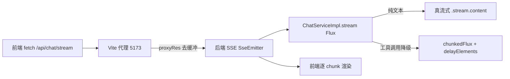

## 用户需求

用户项目为一款基于 Spring Boot 4 + Spring AI 2.0.0（DashScope 通义千问）的生活习惯助手 Agent，前端为 Vite + Vue。用户在开发期测试时发现：AI 对话无论如何都表现为"一次性整段跳出来"，无法观察到逐字/分片输出，误以为项目只能非流式。经定位，代码层面流式链路（后端 SSE Flux、前端 fetch 解析）本身正确，问题出在中间环节。本次需求：按已确认范围，只做前两项低风险优化，消除"非流式错觉"。

## 产品概述

优化 AI 对话流式输出的开发期体验，使前端能实时观察到逐字/分片输出，无需改动业务功能与接口契约。

## 核心功能

- 关闭 Vite 开发代理对 SSE（text/event-stream）响应的整体缓冲，让后端流式的每个 chunk 实时转发到浏览器（核心根因修复）。
- 给工具调用轮次的"模拟流式"分片 Flux 追加异步间隔发射（delayElements），使降级轮次也呈现平滑打字机效果，而非同一时刻唰地整段出现。
- 保持现有接口契约（meta/chunk/tool_call/done/error 事件、非流式 POST /api/chat、/stop 停止）完全不变；工具调用真流式（升级 Spring AI 或换 SDK）本次不做，留作后续评估。

## 技术栈

- 前端构建：Vite 5（@vitejs/plugin-vue），代理底层为 `http-proxy`
- 后端：Spring Boot 4、Spring AI 2.0.0、Reactor（`Flux` / `Duration`）
- 传输协议：SSE（`text/event-stream`）

## 实现方案

整体策略：仅改动两处——前端 Vite 代理配置（关闭 SSE 缓冲）与后端 `chunkedFlux`（异步间隔发射），不触碰已正确的 SSE 桥接与前端解析逻辑，保证改动面最小、无回归风险。

### 关键技术决策

1. **Vite 代理去缓冲（主因修复）**

- 现状：`frontend/vite.config.js:16-21` 的 `/api` 代理未做 SSE 处理，`http-proxy` 默认对 `text/event-stream` 长连接分块响应整体缓冲至连接关闭才一次性转发，导致无论真/模拟流式都表现为一次性出现。
- 方案：为代理增加 `configure` 钩子，监听 `proxyRes`，当响应 `content-type` 含 `text/event-stream` 时：
    - 删除 `content-length`（强制分块传输，禁止代理层攒整块）；
    - 设置 `cache-control: no-cache, no-transform`（避免任何中间层压缩/转换缓冲）。
- 取舍：这是针对 SSE 最稳妥的写法，无需改后端或前端解析；较 `ws`/`xfwd` 等通用配置更精准可靠，且对普通 JSON 接口无副作用（仅对 event-stream 生效）。

2. **chunkedFlux 平滑发射（次因修复）**

- 现状：`ChatServiceImpl.java:138-147` 用 `Flux.fromIterable(chunks)` 在同一线程同步发射所有 3 字符分片，`emitter.send` 在毫秒级内全部完成，工具调用轮次仍"唰"地整段出现。
- 方案：在 `Flux.fromIterable(chunks)` 后追加 `.delayElements(Duration.ofMillis(20))`，使每个分片间隔 20ms 异步发射，形成平滑打字机效果。间隔 20ms 兼顾"看起来逐字"与"不拖沓"（例如 300 字约 6 秒，体验合理；可按需微调）。
- 性能/可靠性：仅作用于降级轮次（工具调用触发），纯文本真流式轮次不受影响；`delayElements` 基于 Reactor 调度器，开销极低，不阻塞 I/O。

### 不改动项（已验证正确）

- `frontend/src/api/chat.js` 的 `streamMessage()`（fetch + ReadableStream 逐 chunk 渲染）——逻辑正确，无需改。
- `ChatController.java:78-148`（SseEmitter 桥接 Flux、五种 SSE 事件）——已正确，无需改。
- 非流式 `POST /api/chat`、`/stop` 停止接口——本次不涉及。

## 实现注意

- **向后兼容**：代理钩子仅对 `text/event-stream` 生效，不影响其他 API；`chunkedFlux` 仅在降级分支被调用，纯文本轮次仍是原生真流式。
- **日志**：后端已通过 `log.warn("[流式降级]...")` 输出降级原因，新增延迟发射不增加额外日志，避免日志噪声。
- **验证方式**：浏览器 DevTools → Network → `/api/chat/stream` 的 EventStream 面板，确认 chunk 实时逐条到达；或 `curl -N http://localhost:5173/api/chat/stream?message=xxx` 观察分块输出。注意须通过 5173（Vite）而非直接 8080 验证代理生效。

## 架构设计

本次为局部配置/小改，不引入新架构模式，沿用现有分层（Controller 桥接 Service 的 `Flux<String>`，前端原生 fetch 解析 SSE）。数据流不变：



## 目录结构

```
frontend/
└── vite.config.js                     # [MODIFY] 为 /api 代理增加 configure 钩子，监听 proxyRes，对 text/event-stream 删除 content-length、设置 cache-control: no-cache, no-transform，关闭缓冲。
src/main/java/com/habit/agent/service/impl/
└── ChatServiceImpl.java               # [MODIFY] chunkedFlux 方法（138-147 行）在 Flux.fromIterable(chunks) 后追加 .delayElements(Duration.ofMillis(20))，实现模拟流式平滑打字机效果；补充 import java.time.Duration。
```