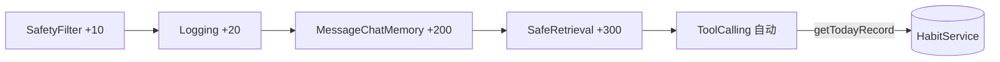

## 用户需求

彻底移除 `ContextInjectionAdvisor`，将"日期 + 今日打卡概况"等用户上下文查询完全交给已有的 `HabitQueryTools` 工具，由模型按需自主调用。

## 产品概述

当前 `ContextInjectionAdvisor` 每轮通过改写用户消息注入业务背景，导致跨轮重复、旧背景过期、挤占记忆窗口，且与已有工具能力冗余。本次升级删除该 Advisor，回归"工具自主查询"的干净架构。

## 核心特性

- 删除 `ContextInjectionAdvisor` 类及其全部引用
- 保留 `HabitQueryTools.getTodayRecord()` 等工具作为模型查询今日打卡的入口
- 同步清理 `ChatClientConfig` 中相关 import、方法参数、Advisor 链装配与顺序表注释
- 确保编译通过、对话链路可用，模型可自主调工具获取上下文

## 技术栈

- 沿用现有项目栈：Spring Boot 4 + Spring AI 2.0.0 + Java 21
- 架构分层：Controller → Service → Repository，Advisor 链装配于 `ChatClientConfig`

## 实现方案

**策略**：采用"删除即升级"策略——移除冗余的上下文注入 Advisor，将上下文获取职责完全交还给已注册的工具调用链，不做任何替换实现。

**工作原理**：`ChatClient` 的 `defaultAdvisors` 列表移除 `ContextInjectionAdvisor` 后，用户消息不再被改写；模型在遇到"今天打卡了吗"等时间相关问题时，由 `ToolCallingAdvisor` 自动触发 `HabitQueryTools.getTodayRecord()` 获取实时数据。记忆 Advisor 只存纯用户/助手轮次，彻底消除跨轮背景重复与窗口污染。

**关键技术决策**：

1. 直接删除而非改造为 SystemMessage：用户已确认工具能力完备，注入属于冗余预热，删除最符合架构意图，且每轮零额外 DB 查询。
2. 顺序表注释同步更新：保留 SafetyFilter(+10) → Logging(+20) → MessageChatMemory(+200) → SafeRetrieval(+300) 的既有顺序，删去 +100 行。
3. 不引入缓存或新组件：方案甲要求最小改动面，避免新增复杂度。

**性能与可靠性**：

- 删除后每轮对话减少一次 `habitService.getTodayRecord()` 点查（原 `before()` 必查），降低 DB 压力与延迟。
- 无任何新增外部依赖，回归官方推荐的工具调用模式，可靠性更高。

## 实现注意点

- 删除文件后必须清理所有 import 与装配引用，否则编译失败（已定位 `ChatClientConfig` 第 15/79/95/117/121 行及类注释 58-59 行）。
- `reportChatClient()` 同样引用了该 Advisor，需一并移除（第 117/121-122 行），否则 `@Bean` 方法参数缺失导致启动失败。
- 删除后用户消息不再被改写，`LoggingAdvisor.resolveUserInput()` 用 `getUserMessage()` 取到的即为原始输入，日志更准确，无需改动。
- `system-prompt.st` 已声明工具能力，保留不动。
- 遵循项目记忆：改动完成后需 git 提交并推送（执行阶段由主 agent 处理）。

## 架构设计

现有 Advisor 链（删除后）：



可见上下文获取已完全由工具链承担，无独立注入节点。

## 目录结构

```
src/main/java/com/habit/agent/
├── agent/advisor/
│   └── ContextInjectionAdvisor.java   # [DELETE] 整个文件删除，不再需要业务上下文注入
└── config/
    └── ChatClientConfig.java          # [MODIFY] 移除 import、chatClient/reportChatClient 中的 contextInjectionAdvisor 参数与装配、更新顶部顺序表注释与方法注释
```