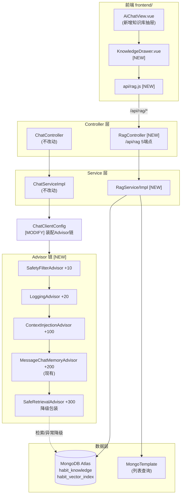
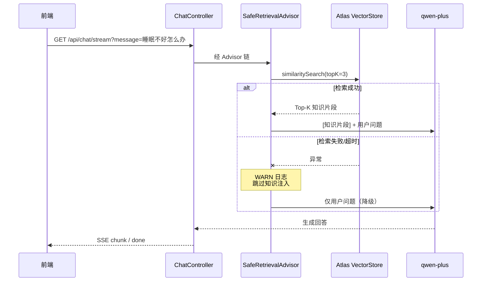

## 用户需求

依据 PRD 三份文档（`PRD/详细模块开发流程.md`、`PRD/API接口设计方案.md`、`PRD/向量库搭建计划表.md`）对齐接口与模块规范，完成：

- **阶段六未完成部分（6-2 自定义 Advisor）**
- **阶段八完整任务（RAG 知识库）**

## 产品概述

为「生活习惯助手 Agent」补齐 AI 对话链路的两项能力：一是可观测、可防护的 Advisor 增强层，二是基于 MongoDB Atlas 向量检索的健康知识库，使助手在回答睡眠、饮食、运动等健康问题时能引用项目内置的专业知识，而不只依赖模型自身记忆。

## 核心功能

### 一、自定义 Advisor 增强层（阶段 6-2）

- **日志 Advisor**：记录每轮对话的会话 ID、输入摘要、响应耗时与 Token 用量，敏感内容脱敏、超长内容截断，便于排障与成本观测。
- **安全过滤 Advisor**：对用户输入做敏感词与超长文本前置校验，命中时直接返回合规话术并阻断模型调用，避免无效 Token 消耗。
- **上下文注入 Advisor**：在提问前自动补充当前日期、用户今日打卡概况等业务上下文，让助手回答具备时间与数据感知力。

### 二、RAG 知识库（阶段八）

- **预设知识文档**：内置睡眠、运动、饮食三篇健康指南 Markdown，作为知识库初始语料。
- **知识库管理接口（5 个）**：
- 导入预设文档（批量解析、分块、向量化入库）
- 上传自定义文档（支持 .md / .txt）
- 语义检索（按相似度返回 Top-K 片段与分数）
- 文档列表（按来源分组展示已入库片段）
- 按 ID 删除文档片段
- **对话链路自动增强**：`/api/chat` 与 `/api/chat/stream` 在生成回答前自动检索知识库并注入相关片段；检索或向量化失败时**静默跳过知识注入、对话正常继续**，不中断用户体验。

### 三、知识库管理界面

在现有「AI 建议」页面内以**抽屉式面板**形式提供知识库管理入口（**不新增页面路由、不新增顶部导航项**）。面板包含：一键导入预设、拖拽/点选上传文档、检索测试框（输入问题即时查看命中片段与相似度）、已入库文档列表与删除操作。视觉沿用现有玻璃拟态风格，支持加载态、空态与操作结果提示。

### 四、文档同步

实现完成后同步更新 PRD 三份文档中阶段六、阶段八的完成状态、端点清单与端点计数（35 → 40）。

## 技术栈

沿用现有项目栈，不引入新框架：

| 层 | 技术 | 说明 |
| --- | --- | --- |
| 后端 | Spring Boot 4.1.0 + JDK 21 | 现有 `pom.xml` parent |
| AI | Spring AI 2.0.0（BOM 统一管理） | `spring-ai-starter-model-openai` 接 DashScope 兼容模式 |
| 向量库 | MongoDB Atlas Vector Search | `spring-ai-starter-vector-store-mongodb-atlas` **已在 pom.xml（第 84 行）引入，无需新增** |
| Embedding | DashScope `text-embedding-v3`（1024 维） | `application.yml` 已配置 |
| 持久层 | JPA(MySQL) + Spring Data MongoDB | 现有双库架构 |
| 前端 | Vue 3 + Vite + Element Plus + Tailwind + lucide-vue-next | 现有栈 |


**需新增的唯一依赖**：`org.springframework.ai:spring-ai-advisors-vector-store`（提供 `RetrievalAugmentationAdvisor`、`VectorStoreDocumentRetriever`、`ContextualQueryAugmenter`），由 spring-ai-bom 管理版本，不写 version。

## 实现方案

### 总体策略

在**不改动现有 35 个端点行为**的前提下，于 `ChatClientConfig` 这一个装配点集中挂载新增 Advisor 链，并新增一条独立的 RAG 模块纵切（Controller → Service → VectorStore）。核心决策如下：

**1. Advisor 而非拦截器/AOP**
现有 `ChatClientConfig.chatClient()`（第 54-74 行）已通过 `.defaultAdvisors(memoryAdvisor)` 装配 Advisor，日志/安全/上下文/RAG 四项均是对话链路横切关注点，用 Spring AI 原生 Advisor 机制最贴合既有架构，且天然支持 order 排序，无需引入 AOP。

**2. Advisor 执行顺序（关键设计）**
Spring AI 2.0 中 `getOrder()` 值越小越先执行。现有约定：`MessageChatMemoryAdvisor` 使用 `Advisor.DEFAULT_CHAT_MEMORY_PRECEDENCE_ORDER`（`HIGHEST_PRECEDENCE + 200`，见 `ChatClientConfig` 类注释第 37-39 行）。新增 Advisor 排布：

```
SafetyFilterAdvisor      order = HIGHEST + 10    最先，命中即短路，省 Token
LoggingAdvisor           order = HIGHEST + 20    包裹全链路，测得完整耗时
ContextInjectionAdvisor  order = HIGHEST + 100   改写 user 文本，须在记忆之前
MessageChatMemoryAdvisor order = HIGHEST + 200   现有，不动
SafeRetrievalAdvisor     order = HIGHEST + 300   记忆之后检索，最贴近模型调用
```

将 RAG 置于记忆 Advisor **之后**是刻意选择：知识片段属于「本轮临时增强」，不应被写入 `ai_chat_memory` 长期记忆，否则窗口 20 条会被大段知识文本迅速挤满。

**3. RAG 降级：自定义包装而非直接用官方 Advisor**
`RetrievalAugmentationAdvisor` 原生**不做异常降级**——Atlas 不可达或 Embedding 超时会直接抛异常，导致 `/api/chat` 500、`/api/chat/stream` 触发 error 事件。用户明确要求「检索失败降级」，故实现 `SafeRetrievalAdvisor`：内部持有官方 `RetrievalAugmentationAdvisor` 委托，`try-catch` 包裹其 `adviseCall`/`adviseStream`，异常时 WARN 日志 + 直接放行原始请求给下游（`chain.nextCall(request)`），保证对话不中断。这是《向量库搭建计划表.md》8-B.3 节明确建议的实现方式（第 599 行）。

**4. VectorStore 可用性防御**
`MongoDBAtlasVectorStore` Bean 由 starter 自动配置，即使 Atlas 未连通 Bean 依然存在（失败发生在调用时）。因此：

- `RagServiceImpl` 所有 VectorStore 调用点统一 try-catch，转 `AiCallException`（复用现有 `common/exception/AiCallException`），由 `GlobalExceptionHandler` 映射为 503 + `CODE_AI_UNAVAILABLE`(50301)。
- 新增启动探针 `VectorStoreProbe`（仿照现有 `ChatConnectivityProbe` 第 85-109 行写法），启动时做一次 topK=1 检索，失败仅 WARN 不阻断启动。

**5. 文档删除与列表：绕开 VectorStore 接口能力缺口**
`VectorStore` 接口只有 `add`/`delete(ids)`/`similaritySearch`，**没有"列出全部文档"能力**。方案：直接注入现有 `MongoTemplate`（`spring-boot-starter-data-mongodb` 已在 pom 第 66 行），对 `habit_knowledge` 集合做原生查询，**用 `Query.fields().exclude("embedding")` 排除 1024 维向量字段**——这是关键性能点，避免每条文档多传 4KB+ 数据。删除仍走 `vectorStore.delete(List.of(id))` 以保证语义一致。

**6. 文档解析与分块**

- Markdown/文本统一用 Spring AI 内置 `TextReader`（`spring-ai-core` 自带，无需额外依赖）读取，避免为 `MarkdownDocumentReader` 引入 `spring-ai-markdown-document-reader`，也避免为通用格式引入 Tika（本期只需 .md/.txt，YAGNI）。
- `TokenTextSplitter` 分块，参数对齐《向量库搭建计划表》8-B.2 节：chunkSize=500、overlap=100。
- 每个 chunk 写入 metadata：`doc_type`、`source`、`chunk_index`、`import_time`。前两者与 Atlas 索引 filter 字段一致（《向量库搭建计划表》6.2 节索引 JSON）。

### 性能与可靠性

| 关注点 | 措施 |
| --- | --- |
| 文档列表返回体积 | MongoTemplate 查询 `exclude("embedding")`，单条从 ~4KB 降至 ~500B |
| 导入耗时 | `vectorStore.add()` 批量提交（一次传整个 chunk 列表），由 Spring AI 内部批处理 Embedding，避免逐条 HTTP |
| 检索延迟 | topK 默认 3、上限 10（`@Max(10)` 校验），similarityThreshold 0.5 过滤低质片段 |
| 上下文膨胀 | ContextInjectionAdvisor 注入内容严格限长（≤200 字），不塞入完整打卡明细 |
| 日志噪音 | LoggingAdvisor 对 prompt/response 截断至 200 字符；不打印 API Key 与完整用户文本 |
| 上传安全 | 校验扩展名白名单(.md/.txt)、大小上限 2MB、UTF-8 解码失败拒绝 |
| 幂等 | 重复导入预设文档时，先按 `metadata.source` 删除旧片段再写入，避免知识库重复膨胀 |


### 避免技术债

- 复用 `Result`、`AgentConstants` 错误码、`GlobalExceptionHandler`、`@Tag`/`@Operation` Swagger 注解、`@RequiredArgsConstructor` 构造注入——全部沿用现有五个 Controller 的写法。
- `RagService` 接口 + `RagServiceImpl` 实现，与现有 6 组 service/impl 分离模式一致。
- 前端 `api/rag.js` 复用 `utils/request.js` 拦截器，与 `api/chat.js` 等 5 个文件风格统一。

## 架构设计



**RAG 对话链路时序（含降级）**



## 目录结构

```
d:/javacode/agent_demo/
├── pom.xml                                    # [MODIFY] 新增 spring-ai-advisors-vector-store 依赖（无 version，由 spring-ai-bom 管理）；
│                                              #          确认 spring-ai-starter-vector-store-mongodb-atlas（第84行）已存在无需改动
│
├── src/main/java/com/habit/agent/
│   ├── agent/
│   │   └── advisor/                           # [NEW] 阶段 6-2 自定义 Advisor 包（与现有 agent/tools 平级）
│   │       ├── LoggingAdvisor.java            # [NEW] 实现 CallAdvisor + StreamAdvisor。职责：记录 conversationId、
│   │       │                                  #       输入摘要(截断200字)、响应耗时(ms)、Token用量(从ChatResponse.metadata.usage取)。
│   │       │                                  #       getOrder() 返回 HIGHEST_PRECEDENCE+20。使用 @Slf4j，日志前缀 [Advisor:Logging]。
│   │       │                                  #       不打印完整 prompt/response，不打印 API Key。异常不吞（仅记录后重抛）。
│   │       ├── SafetyFilterAdvisor.java       # [NEW] 实现 CallAdvisor + StreamAdvisor。职责：前置校验用户输入——
│   │       │                                  #       ①敏感词命中（内置精简词表常量，含政治/违法/医疗诊断类）②长度>4000字符。
│   │       │                                  #       命中时不调用 chain.nextCall，直接构造 ChatClientResponse 返回合规话术
│   │       │                                  #       （"这个话题超出了我的能力范围，我们聊聊生活习惯吧"），节省Token。
│   │       │                                  #       getOrder() 返回 HIGHEST_PRECEDENCE+10（最先执行）。
│   │       ├── ContextInjectionAdvisor.java   # [NEW] 实现 CallAdvisor + StreamAdvisor。职责：在 user 文本前拼接业务上下文——
│   │       │                                  #       当前日期(LocalDate.now())、星期、用户今日是否已打卡概况。
│   │       │                                  #       依赖注入 HabitService 查询今日记录；查询异常时跳过注入不阻断。
│   │       │                                  #       注入内容严格≤200字。getOrder() 返回 HIGHEST_PRECEDENCE+100（须在记忆Advisor之前）。
│   │       └── SafeRetrievalAdvisor.java      # [NEW] 阶段八核心降级组件。内部委托官方 RetrievalAugmentationAdvisor
│   │                                          #       （由 VectorStoreDocumentRetriever(topK=3, similarityThreshold=0.5) +
│   │                                          #       ContextualQueryAugmenter(allowEmptyContext=true) 构建）。
│   │                                          #       adviseCall/adviseStream 均 try-catch 委托调用，捕获任何 Exception 时
│   │                                          #       打 WARN 日志并 return chain.nextCall(request) 原样放行（跳过知识注入）。
│   │                                          #       getOrder() 返回 HIGHEST_PRECEDENCE+300。
│   │
│   ├── config/
│   │   ├── ChatClientConfig.java              # [MODIFY] 核心装配点。修改 chatClient() Bean 方法签名，新增注入
│   │   │                                      #          LoggingAdvisor/SafetyFilterAdvisor/ContextInjectionAdvisor/SafeRetrievalAdvisor，
│   │   │                                      #          .defaultAdvisors(...) 由单参数改为多参数传入全部5个Advisor（含现有memoryAdvisor）。
│   │   │                                      #          保留 defaultSystem/defaultTools/defaultOptions(parallelToolCalls=false) 不变。
│   │   │                                      #          更新类 Javadoc 说明 Advisor 链顺序表。
│   │   └── VectorStoreProbe.java              # [NEW] 启动探针，严格仿照 ChatClientConfig.ChatConnectivityProbe(第85-109行)写法。
│   │                                          #        构造时执行一次 similaritySearch(query="ping", topK=1)，
│   │                                          #        成功打 INFO "[阶段八] Atlas 向量库连通性验证成功"，
│   │                                          #        失败仅 WARN 提示检查 Atlas URI/向量索引，不抛异常不阻断启动。
│   │
│   ├── controller/
│   │   └── RagController.java                 # [NEW] @RestController @RequestMapping("/api/rag") @Validated
│   │                                          #        @Tag(name="RAG 知识库")，风格对齐 AnalysisController。5 个端点：
│   │                                          #        ① POST /import        → Result<ImportResultVO> 导入 rag-docs 预设文档
│   │                                          #        ② POST /upload        → Result<ImportResultVO> @RequestParam MultipartFile file
│   │                                          #        ③ GET  /search        → Result<List<RagSearchResultVO>> query必填 + topK默认3(@Min1@Max10)
│   │                                          #        ④ GET  /documents     → Result<List<RagDocumentVO>> 可选 docType 过滤
│   │                                          #        ⑤ DELETE /documents/{id} → Result<Void>
│   │                                          #        每个方法带 @Operation 注解；异常交由 GlobalExceptionHandler 统一处理。
│   │
│   ├── service/
│   │   ├── RagService.java                    # [NEW] 接口，定义 5 个方法：importPresetDocs()、uploadDocument(MultipartFile)、
│   │   │                                      #        search(String query, int topK)、listDocuments(String docType)、deleteDocument(String id)。
│   │   └── impl/
│   │       └── RagServiceImpl.java            # [NEW] @Service @RequiredArgsConstructor，注入 VectorStore + MongoTemplate。
│   │                                          #        importPresetDocs：ResourcePatternResolver 扫 classpath:rag-docs/*.md →
│   │                                          #          TextReader 读取 → 按 source 先删旧片段(幂等) → TokenTextSplitter(500/100) 分块 →
│   │                                          #          注入 metadata(doc_type/source/chunk_index/import_time) → vectorStore.add(批量) →
│   │                                          #          汇总 ImportResultVO(totalDocs/totalChunks/success/errors)，单篇失败不中断整体。
│   │                                          #        uploadDocument：校验扩展名白名单(.md/.txt)+大小≤2MB+UTF-8解码，同上流程入库。
│   │                                          #        search：SearchRequest.builder().query().topK().similarityThreshold(0.5)，
│   │                                          #          映射为 RagSearchResultVO(含 score)。
│   │                                          #        listDocuments：MongoTemplate 查 habit_knowledge 集合，
│   │                                          #          Query.fields().exclude("embedding") 排除向量字段（性能关键），可按 metadata.doc_type 过滤。
│   │                                          #        deleteDocument：vectorStore.delete(List.of(id))。
│   │                                          #        全部 VectorStore 调用 try-catch → AiCallException(CODE_AI_UNAVAILABLE)。
│   │
│   └── common/
│       ├── constant/AgentConstants.java       # [MODIFY] 追加 RAG 相关常量：CODE_RAG_SEARCH_ERROR(50304)、
│       │                                      #          CODE_RAG_DOC_NOT_FOUND(40407)、CODE_RAG_UPLOAD_ERROR(40004)；
│       │                                      #          以及 RAG_DEFAULT_TOP_K=3、RAG_MAX_TOP_K=10、RAG_CHUNK_SIZE=500、
│       │                                      #          RAG_CHUNK_OVERLAP=100、RAG_UPLOAD_MAX_SIZE。沿用现有 public static final 风格。
│       │                                      #          注：新错误码落在 GlobalExceptionHandler.resolveHttpStatus 现有区间规则内，无需改该方法。
│       └── vo/
│           ├── ImportResultVO.java            # [NEW] @Data @Builder。字段：totalDocs(Integer)、totalChunks(Integer)、
│           │                                  #        success(Boolean)、errors(List<String>)。对齐《向量库搭建计划表》8-B.2 节契约。
│           ├── RagDocumentVO.java             # [NEW] @Data @Builder。字段：id、content(可截断预览)、docType、source、
│           │                                  #        chunkIndex(Integer)、importTime。不含 embedding 字段。
│           └── RagSearchResultVO.java         # [NEW] @Data @Builder。字段：id、content、score(Double)、docType、source。
│
├── src/main/resources/
│   ├── application.yml                        # [MODIFY] ① MongoDB uri 改为 ${MONGODB_URI:mongodb://localhost:27017/habit_agent}
│   │                                          #             便于由 application-local.yml / 环境变量注入 Atlas 连接串（不写死凭据）。
│   │                                          #          ② spring.ai.vectorstore.mongodb 段补齐：initialize-schema:false、
│   │                                          #             path-name:embedding、metadata-fields-to-filter:doc_type,source
│   │                                          #             （现有仅 collection-name/index-name，第54-57行）。
│   │                                          #          ③ 新增 spring.servlet.multipart.max-file-size/max-request-size = 2MB（支持上传端点）。
│   │                                          #          ④ logging.level 增加 com.habit.agent.agent.advisor: INFO。
│   ├── prompts/
│   │   └── system-prompt.st                   # [MODIFY] 现有第6行已提及"优先结合内置健康知识库（RAG 检索片段）作答"，
│   │                                          #           补充一节"知识库引用准则"：检索片段存在时须基于片段作答并说明来源；
│   │                                          #           无片段时明确告知为通用建议，不得杜撰知识库内容。
│   └── rag-docs/                              # [NEW] 预设知识库语料目录（importPresetDocs 扫描源）
│       ├── sleep-guide.md                     # [NEW] 睡眠健康指南，约 500-800 字，含成人建议睡眠时长(7-9h)、
│       │                                      #        最佳入睡时段、睡眠质量影响因素、改善方法。内容需结构化(标题+要点)便于分块。
│       ├── exercise-guide.md                  # [NEW] 运动健康指南，约 500-800 字，含每周中等强度150分钟/高强度75分钟建议、
│       │                                      #        运动类型分类、循序渐进原则、常见误区。
│       └── diet-guide.md                      # [NEW] 饮食健康指南，约 500-800 字，含膳食均衡结构、饮水量建议(1500-1700ml)、
│                                              #        三餐节律、常见饮食问题改善建议。
│
├── frontend/src/
│   ├── api/
│   │   └── rag.js                             # [NEW] 对齐 api/chat.js 风格，import request from '@/utils/request'。
│   │                                          #        导出：importPresetDocs()、uploadDocument(file)(FormData+multipart头)、
│   │                                          #        searchKnowledge(query, topK)、listDocuments(docType)、deleteDocument(id)。
│   ├── components/
│   │   └── KnowledgeDrawer.vue                # [NEW] 知识库管理抽屉组件（el-drawer，从右侧滑出，宽度约 480px）。
│   │                                          #        props: modelValue(v-model 控制显隐)。内部四区块：
│   │                                          #        ①操作区：「导入预设知识库」按钮 + el-upload 上传(.md/.txt, 限2MB, 手动提交)
│   │                                          #        ②检索测试区：输入框 + topK 选择 + 检索按钮，结果卡片展示 content 与 score 进度条
│   │                                          #        ③文档列表区：按 source 分组折叠，展示 chunkIndex/内容预览，每项带删除按钮(带确认)
│   │                                          #        ④状态区：loading 骨架、空态提示、ElMessage 结果反馈。
│   │                                          #        样式沿用 glass-strong / rounded-card-xl / bg-grad-primary 等现有工具类，
│   │                                          #        图标用 lucide-vue-next(BookOpen/Upload/Search/Trash2/RefreshCw)。
│   └── views/
│       └── AiChatView.vue                     # [MODIFY] 最小侵入改造：①import KnowledgeDrawer 与 BookOpen 图标；
│                                              #           ②新增 ref knowledgeOpen=false；③在顶部标题区（现第266-270行 RotateCcw
│                                              #           按钮旁）插入一个「知识库」图标按钮，点击置 knowledgeOpen=true；
│                                              #           ④模板末尾挂载 <KnowledgeDrawer v-model="knowledgeOpen" />。
│                                              #           不改动现有对话/会话/SSE 任何逻辑。
│
└── PRD/                                       # 实现完成后同步更新（文档口径一致性）
    ├── 详细模块开发流程.md                     # [MODIFY] 总览表阶段六 6-2 改 ✅ 已落地并列出4个Advisor；
    │                                          #           阶段八 8-1 改 ✅ 已落地；「已实现模块端点对照」表新增 RagController 5端点、
    │                                          #           合计 35→40；「待开发模块端点规划」表移除 Rag 行、合计 16→11；
    │                                          #           阶段六/阶段八详解章节据实描述；追加修订记录条目。
    ├── API接口设计方案.md                      # [MODIFY] 「接口实现状态总览」表 RAG 知识库行改 ✅ 已实现；
    │                                          #           已落地表新增 RAG 行(5端点)、小计 35→40；待开发表移除 RAG、小计 16→11。
    └── 向量库搭建计划表.md                     # [MODIFY] 「十三、后续开发衔接」表中 RAG 模块与对话链路 RAG 注入状态改 ✅ 已落地；
                                               #           补充 SafeRetrievalAdvisor 实际实现说明与降级验证结果。
```

## 关键代码结构

仅列出跨模块依赖、契约必须精确的两处：

**1. SafeRetrievalAdvisor 降级契约**（阶段八核心，决定对话不中断）

```java
public class SafeRetrievalAdvisor implements CallAdvisor, StreamAdvisor {
    private final RetrievalAugmentationAdvisor delegate; // 官方 Advisor，构造时用 VectorStoreDocumentRetriever 装配

    // 关键：捕获全部异常后放行原始 request，跳过知识注入而非抛出
    @Override
    ChatClientResponse adviseCall(ChatClientRequest request, CallAdvisorChain chain);

    @Override
    Flux<ChatClientResponse> adviseStream(ChatClientRequest request, StreamAdvisorChain chain);

    @Override
    int getOrder(); // Ordered.HIGHEST_PRECEDENCE + 300，位于记忆 Advisor 之后
}
```

**2. RagService 接口契约**（Controller 与前端共同依赖）

```java
public interface RagService {
    ImportResultVO importPresetDocs();                         // 扫 classpath:rag-docs/*.md，幂等重入
    ImportResultVO uploadDocument(MultipartFile file);         // .md/.txt，≤2MB
    List<RagSearchResultVO> search(String query, int topK);    // topK ∈ [1,10]
    List<RagDocumentVO> listDocuments(String docType);         // docType 可为 null（不过滤）
    void deleteDocument(String id);
}
```

## 实施要点

- **依赖确认**：`spring-ai-starter-vector-store-mongodb-atlas` 已在 `pom.xml` 第 84 行，**切勿重复添加**；仅需新增 `spring-ai-advisors-vector-store`，且不写 `<version>`（由第 29 行的 spring-ai-bom 2.0.0 管理）。
- **Atlas 索引前置条件**：向量索引 `habit_vector_index` 需在 Atlas 控制台手动创建（1024 维、cosine、path=embedding、filter=metadata.doc_type/metadata.source），配置 `initialize-schema: false`。此为运行前置条件，代码侧通过 `VectorStoreProbe` 给出明确 WARN 引导，不阻断启动。
- **凭据安全**：`application.yml` 只放 `${MONGODB_URI:...}` 占位符与本地默认值，真实 Atlas 连接串由用户填入已 gitignore 的 `application-local.yml`，**不得将 Atlas URI 或密码写入受版本控制的文件**。
- **不改动既有行为**：`ChatController`（含方案 B 一次性输出策略）、`ChatServiceImpl`、现有 14 个 @Tool、35 个既有端点均不修改，避免回归。
- **Advisor 异常隔离**：Logging/Context/Safety 三个 Advisor 内部逻辑异常均不得冒泡影响对话——除 Safety 主动短路属预期行为外，其余一律 try-catch 后放行。
- **前端零新增路由**：严格不修改 `frontend/src/router/index.js` 与 `MainLayout.vue` 的 `menus` 数组，知识库仅作为 AiChatView 内的抽屉存在。
- **验证路径**：启动看 Atlas 探针 INFO → `POST /api/rag/import` 返回 totalChunks>0 → Atlas 控制台见带 embedding 的文档 → `GET /api/rag/search?query=睡眠不好怎么办` 睡眠片段排名靠前 → 前端抽屉四项功能可用 → 断开 Atlas 后 `/api/chat/stream` 仍正常回答（降级验证）。
- **Git 规范**：按项目既有约定，每完成一个有效阶段执行提交并推送。

## 设计目标

在既有「AI 建议」页面中嵌入知识库管理抽屉，视觉语言完全沿用项目现有玻璃拟态体系（`glass-strong`、`rounded-card-xl`、`bg-grad-primary`、`shadow-glow`），使其看起来像原生功能而非外挂模块。**不新增页面、不新增导航项**。

## 入口设计

在 `AiChatView.vue` 顶部标题区右侧，紧邻现有「开启新对话」圆形按钮，新增一枚同规格圆形图标按钮（`BookOpen` 图标，40×40，边框 `border-slate-200`，hover 变 `text-brand-soft`），tooltip 为「知识库」。点击从右侧滑出抽屉。

## 抽屉布局（自上而下四区块）

**1. 抽屉头部（56px）**
渐变底 `bg-grad-primary`，左侧 `BookOpen` 图标 + 标题「健康知识库」，副标题「AI 回答的专业依据来源」，右侧关闭按钮。底部 1px 半透明白色分隔。

**2. 操作区（卡片）**
玻璃卡片内左右分栏：左为「导入预设知识库」主按钮（渐变填充，带 `RefreshCw` 图标，加载时旋转 + 文案变「导入中…」）；右为上传区（虚线边框拖拽框，`Upload` 图标 + 「拖拽或点击上传 .md / .txt，≤2MB」提示文案）。导入完成后以 `ElMessage.success` 提示「已导入 N 篇 / M 个片段」。

**3. 检索测试区（卡片）**
圆角输入框 + topK 数字选择器（1-10，默认 3）+ 渐变检索按钮（`Search` 图标）。结果以卡片列表展示：每张卡片顶部为来源标签（`doc_type` 彩色 Pill）与相似度分数，分数用细进度条可视化（0-1 映射宽度，渐变填充）；下方为片段正文（限 3 行，`line-clamp-3`）。无结果时显示插画式空态。

**4. 文档列表区（卡片，可滚动）**
按 `source` 分组的折叠面板，组标题显示文件名与片段数徽标。展开后每行显示 `#chunkIndex` + 内容预览（单行截断），行尾 `Trash2` 删除图标（hover 显现，红色，点击弹 `ElMessageBox` 二次确认）。加载中显示骨架条，空库时显示「知识库还是空的，先导入预设文档试试」。

## 交互与动效

- 抽屉滑入滑出 0.3s ease，遮罩淡入。
- 所有异步操作有独立 loading 态，按钮禁用防重复提交。
- 检索结果卡片 stagger 淡入上移（复用现有 `animate-rise`）。
- 删除行有淡出收起动画。
- 全部操作结果统一用 Element Plus `ElMessage` 反馈，与项目现有提示方式一致。

## 响应式

抽屉宽度 480px；视口宽度 < 640px 时改为 90vw 全高，操作区左右分栏改为上下堆叠。

## Agent Extensions

### SubAgent

- **code-explorer**
- Purpose: 在实现 Advisor 链与 RAG 模块前，批量核查 Spring AI 2.0.0 在本项目中的实际可用 API（`CallAdvisor`/`StreamAdvisor` 接口签名、`RetrievalAugmentationAdvisor.builder()` 构建方式、`VectorStoreDocumentRetriever` 参数），以及 `HabitService`、`AiCallException`、`MongoTemplate` 的现有用法。
- Expected outcome: 输出经核实的类全限定名、方法签名与构造方式清单，确保新增 Advisor 与 RagServiceImpl 一次编译通过，避免因 Spring AI 1.x/2.x API 差异返工。

### Skill

- **webapp-testing**
- Purpose: 在前端知识库抽屉开发完成后，驱动本地 Vite 应用验证完整交互链路——打开抽屉、导入预设、上传文档、检索测试、删除片段，并捕获浏览器控制台错误与界面截图。
- Expected outcome: 确认五项前端功能均能正确调用 `/api/rag/*` 并渲染结果，无控制台报错，抽屉样式与现有页面视觉一致。